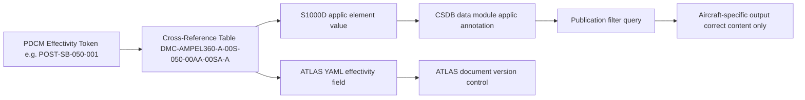

# ATLAS 050-059 · 05.050.050 — S1000D CSDB Mapping and Traceability

## 1. Purpose

Defines the **S1000D data module code (DMC) mapping and CSDB traceability** for all applicability and effectivity documentation within subsubject `050`, ensuring each ATLAS document has a corresponding S1000D DMC and that the CSDB applicability annotations are consistent with the PDCM master effectivity register.

## 2. Scope

### 2.1 Context

Subsubject `050` applicability and effectivity documents are primarily descriptive (infoCode `040`) data modules in the S1000D sense — they describe the rules and data structures governing effectivity rather than providing step-by-step maintenance procedures. The CSDB system module (infoCode `00S`) captures the applicability cross-reference table that maps PDCM effectivity tokens to S1000D `<applic>` element values, providing the authoritative lookup used by all publication-filtering tools.

The AMPEL360 eWTW uses S1000D Issue 5.0 with the AMPEL360 project-specific Business Rules Decision Points (BRDPs) documented in BREX-AMPEL360-001.

### 2.2 CSDB Applicability Traceability Flow

### 2.3 DMC Assignment Table — Subsubject 050

| ATLAS Document | DMC (abbreviated) | Info Code | Status |
|---|---|---|---|
| Applicability-Overview | `DMC-AMPEL360-A-050-050-00AA-040A-A` | 040 — Description | draft |
| Programme-Applicability-Rules | `DMC-AMPEL360-A-050-050-01AA-040A-A` | 040 — Description | draft |
| Aircraft-Effectivity-Config-Baselines | `DMC-AMPEL360-A-050-050-02AA-040A-A` | 040 — Description | draft |
| Structural-Variant-Applicability | `DMC-AMPEL360-A-050-050-03AA-040A-A` | 040 — Description | draft |
| Serial-Number-Block-Effectivity | `DMC-AMPEL360-A-050-050-04AA-040A-A` | 040 — Description | draft |
| Retrofit-SB-Effectivity | `DMC-AMPEL360-A-050-050-05AA-040A-A` | 040 — Description | draft |
| Inspection-Applicability-Thresholds | `DMC-AMPEL360-A-050-050-06AA-040A-A` | 040 — Description | draft |
| Repair-Applicability-ADL | `DMC-AMPEL360-A-050-050-07AA-040A-A` | 040 — Description | draft |
| Applicability-Governance-Change | `DMC-AMPEL360-A-050-050-08AA-040A-A` | 040 — Description | draft |
| CSDB XRef Table | `DMC-AMPEL360-A-00S-050-00AA-00SA-A` | 00S — BREX/XRef | draft |

## 3. Footprint

| Metric | Value |
|---|---|
| Document ID | `QATL-ATLAS-1000-ATLAS-050-059-05-050-050-S1000D-CSDB-MAPPING-AND-TRACEABILITY` |
| Status |  |
| Folder path | `Q+ATLANTIDE/000-099_ATLAS/050-059_Estructuras/050_General/050-050-Applicability-and-Effectivity/` |

## 4. References

[^baseline]: Q+ATLANTIDE Baseline — [`organization/Q+ATLANTIDE.md`](../../../../../organization/Q+ATLANTIDE.md)

| Ref | Document |
|---|---|
| S1000D Issue 5.0 | International specification for technical publications |
| BREX-AMPEL360-001 | AMPEL360 Business Rules Exchange Object |
| ASD-STE100 | Simplified Technical English |
| [`./README.md`](./README.md) | Subsubject 050 index |
| [`../README.md`](../README.md) | 050_General subsection index |
