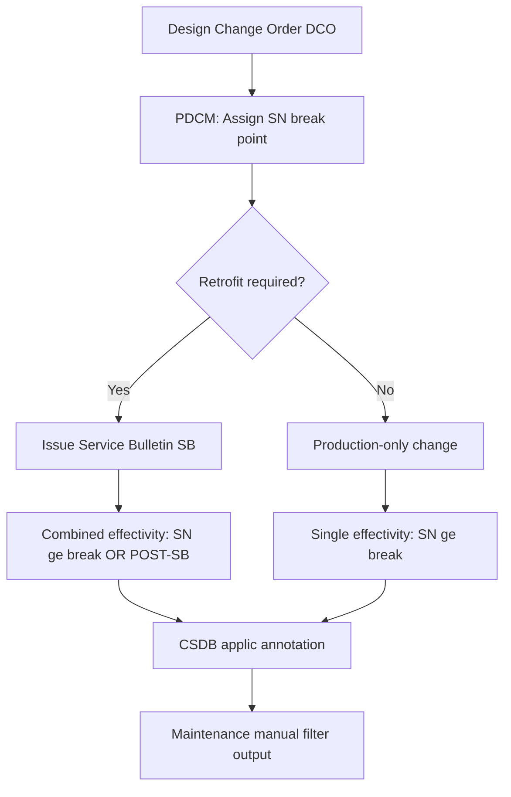

# ATLAS 050-059 · 05.050.050 — Serial Number Block and Production Effectivity

## 1. Purpose

Defines the **serial-number block and production effectivity** framework for AMPEL360 eWTW structural documentation, specifying how production lots are bounded, how structural changes are introduced at defined serial-number break points, and how these effectivities are encoded in the CSDB and maintenance manuals.

## 2. Scope

### 2.1 Context

Production effectivity maps each structural change (driven by a design change order, production concession, or quality escape) to the serial-number range at which it takes effect. Serial-number break points define clear boundaries: aircraft below the break point retain the original structural definition; aircraft at or above the break point incorporate the changed configuration. Where a change is also retrofittable to earlier aircraft via service bulletin, the combined effectivity is expressed as `SN >= break_point OR POST-SB-{number}`.

The PDCM master aircraft register is the system of record for production effectivity. Structural ATLAS documents reference effectivity via the `effectivity` YAML field, which is populated from the PDCM export at each document revision.

### 2.2 Production Effectivity Resolution

### 2.3 Current Structural Break Points (planned)

| Change Ref | Description | SN Break | Retrofit SB |
|---|---|---|---|
| DCO-S-001 | LH₂ tank frame pitch revision (ER) | SN 051 (ER series) | n/a |
| DCO-S-002 | Wing lower spar cap layer increase | SN 026 | SB-050-001 |
| DCO-S-003 | Nose-gear drag-strut titanium upgrade | SN 076 | SB-050-002 |
| DCO-S-004 | Fuselage lap-joint fastener upgrade | SN 101 | SB-050-003 |

## 3. Footprint

| Metric | Value |
|---|---|
| Document ID | `QATL-ATLAS-1000-ATLAS-050-059-05-050-050-SERIAL-NUMBER-BLOCK-AND-PRODUCTION-EFFECTIVITY` |
| Status |  |
| Folder path | `Q+ATLANTIDE/000-099_ATLAS/050-059_Estructuras/050_General/050-050-Applicability-and-Effectivity/` |

## 4. References

[^baseline]: Q+ATLANTIDE Baseline — [`organization/Q+ATLANTIDE.md`](../../../../../organization/Q+ATLANTIDE.md)

| Ref | Document |
|---|---|
| S1000D Issue 5.0 | Effectivity annotation — serial-number ranges |
| ATA iSpec 2200 | Serial-number effectivity management |
| PDCM-AMPEL360-001 | Product Definition and Configuration Management Plan |
| [`./README.md`](./README.md) | Subsubject 050 index |
| [`../README.md`](../README.md) | 050_General subsection index |
