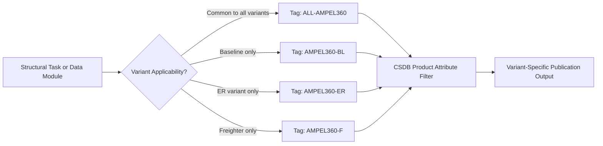

# ATLAS 050-059 · 05.050.050 — Structural Variant and Model Applicability

## 1. Purpose

Defines how structural documentation applicability is scoped to specific **AMPEL360 eWTW variants and model types**, cataloguing the structural differences between the baseline and derivative variants and the rules for selecting the applicable repair schemes, inspection limits, and structural data modules for each model.

## 2. Scope

### 2.1 Context

The AMPEL360 eWTW family is planned to include the baseline medium-haul variant, an extended-range (ER) variant with a strengthened centre-wing box and additional LH₂ tank capacity, and a potential freighter (F) derivative. Each variant introduces structural differences that affect applicable inspection thresholds, repair allowances, and structural limits. These differences are captured in the Structural Variant Difference Register (SVDR), which maps each structural zone and PSE to the variants for which it applies.

Model applicability in the CSDB is encoded using S1000D product attributes and product attribute values, allowing a single publication to deliver variant-specific content to the appropriate operator fleet without maintaining entirely separate document sets.

### 2.2 Variant Applicability Resolution

### 2.3 Structural Variant Differences

| Structural Zone | Baseline | ER Variant | Freighter Variant |
|---|---|---|---|
| Centre-wing box lower panel thickness | 8.0 mm CFRP | 10.5 mm CFRP | 12.0 mm CFRP |
| LH₂ tank attach frame pitch | 635 mm | 500 mm (extra tank) | n/a (no pax tank) |
| Cabin floor beam section | Std 100 × 50 mm | Std 100 × 50 mm | Heavy 150 × 75 mm |
| Fuselage skin gauge (barrel) | 2.2 mm | 2.2 mm | 2.8 mm (cargo loads) |
| MTOW (structural sizing) | 78,000 kg | 85,000 kg | 90,000 kg |

## 3. Footprint

| Metric | Value |
|---|---|
| Document ID | `QATL-ATLAS-1000-ATLAS-050-059-05-050-050-STRUCTURAL-VARIANT-AND-MODEL-APPLICABILITY` |
| Status |  |
| Folder path | `Q+ATLANTIDE/000-099_ATLAS/050-059_Estructuras/050_General/050-050-Applicability-and-Effectivity/` |

## 4. References

[^baseline]: Q+ATLANTIDE Baseline — [`organization/Q+ATLANTIDE.md`](../../../../../organization/Q+ATLANTIDE.md)

| Ref | Document |
|---|---|
| S1000D Issue 5.0 | Product attribute applicability |
| SVDR-AMPEL360-001 | Structural Variant Difference Register |
| [`./README.md`](./README.md) | Subsubject 050 index |
| [`../README.md`](../README.md) | 050_General subsection index |
