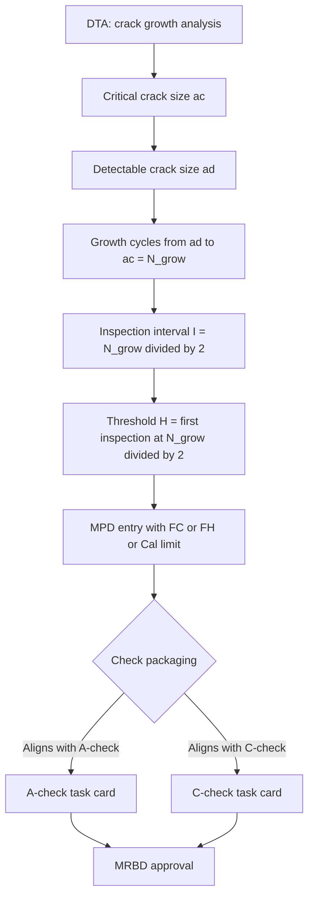

# ATLAS 050-059 · 05.050.060 — Inspection Intervals and Maintenance Planning

## 1. Purpose

Defines the **inspection interval derivation methodology and maintenance planning framework** for [PROGRAMME-AIRCRAFT] [PROGRAMME-VARIANT] structural tasks, covering how DTA-derived thresholds and intervals are translated into the Maintenance Planning Document (MPD), how check packages are built around maintenance check periods, and how the Ageing Aircraft Programme governs interval escalation over fleet life.

## 2. Scope

### 2.1 Context

Structural inspection intervals are derived from DTA per CS-25.571, with the inspection interval set at no more than half the crack-growth life from initial detectable flaw to critical crack size. These intervals are expressed in flight cycles (FC), flight hours (FH), or calendar time, whichever is most limiting for the PSE concerned. For pressurised structure, intervals are typically FC-driven; for fatigue-sensitive zones, FH-driven; for environmental degradation (corrosion, hydrogen embrittlement), calendar-driven.

The Maintenance Planning Document (MPD) aggregates all structural inspection tasks and packages them into check intervals aligned with the operator's maintenance programme (typically A/B/C equivalent or continuous airworthiness maintenance programme — CAMP). The MRB process approves initial intervals; the Ageing Aircraft Programme (AAP) governs interval adjustments based on fleet-wide finding rates reported through the Structural Audit Report (SAR) process.

### 2.2 Interval Derivation and Planning Flow

### 2.3 Structural Check Package Summary

| Check Package | Interval | Structural Scope | Location |
|---|---|---|---|
| Daily / pre-flight | Per flight | Walk-around visual; door seals | Line |
| A-check equivalent | 600–800 FH | General visual; opportunistic access | Line / Base |
| C-check equivalent | 6,000 FH | HFEC lap joints; visual SSI access | Base |
| 2C structural check | 12,000 FH | Detailed CFRP and metallic PSE inspection | Base |
| D-check structural | 24,000 FH | Full structure; LH₂ fittings; spar caps | Depot |

## 3. Footprint

| Metric | Value |
|---|---|
| Document ID | `QATL-ATLAS-1000-ATLAS-050-059-05-050-060-INSPECTION-INTERVALS-AND-MAINTENANCE-PLANNING` |
| Status |  |
| Folder path | `Q+ATLANTIDE/000-099_ATLAS/050-059_Estructuras/050_General/050-060-Maintenance-Concept-General/` |

## 4. References

[^baseline]: Q+ATLANTIDE Baseline — [`organization/Q+ATLANTIDE.md`](../../../../../organization/Q+ATLANTIDE.md)

| Ref | Document |
|---|---|
| CS-25.571 | Inspection interval derivation methodology |
| MSG-3 Rev 3 | Interval packaging and MPD development |
| MRBD-[PROGRAMME-AIRCRAFT]-001 | Maintenance Review Board Document |
| MPD-[PROGRAMME-AIRCRAFT]-050 | Maintenance Planning Document — Structures |
| [`./README.md`](./README.md) | Subsubject 060 index |
| [`../README.md`](../README.md) | 050_General subsection index |
