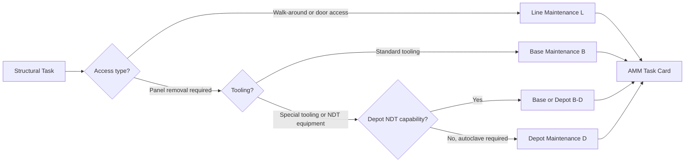

# ATLAS 050-059 · 05.050.060 — Line, Base and Depot Maintenance Boundaries

## 1. Purpose

Defines the **line, base, and depot maintenance level boundaries** for AMPEL360 eWTW structural tasks: which tasks may be accomplished at line (transit/overnight), which require base-maintenance access and tooling, and which require full depot-level disassembly — ensuring that structural maintenance activities are assigned to the capability level at which they can be safely and effectively performed.

## 2. Scope

### 2.1 Context

Maintenance level boundaries for structural tasks are driven by three factors: access complexity (how many panels, fairings, or structural covers must be removed); tooling and equipment requirements (standard vs. special tooling, calibrated NDT equipment); and skill and certification requirements (level 2 NDT certification, composite repair authorisation). The AMPEL360 eWTW's high composite content means that many structural inspections require thermographic or HFEC equipment available only at certified base-maintenance facilities.

Line-maintenance structural tasks are typically limited to visual walk-around checks, minor damage assessment against ADL tables, and opportunistic visual access via already-open doors. Depot-level tasks include wing-spar HFEC inspections requiring full wing-panel removal, LH₂ tank attach-fitting inspections, and major repairs requiring autoclave cure capability.

### 2.2 Maintenance Level Allocation

### 2.3 Structural Task Level Allocation Summary

| Task Type | Level | Access Required | Certification |
|---|---|---|---|
| Visual walk-around (skin, doors) | L | None — external | Cat A line certifier |
| General visual (open-panel access) | B | Standard panel removal | Cat B1/B2 base certifier |
| HFEC lap-joint inspection | B | Panel removal + HFEC probe | Level 2 HFEC + Cat B1 |
| Thermographic CFRP inspection | B | Panel removal + thermographic equipment | Level 2 thermographic |
| LH₂ fitting DPI inspection | D | Full belly-fairing removal | Level 2 DPI + H₂ hazmat cert |
| Wing spar cap HFEC (access panel removed) | D | Wing under-surface panel removal | Level 2 HFEC + authorised inspector |

## 3. Footprint

| Metric | Value |
|---|---|
| Document ID | `QATL-ATLAS-1000-ATLAS-050-059-05-050-060-LINE-BASE-AND-DEPOT-MAINTENANCE-BOUNDARIES` |
| Status |  |
| Folder path | `Q+ATLANTIDE/000-099_ATLAS/050-059_Estructuras/050_General/050-060-Maintenance-Concept-General/` |

## 4. References

[^baseline]: Q+ATLANTIDE Baseline — [`organization/Q+ATLANTIDE.md`](../../../../../organization/Q+ATLANTIDE.md)

| Ref | Document |
|---|---|
| MSG-3 Rev 3 | Maintenance level allocation rules |
| EASA Part-145 | Maintenance organisation approval — capability scopes |
| EASA Part-66 | Aircraft maintenance licence — NDT certifications |
| [`./README.md`](./README.md) | Subsubject 060 index |
| [`../README.md`](../README.md) | 050_General subsection index |
