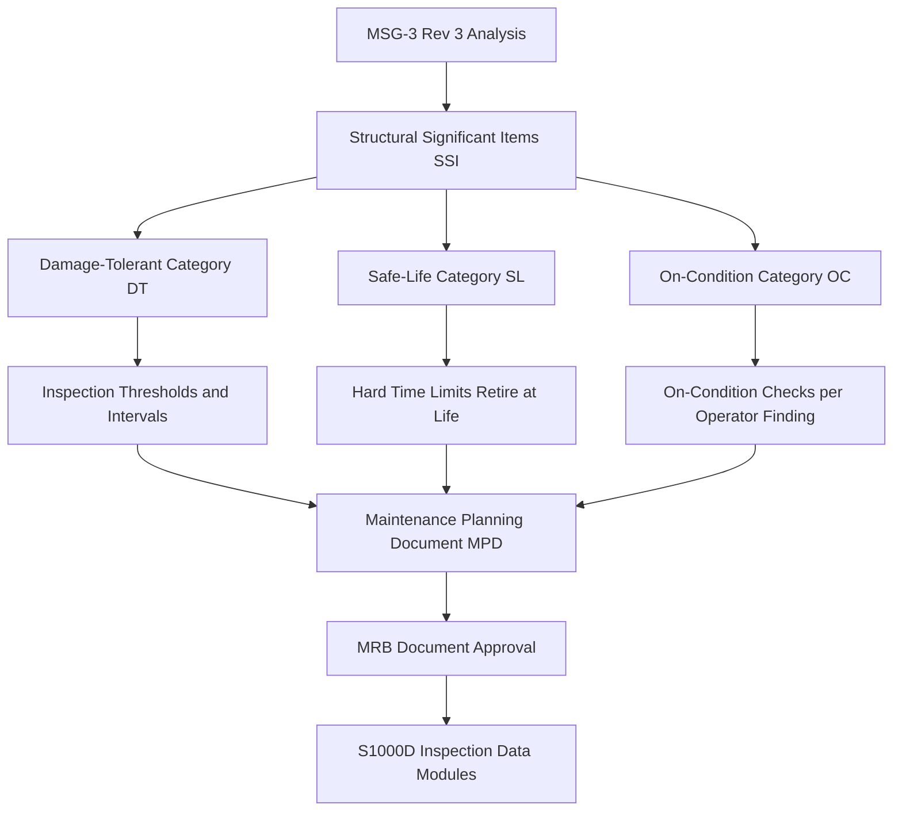

# ATLAS 050-059 · 05.050.060 — Maintenance Concept General Overview

## 1. Purpose

Provides the programme-level overview of the **structural maintenance concept** for the AMPEL360 eWTW: the governing philosophy (MSG-3 damage-tolerant), the maintenance level boundaries (line/base/depot), and the key inputs that shape structural maintenance tasks, inspection intervals, and repair decision logic throughout the aircraft lifecycle.

## 2. Scope

### 2.1 Context

The AMPEL360 eWTW structural maintenance concept is built on the MSG-3 Revision 3 methodology, ensuring that all structural inspection and maintenance tasks are derived from, and traceable to, the damage-tolerance analysis (DTA) for each Principal Structural Element. The design service goal (DSG) of 90,000 flight cycles / 180,000 flight hours sets the outer boundary of the maintenance programme; WFD/MSD assessments extend or govern the programme beyond the DSG where applicable.

The introduction of CFRP primary structure and LH₂ cryogenic fuel systems requires novel inspection techniques — including thermographic imaging for delamination detection and hydrogen-embrittlement monitoring at tank attachment fittings — beyond those used in conventional aluminium primary-structure programmes.

### 2.2 Structural Maintenance Concept Overview

### 2.3 Maintenance Concept Key Parameters

| Parameter | Value |
|---|---|
| Design service goal (DSG) | 90,000 FC / 180,000 FH |
| MSG-3 structural category | Damage-tolerant (primary); safe-life (landing gear primary) |
| Primary structure material | CFRP (≥ 70% by airframe weight) |
| Novel inspection method | Thermographic imaging (CFRP); H₂ embrittlement probe (metal fittings) |
| Minimum inspection check interval (base) | 6,000 FH (approximate A-check equivalent) |
| Major structural inspection check (base/depot) | 24,000 FH (approximate C-check equivalent) |

## 3. Footprint

| Metric | Value |
|---|---|
| Document ID | `QATL-ATLAS-1000-ATLAS-050-059-05-050-060-MAINTENANCE-CONCEPT-GENERAL-OVERVIEW` |
| Status |  |
| Folder path | `Q+ATLANTIDE/000-099_ATLAS/050-059_Estructuras/050_General/050-060-Maintenance-Concept-General/` |

## 4. References

[^baseline]: Q+ATLANTIDE Baseline — [`organization/Q+ATLANTIDE.md`](../../../../../organization/Q+ATLANTIDE.md)

| Ref | Document |
|---|---|
| CS-25.571 | Damage-tolerance and fatigue evaluation |
| MSG-3 Rev 3 | Airline/Manufacturer Maintenance Programme Development |
| MRBD-AMPEL360-001 | Maintenance Review Board Document |
| [`./README.md`](./README.md) | Subsubject 060 index |
| [`../README.md`](../README.md) | 050_General subsection index |
