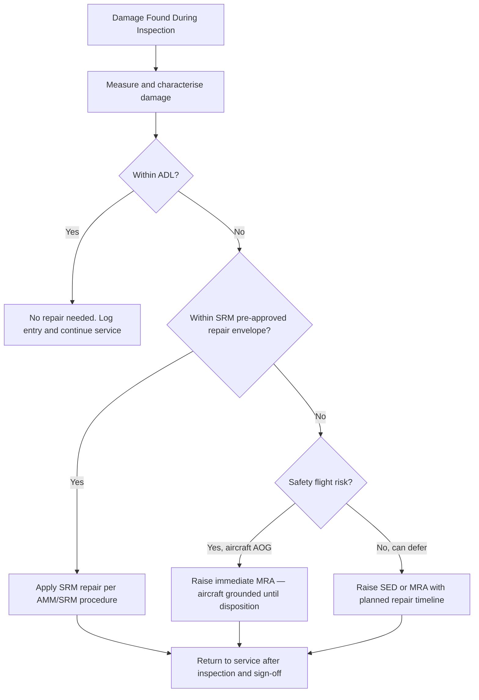

# ATLAS 050-059 · 05.050.060 — Repair Decision Logic and Escalation Rules

## 1. Purpose

Defines the **repair decision logic and escalation rules** for [PROGRAMME-AIRCRAFT] [PROGRAMME-VARIANT] structural damage findings: the decision path from damage discovery through allowable-damage assessment, SRM pre-approved repair selection, and escalation to a Manufacturer Repair Approval (MRA) or engineering disposition when SRM coverage is exceeded.

## 2. Scope

### 2.1 Context

When a structural discrepancy is found during inspection, the maintenance technician must follow a defined decision process to determine the appropriate disposition: the damage may be within the allowable damage limits (ADL) and require no action; it may fall within the SRM pre-approved repair envelope; or it may exceed SRM limits and require escalation to the manufacturer's structural engineering team. Timely escalation is critical: operating an aircraft with damage beyond ADL without a valid engineering disposition is an airworthiness violation.

Escalation paths for CFRP primary structure involve the Structures Damage Tolerance Group (SDTG) and require submission of a completed damage report (including fibre-optic or thermographic imagery) before an MRA is issued. Metallic structure damage beyond SRM limits is escalated via the Structural Engineering Disposition (SED) process.

### 2.2 Repair Decision Flowchart

### 2.3 Escalation Path Summary

| Damage Category | Disposition Path | Response Time |
|---|---|---|
| Within ADL | No action; log book entry | Immediate (no delay) |
| SRM pre-approved | SRM repair procedure | Check period turnaround |
| Beyond SRM — non-critical | SED / MRA requested | Typically 5–10 working days |
| Beyond SRM — safety-critical | Immediate MRA; AOG | < 24 hours response target |
| Novel damage type (no precedent) | SDTG escalation + special inspection | As agreed with EASA |

## 3. Footprint

| Metric | Value |
|---|---|
| Document ID | `QATL-ATLAS-1000-ATLAS-050-059-05-050-060-REPAIR-DECISION-LOGIC-AND-ESCALATION-RULES` |
| Status |  |
| Folder path | `Q+ATLANTIDE/000-099_ATLAS/050-059_Estructuras/050_General/050-060-Maintenance-Concept-General/` |

## 4. References

[^baseline]: Q+ATLANTIDE Baseline — [`organization/Q+ATLANTIDE.md`](../../../../../organization/Q+ATLANTIDE.md)

| Ref | Document |
|---|---|
| CS-25.571 | Structural residual strength requirements |
| SRM-[PROGRAMME-AIRCRAFT]-050 | Structural Repair Manual — Chapter 050 |
| EASA Part-145 | Approved Maintenance Organisation — release to service |
| SED-PROC-[PROGRAMME-AIRCRAFT]-001 | Structural Engineering Disposition Procedure |
| [`./README.md`](./README.md) | Subsubject 060 index |
| [`../README.md`](../README.md) | 050_General subsection index |
