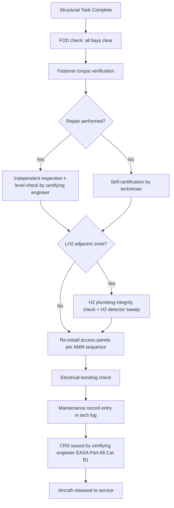

# ATLAS 050-059 · 05.050.060 — Return-to-Service and Close-Up Criteria

## 1. Purpose

Defines the **return-to-service (RTS) and close-up criteria** for [PROGRAMME-AIRCRAFT] [PROGRAMME-VARIANT] structural maintenance tasks: the mandatory inspections, functional tests, and certifications that must be completed and recorded before the aircraft may be released to service following structural work, including the specific RTS requirements following LH₂-system-adjacent structural access.

## 2. Scope

### 2.1 Context

Return-to-service following structural maintenance on the [PROGRAMME-AIRCRAFT] [PROGRAMME-VARIANT] involves a multi-stage close-up process. Standard close-up includes: torque verification of all re-installed structural fasteners; FOD (foreign object debris) inspection of all opened structural bays; restoration of all electrical bonding connections; and verification that all access panels are correctly re-installed and latched. Where structural repairs have been performed, an independent inspection (I-level check) by a certifying engineer is mandatory before close-up.

For any work in LH₂-adjacent structural zones, additional RTS steps are mandatory: H₂ system integrity check (pressure test of the LH₂ plumbing disturbed or adjacent to the work area); H₂ detector sweep of the work zone; and confirmation that all cryogenic seals have been renewed per the AMM.

### 2.2 Return-to-Service Process

### 2.3 Close-Up Criteria Checklist Summary

| Step | Criterion | Mandatory For |
|---|---|---|
| FOD inspection | Zero foreign objects in all opened bays | All structural access |
| Fastener torque | 100% of re-installed fasteners torqued to AMM value | All structural access |
| Independent inspection | Certifying engineer sign-off on repair | Any structural repair |
| H₂ plumbing integrity | Pressure test ≥ 1.1 × MAWP for 15 min | Any LH₂-adjacent work |
| H₂ detector sweep | < 10% LEL at all measurement points | Any LH₂-adjacent work |
| Electrical bonding | Bond resistance < 10 mΩ per AMM table | Any panel disturbing bonding |
| Panel re-installation | All latches, fasteners and seals verified | All structural access |
| CRS issue | EASA Part-66 Cat B1 certifying engineer signature | Release to service |

## 3. Footprint

| Metric | Value |
|---|---|
| Document ID | `QATL-ATLAS-1000-ATLAS-050-059-05-050-060-RETURN-TO-SERVICE-AND-CLOSE-UP-CRITERIA` |
| Status |  |
| Folder path | `Q+ATLANTIDE/000-099_ATLAS/050-059_Estructuras/050_General/050-060-Maintenance-Concept-General/` |

## 4. References

[^baseline]: Q+ATLANTIDE Baseline — [`organization/Q+ATLANTIDE.md`](../../../../../organization/Q+ATLANTIDE.md)

| Ref | Document |
|---|---|
| EASA Part-66 | Aircraft maintenance licence — certifying engineer |
| EASA Part-145 | Approved maintenance organisation — release to service |
| AMM-[PROGRAMME-AIRCRAFT]-050-00-20 | Close-up and RTS procedures — General |
| SC-[PROGRAMME-AIRCRAFT]-LH2-002 | Special Condition — LH₂ RTS integrity requirements |
| [`./README.md`](./README.md) | Subsubject 060 index |
| [`../README.md`](../README.md) | 050_General subsection index |
