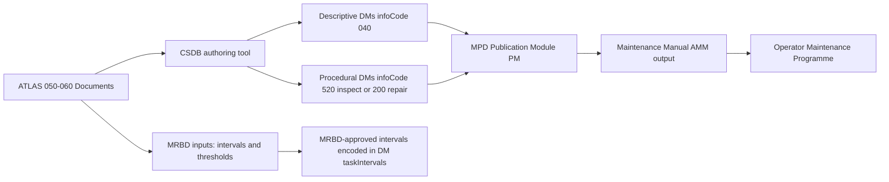

# ATLAS 050-059 · 05.050.060 — S1000D CSDB Mapping and Traceability

## 1. Purpose

Defines the **S1000D data module code (DMC) mapping and CSDB traceability** for all maintenance-concept documentation within subsubject `060`, ensuring that the AMPEL360 eWTW structural maintenance concept is fully represented in the S1000D CSDB with correct information codes, applicability annotations, and cross-references to the Maintenance Planning Document (MPD) and AMM.

## 2. Scope

### 2.1 Context

Subsubject `060` maintenance-concept documents translate into a mix of S1000D information codes: descriptive DMs (infoCode `040`) for philosophical and planning content; procedural DMs (infoCode `520` — inspect) and `200`-series (repair) for task-level procedures referenced from the MPD. The CSDB maintenance-concept module set provides the authoritative reference for how structural maintenance philosophy, level boundaries, access conditions, and RTS criteria are encoded in the publication framework.

All `060`-series DMs are referenced from the Maintenance Planning Document (MPD) publication module and from the applicable AMM chapters. The BREX-AMPEL360-001 Business Rules Exchange Object governs authoring constraints applied to all DMs in this subsubject.

### 2.2 CSDB Maintenance Concept Traceability

### 2.3 DMC Assignment Table — Subsubject 060

| ATLAS Document | DMC (abbreviated) | Info Code | Status |
|---|---|---|---|
| Maintenance-Concept-Overview | `DMC-AMPEL360-A-050-060-00AA-040A-A` | 040 — Description | draft |
| Structural-Maintenance-Philosophy | `DMC-AMPEL360-A-050-060-01AA-040A-A` | 040 — Description | draft |
| Line-Base-Depot-Boundaries | `DMC-AMPEL360-A-050-060-02AA-040A-A` | 040 — Description | draft |
| Access-Preparation-Safety | `DMC-AMPEL360-A-050-060-03AA-520A-A` | 520 — Inspect (prep procedure) | draft |
| Inspection-Intervals-Planning | `DMC-AMPEL360-A-050-060-04AA-040A-A` | 040 — Description | draft |
| Repair-Decision-Logic | `DMC-AMPEL360-A-050-060-05AA-040A-A` | 040 — Description | draft |
| LRU-SRU-Boundaries | `DMC-AMPEL360-A-050-060-06AA-040A-A` | 040 — Description | draft |
| Tools-GSE-Requirements | `DMC-AMPEL360-A-050-060-07AA-040A-A` | 040 — Description | draft |
| Return-to-Service-Criteria | `DMC-AMPEL360-A-050-060-08AA-520A-A` | 520 — Inspect (RTS procedure) | draft |

## 3. Footprint

| Metric | Value |
|---|---|
| Document ID | `QATL-ATLAS-1000-ATLAS-050-059-05-050-060-S1000D-CSDB-MAPPING-AND-TRACEABILITY` |
| Status |  |
| Folder path | `Q+ATLANTIDE/000-099_ATLAS/050-059_Estructuras/050_General/050-060-Maintenance-Concept-General/` |

## 4. References

[^baseline]: Q+ATLANTIDE Baseline — [`organization/Q+ATLANTIDE.md`](../../../../../organization/Q+ATLANTIDE.md)

| Ref | Document |
|---|---|
| S1000D Issue 5.0 | International specification for technical publications |
| BREX-AMPEL360-001 | AMPEL360 Business Rules Exchange Object |
| MPD-AMPEL360-050 | Maintenance Planning Document — Structures |
| MRBD-AMPEL360-001 | Maintenance Review Board Document |
| [`./README.md`](./README.md) | Subsubject 060 index |
| [`../README.md`](../README.md) | 050_General subsection index |
