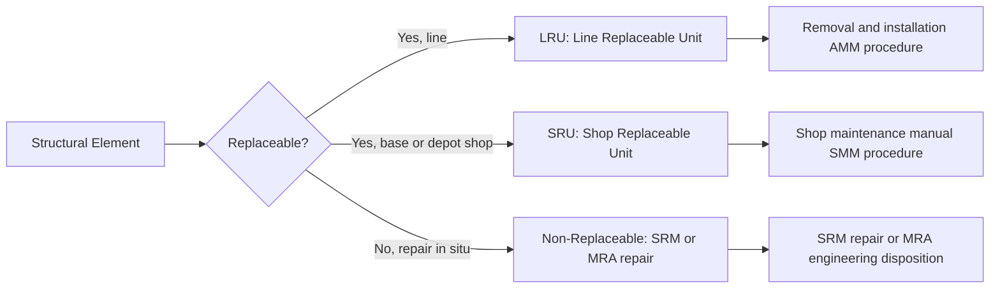

# ATLAS 050-059 · 05.050.060 — Structural LRU, SRU and Assembly Replacement Boundaries

## 1. Purpose

Defines the **Line Replaceable Unit (LRU), Shop Replaceable Unit (SRU), and structural assembly replacement boundaries** for the [PROGRAMME-AIRCRAFT] [PROGRAMME-VARIANT], identifying which structural components are designed for removal and replacement at line or base maintenance, and which require depot-level disassembly or permanent bonded/fastened repair schemes.

## 2. Scope

### 2.1 Context

The [PROGRAMME-AIRCRAFT] [PROGRAMME-VARIANT] structural design maximises replaceability of access panels, secondary fairings, and modular structural attachments to minimise aircraft on-ground (AOG) time. Primary structural elements (wing spar, centre-wing box, main frames) are not LRUs — they are repaired in-situ via SRM or MRA schemes. However, the LH₂ tank assembly is designed as a depot-replaceable unit due to cryogenic seal integrity requirements, and the modular DEP nacelle attachment frames are base-maintainable LRU-level assemblies.

The LRU/SRU classification defines the spares inventory requirements, the RSPL (Recommended Spare Parts List), and the skill and tooling requirements at each maintenance level. It also drives the S1000D data module scope (procedure DMs for LRU removal/installation vs. repair DMs for non-replaceable structure).

### 2.2 Replacement Boundary Classification

### 2.3 Structural LRU / SRU Register (Top Level)

| Item | Classification | Level | Replacement Driver |
|---|---|---|---|
| Access and inspection panels | LRU | Line | Damage or scheduled removal |
| Trailing-edge flap track assembly | LRU | Base | Wear, corrosion, damage |
| DEP nacelle attachment frame | LRU | Base | Fatigue life, damage |
| LH₂ tank assembly | SRU | Depot | Seal integrity, corrosion, life limit |
| Main gear primary fitting | SRU | Depot | Safe-life limit |
| Wing spar cap | Non-replaceable | Depot repair (SRM/MRA) | Damage beyond ADL |
| Centre-wing box lower panel | Non-replaceable | Depot repair (SRM/MRA) | Fatigue or damage |

## 3. Footprint

| Metric | Value |
|---|---|
| Document ID | `QATL-ATLAS-1000-ATLAS-050-059-05-050-060-STRUCTURAL-LRU-SRU-AND-ASSEMBLY-REPLACEMENT-BOUNDARIES` |
| Status |  |
| Folder path | `Q+ATLANTIDE/000-099_ATLAS/050-059_Estructuras/050_General/050-060-Maintenance-Concept-General/` |

## 4. References

[^baseline]: Q+ATLANTIDE Baseline — [`organization/Q+ATLANTIDE.md`](../../../../../organization/Q+ATLANTIDE.md)

| Ref | Document |
|---|---|
| ATA iSpec 2200 | LRU and SRU classification |
| AMM-[PROGRAMME-AIRCRAFT]-050 | Aircraft Maintenance Manual — Structures |
| RSPL-[PROGRAMME-AIRCRAFT]-001 | Recommended Spare Parts List |
| SRM-[PROGRAMME-AIRCRAFT]-050 | Structural Repair Manual |
| [`./README.md`](./README.md) | Subsubject 060 index |
| [`../README.md`](../README.md) | 050_General subsection index |
