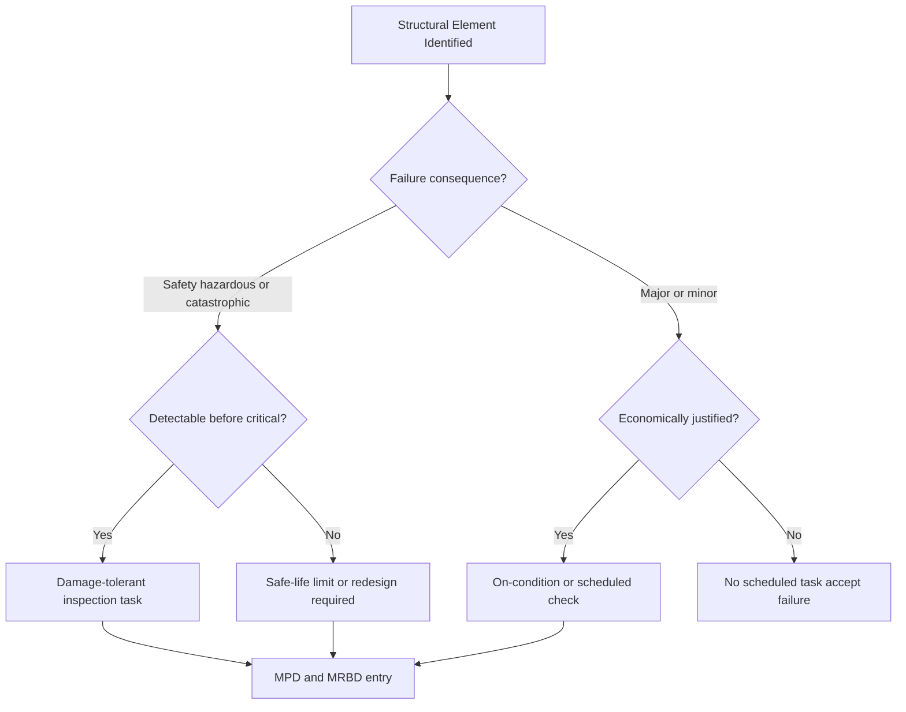

# ATLAS 050-059 · 05.050.060 — Structural Maintenance Philosophy

## 1. Purpose

Defines the **structural maintenance philosophy** underpinning the [PROGRAMME-AIRCRAFT] [PROGRAMME-VARIANT] maintenance programme: the decision principles for MSG-3 task analysis, the damage-tolerant versus safe-life design philosophy for each structural category, and the overarching goals of maintaining airworthiness while minimising unnecessary maintenance burden.

## 2. Scope

### 2.1 Context

The [PROGRAMME-AIRCRAFT] [PROGRAMME-VARIANT] structural maintenance philosophy is governed by three principles: *detect before critical* (damage-tolerant PSEs must be inspectable with adequate margin before any flaw reaches critical size); *minimum necessary intervention* (maintenance tasks are justified only where failure consequences or probability meet MSG-3 criteria); and *data-driven escalation* (inspection intervals may be escalated or de-escalated based on fleet finding rates fed back through the Ageing Aircraft Programme).

These principles are operationalised through the MSG-3 Working Group (MRBWG) process, which produces the Maintenance Planning Document (MPD) and the Maintenance Review Board Document (MRBD) submitted to EASA for approval. The philosophy explicitly rejects scheduled replacement of damage-tolerant primary structure unless DTA demonstrates impracticality of inspection access.

### 2.2 Philosophy Decision Logic

### 2.3 Structural Categorisation by Philosophy

| Structural Category | Maintenance Philosophy | Governing Analysis |
|---|---|---|
| Primary PSE (wing spar, centre box) | Damage-tolerant | CS-25.571 DTA |
| Primary PSE (landing gear primary) | Safe-life | CS-25.571 fatigue spectrum |
| Secondary structural attachments | Damage-tolerant or on-condition | MSG-3 Task Analysis |
| Tertiary / non-structural fairings | On-condition | Visual inspection |
| LH₂ tank attach fittings | Damage-tolerant + leak-before-break | DTA + pressure test |

## 3. Footprint

| Metric | Value |
|---|---|
| Document ID | `QATL-ATLAS-1000-ATLAS-050-059-05-050-060-STRUCTURAL-MAINTENANCE-PHILOSOPHY` |
| Status |  |
| Folder path | `Q+ATLANTIDE/000-099_ATLAS/050-059_Estructuras/050_General/050-060-Maintenance-Concept-General/` |

## 4. References

[^baseline]: Q+ATLANTIDE Baseline — [`organization/Q+ATLANTIDE.md`](../../../../../organization/Q+ATLANTIDE.md)

| Ref | Document |
|---|---|
| CS-25.571 | Damage-tolerance and fatigue evaluation |
| MSG-3 Rev 3 | Section 3 — Structural Task Development |
| CS-25.1309 | Equipment, systems and installations |
| [`./README.md`](./README.md) | Subsubject 060 index |
| [`../README.md`](../README.md) | 050_General subsection index |
