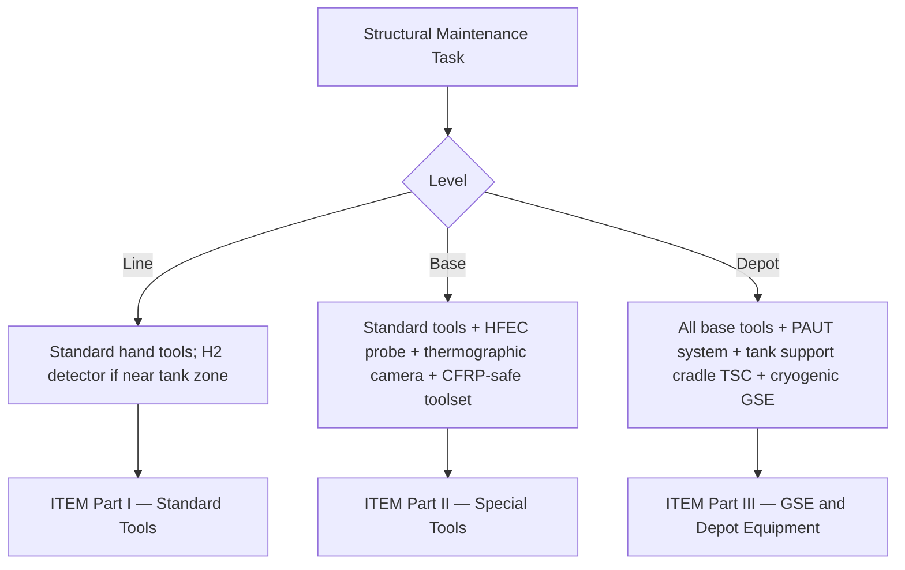

# ATLAS 050-059 · 05.050.060 — Tools, GSE and Special Equipment Requirements

## 1. Purpose

Defines the **tools, ground support equipment (GSE), and special equipment requirements** for [PROGRAMME-AIRCRAFT] [PROGRAMME-VARIANT] structural maintenance tasks, including standard tooling, manufacturer-specific special tools (listed in the Illustrated Tool and Equipment Manual — ITEM), NDT equipment, and the novel H₂ detection and cryogenic-handling GSE required by the LH₂ propulsion system.

## 2. Scope

### 2.1 Context

The [PROGRAMME-AIRCRAFT] [PROGRAMME-VARIANT] introduces several new categories of tooling and GSE not previously required on conventional transport aircraft. The LH₂ fuel system requires cryogenic-rated defuelling equipment, inert-gas purge carts, and calibrated H₂ gas detectors approved for use in proximity to aircraft. The all-CFRP primary structure requires thermographic inspection systems, phased-array ultrasonic (PAUT) equipment, and non-metallic-safe hand tools to avoid foreign-object debris embedding in composite laminates.

Wing-jacking requires CFRP-compatible jack pad adapters (metallic jack pads are prohibited on CFRP skin surfaces). Structure shoring for LH₂ tank access uses a dedicated tank support cradle (TSC-[PROGRAMME-AIRCRAFT]-001) that is controlled as a safety-critical GSE item.

### 2.2 Tool Requirement by Maintenance Level

### 2.3 Special Tools and GSE Summary

| Tool / GSE | Part Number | Application | Level Required |
|---|---|---|---|
| H₂ gas detector (calibrated) | GSE-H2-001 | LH₂ zone access check | L / B / D |
| CFRP thermographic imaging system | SE-TH-001 | CFRP delamination detection | B / D |
| HFEC probe kit (2 MHz, 4 MHz) | SE-HFEC-001 | Metallic and CFRP ply-to-ply HFEC | B / D |
| Phased-array UT system (PAUT) | SE-PAUT-001 | Spar cap and thick laminate inspection | D |
| LH₂ tank support cradle | TSC-[PROGRAMME-AIRCRAFT]-001 | Tank weight support during access | D |
| Wing jack adapter (CFRP-safe) | JA-[PROGRAMME-AIRCRAFT]-001 | Wing jacking without skin damage | B / D |
| Cryogenic defuelling cart | GSE-CRYO-001 | LH₂ defuelling prior to structural access | D |

## 3. Footprint

| Metric | Value |
|---|---|
| Document ID | `QATL-ATLAS-1000-ATLAS-050-059-05-050-060-TOOLS-GSE-AND-SPECIAL-EQUIPMENT-REQUIREMENTS` |
| Status |  |
| Folder path | `Q+ATLANTIDE/000-099_ATLAS/050-059_Estructuras/050_General/050-060-Maintenance-Concept-General/` |

## 4. References

[^baseline]: Q+ATLANTIDE Baseline — [`organization/Q+ATLANTIDE.md`](../../../../../organization/Q+ATLANTIDE.md)

| Ref | Document |
|---|---|
| ITEM-[PROGRAMME-AIRCRAFT]-050 | Illustrated Tool and Equipment Manual — Structures |
| SC-[PROGRAMME-AIRCRAFT]-LH2-002 | Special Condition — LH₂ ground handling safety |
| EASA Part-145 | Equipment requirements for maintenance organisations |
| [`./README.md`](./README.md) | Subsubject 060 index |
| [`../README.md`](../README.md) | 050_General subsection index |
