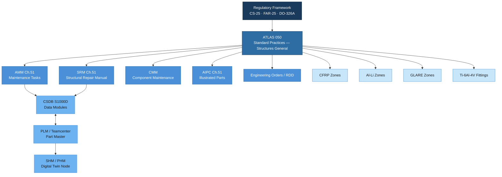

# ATLAS 050-059 · 05.050.000 — Standard Practices — Structures General

## 1. Purpose

This subsubject establishes the overarching framework for all structural standard practices within the AMPEL360/eWTW programme under the Q+ATLANTIDE architecture, corresponding to ATA Chapter 51. It defines the scope, applicability matrix, regulatory basis, and document hierarchy governing structural design, manufacturing, inspection, repair, and in-service monitoring practices. All subordinate subsubjects in the 050 subsection derive their authority and boundary conditions from this general document.

## 2. Scope

### 2.1 Programme Applicability

The Standard Practices — Structures (SPS) framework applies to all structural zones of the AMPEL360 and eWTW (extended Wing Technology Winglet) variants. Applicability is governed by the Aircraft Configuration Table (ACT) within the CSDB and is valid for the following structural zone categories:

| Zone Category | Primary Material | Applicable Variants | SPS Applicability Flag |
|---|---|---|---|
| Fuselage Crown (Sec. 41–43) | CFRP (IM7/8552) | AMPEL360-A, -B | FULL |
| Fuselage Lower (Sec. 44–46) | Al-Li 2198-T8 | AMPEL360-A, -B | FULL |
| Wing Box — Upper | CFRP (IM7/8552) | eWTW-A | FULL |
| Wing Box — Lower | Al-Li 2198-T8 | eWTW-A | FULL |
| Nose Fuselage (Sec. 41) | GLARE 3-3/2-0.3 | AMPEL360-A | PARTIAL |
| Empennage | CFRP (T800/M21) | AMPEL360-A, -B | FULL |
| Fittings & Bulkheads | Ti-6Al-4V (ELI) | All variants | FULL |

### 2.2 Regulatory Framework

The SPS framework is established in full compliance with the following regulatory and advisory documents:

- **EASA CS-25** (Certification Specifications for Large Aeroplanes, Amendment 27) — primary airworthiness basis for structural design and repair.
- **FAA FAR Part 25** — bilateral compliance basis for US market certification under BASA/TCA agreement.
- **EASA CM-S-006** — Certification Memorandum on composite aircraft structure; governs damage tolerance methodology for CFRP zones.
- **DO-326A / ED-202A** — Airworthiness Security Process Specification; structural cybersecurity applicability for SHM-enabled zones.
- **EASA AMC 25.571** — Damage Tolerance and Fatigue Evaluation of Structure.
- **SAE AS7003** — Manufacturing standard for structural composite assemblies.

Deviations from the regulatory baseline require a Deviation Notice (DN) traceable to the programme CMP (Configuration Management Plan).

### 2.3 Document Hierarchy

The SPS documentation stack follows the S1000D Issue 5.0 / ASD-STE100 framework and interfaces with the PLM backbone as follows:

```
Q+ATLANTIDE Baseline (QATL)
  └── ATLAS 050 — Standard Practices Structures
        ├── AMM Chapter 51 (Maintenance tasks — line & base)
        ├── SRM Chapter 51 (Structural Repair Manual)
        ├── CMM relevant chapters (Component Maintenance)
        ├── AIPC Chapter 51 (Illustrated Parts Catalogue)
        └── Engineering Orders (EO) / Repair Design Data (RDD)
```

Documents are authored as S1000D Data Modules (DM) and stored in the Common Source DataBase (CSDB). Cross-reference to PLM is maintained via the Part Master–DM Association Table.

### 2.4 Digital Thread and PLM Interface

All structural standard-practices data modules are linked to the programme Digital Thread through the following integration points:

| Integration Point | Tool/System | Data Exchange Protocol |
|---|---|---|
| Geometry & Drawing | CATIA V5 / 3DEXPERIENCE | STEP AP242 / JT |
| Material Qualification | MSDB (Material Specification DB) | REST API → CSDB |
| PLM Part Structure | Teamcenter | XML/PLCS (ISO 10303-239) |
| Loads & FEM | MSC Nastran / Patran | .op2 → ATLAS HPC bridge |
| SHM Data | SHM Concentrator (AFDX) | ACMS → PHM cloud node |
| Repair Documentation | CSDB (S1000D) | BREX-validated DM packages |

### 2.5 Governance and Change Control

Changes to any SPS subsubject document follow the ATLAS-1000 baseline change process:

1. Engineering Change Request (ECR) raised in PLM.
2. Structural Review Board (SRB) evaluation within 15 working days.
3. Q-STRUCTURES (primary) and Q-INDUSTRY (supporting) sign-off.
4. ORB-LEG legal/IPR clearance for regulatory-impacting changes.
5. Baseline increment (minor: x.y+1.0; major: x+1.0.0).
6. CSDB publication and AMM/SRM synchronisation release.

## 3. Diagram



## 4. Footprint

| Metric | Value |
|---|---|
| Architecture | ATLAS — Aircraft Top Level Architecture Schema/System |
| Master range | 000–099 |
| Code range | 050-059 |
| Section | 05 — Estructuras |
| Subsection | 050 — Standard Practices — Structures |
| Subsubject | 000 — Standard Practices — Structures General |
| Primary Q-Division | Q-STRUCTURES |
| Support Q-Divisions | Q-AIR · Q-INDUSTRY · Q-HPC |
| ORB support | ORB-PMO · ORB-FIN · ORB-LEG |
| Governance class | baseline |
| Folder path | `Q+ATLANTIDE/000-099_ATLAS/050-059_Estructuras/050_Standard-Practices-Structures/` |
| Document | `050-000-Standard-Practices-Structures-General.md` |
| Parent subsection | [`README.md`](./README.md) |
| Cross-ref — AMM | AMM Chapter 51 (Structures Standard Practices) |
| Cross-ref — SRM | SRM Chapter 51 |
| Cross-ref — Regulatory | CS-25, FAR 25, DO-326A |
| Cross-ref — PLM | Teamcenter ATLAS-1000 part structure |

## 5. References & Citations

[^baseline]: Q+ATLANTIDE Baseline Document — `../../../../organization/Q+ATLANTIDE.md`
[^archtable]: ATLAS Architecture Table — `../../README.md`
[^qdiv]: Q-Division Registry — Q-STRUCTURES primary, Q-AIR/Q-INDUSTRY/Q-HPC supporting.
[^gov]: ATLAS Governance Class Definition — baseline implies full SRB/ORB change control.
[^n001]: ATLAS 050 Subsection Index — `../README.md`
[^cs25]: EASA CS-25 Amendment 27 — Certification Specifications for Large Aeroplanes. European Union Aviation Safety Agency, 2023.
[^ata51]: ATA iSpec 2200 Chapter 51 — Standard Practices and Structures. Air Transport Association, 2019.
[^s1000d]: S1000D Issue 5.0 — International specification for technical publications. ASD/AIA/ATA, 2021.
[^do326a]: DO-326A / ED-202A — Airworthiness Security Process Specification. RTCA/EUROCAE, 2014.
