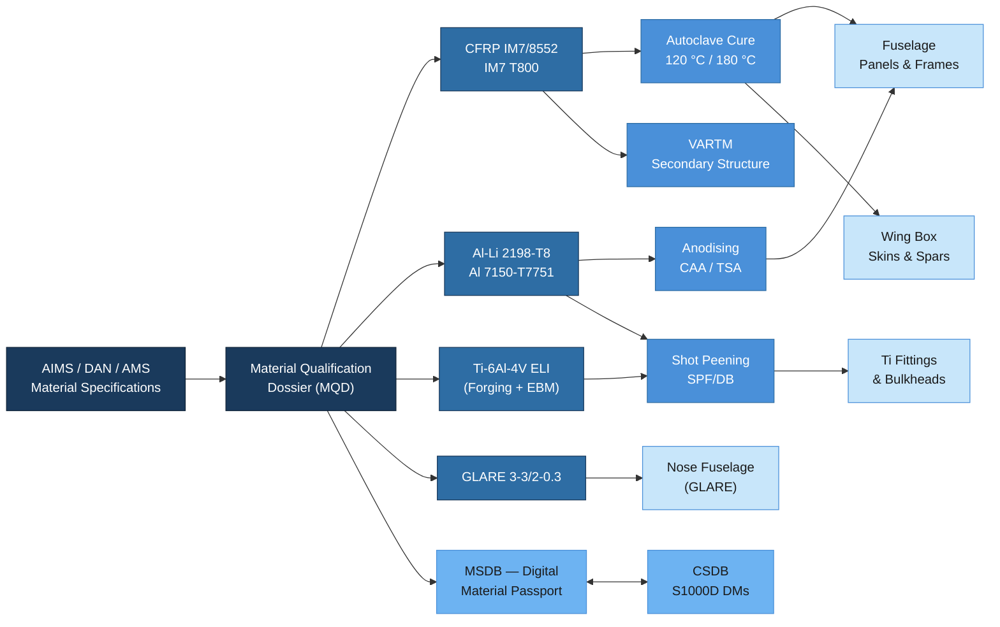

# ATLAS 050-059 · 05.050.010 — Structural Materials and Processes

## 1. Purpose

This subsubject defines the approved structural materials and associated manufacturing processes for all primary and secondary structural zones of the AMPEL360/eWTW programme. It establishes the qualification basis, batch acceptance requirements, and traceability obligations for each material family, and provides the interface to the Digital Material Passport (DMP) within the programme's digital thread. All repair and manufacturing operations on ATLAS-registered structures shall use only materials and processes listed herein unless a formal Deviation Notice (DN) is in force.

## 2. Scope

### 2.1 Primary Structural Materials

The following materials are approved for use in primary structural applications on the eWTW programme. Qualification is held at programme level unless otherwise noted.

| Material | Specification | Structural Zone | Processing Route | Qualification Basis |
|---|---|---|---|---|
| CFRP — IM7/8552 prepreg | AIMS 05-01-002 | Fuselage panels, wing skins, empennage | Autoclave cure (120 °C/180 °C) | EASA/FAA shared test data (6 000+ coupons) |
| CFRP — T800/M21 prepreg | AIMS 05-01-005 | Empennage spars and ribs | Autoclave cure (180 °C) | Airbus TANGO programme heritage |
| Al-Li 2198-T8 sheet/plate | AMS 2770, DAN-05-0041 | Lower wing cover, fuselage frames | CNC machining, shot peen | MMPDS-12 B-basis |
| GLARE 3-3/2-0.3 | AIMS 03-13-001 | Nose fuselage (Sec. 41) | Autoclave / Redux bonded | NLR/Fokker qualification dossier |
| Ti-6Al-4V (ELI) | AMS 4928 / AMS 4965 | Fittings, bulkheads, fasteners | Forging + CNC; EBM additive (secondary) | MMPDS-12 / SAE ARP5765A |
| Al 7150-T7751 plate | AMS 2770 | Keel beam web | CNC machining | MMPDS-12 B-basis |

### 2.2 Material Specifications and Standards

All materials must conform to an approved material specification before purchase order placement. The specification hierarchy is:

1. **AIMS** (Airbus Material Specification) — programme-preferred; traceable to ASTM/ISO test methods.
2. **DAN** (Design Allowable Note) — programme-specific allowable data packages, managed by Q-STRUCTURES.
3. **AMS** (SAE Aerospace Material Specification) — accepted for metallic alloys where AIMS is not defined.
4. **ASTM** — fallback for raw material characterisation testing only; not accepted for production without AIMS/AMS wrapping.

Material Qualification Dossiers (MQD) are stored in the MSDB (Material Specification DataBase) and linked to the CSDB via the DMP-ID field in the relevant Data Modules.

### 2.3 Process Specifications

Manufacturing processes for structural materials require a Process Specification (PS) and a qualified Process Approval (PA) from Q-INDUSTRY before any production use.

| Process | Process Specification | Applicable Material | Key Control Parameters |
|---|---|---|---|
| Autoclave cure — 120 °C | PS-CURE-120-A | IM7/8552 out-of-autoclave | Temp ±2 °C, Pressure ±0.02 MPa, Vacuum ≥ 0.096 MPa |
| Autoclave cure — 180 °C | PS-CURE-180-A | IM7/8552, T800/M21 | Temp ±2 °C, Ramp rate 1–3 °C/min |
| VARTM (Vacuum-Assisted RTM) | PS-VARTM-001 | CFRP secondary structure | Preform permeability, resin pot life, vacuum integrity |
| Chromic Acid Anodise (CAA) | PS-ANOD-CAA-001 | Al alloys (pre-bond) | Voltage, bath temp, coating weight |
| Tartaric Sulphuric Anodise (TSA) | PS-ANOD-TSA-001 | Al alloys (pre-bond, REACH-compliant) | H₂SO₄/tartaric ratio, pH, coating weight |
| Shot peening | PS-PEEN-001 | Al-Li, Ti fittings | Almen intensity, coverage %, media type |
| Diffusion bonding (SPF/DB) | PS-SPF-001 | Ti-6Al-4V complex fittings | Temp, pressure, hold time, vacuum level |

### 2.4 Material Qualification and Batch Acceptance

**Qualification** is a one-time programme activity producing a Qualification Test Report (QTR) and B-basis allowables. The QTR is submitted to EASA as part of the compliance substantiation for CS-25.613.

**Batch acceptance** is a recurring production activity. Each incoming material batch must satisfy:

- Certificate of Conformance (CoC) to the governing specification.
- Material Test Report (MTR) with chemical composition and mechanical properties.
- Incoming Inspection per Q-INDUSTRY Receiving Inspection Plan (RIP-050-010).
- Traceability tag linking batch number to Digital Material Passport (DMP) entry in MSDB.

Non-conforming material is quarantined under NCR (Non-Conformance Record) and dispositioned by Q-STRUCTURES within 10 working days.

### 2.5 Digital Material Passport

Each approved material has a Digital Material Passport (DMP) entry in the MSDB. The DMP contains:

- Material specification reference and revision.
- B-basis / A-basis allowables per environment (RTD, ETW, CTD).
- Qualified supplier list and approved batch history.
- Environmental compliance status (REACH, RoHS, Cr(VI)-free roadmap).
- Link to CSDB DM for in-service data.

The DMP is updated at each material re-qualification event or when a new supplier is qualified.

## 3. Diagram

## 4. Footprint

| Metric | Value |
|---|---|
| Architecture | ATLAS — Aircraft Top Level Architecture Schema/System |
| Master range | 000–099 |
| Code range | 050-059 |
| Section | 05 — Estructuras |
| Subsection | 050 — Standard Practices — Structures |
| Subsubject | 010 — Structural Materials and Processes |
| Primary Q-Division | Q-STRUCTURES |
| Support Q-Divisions | Q-AIR · Q-INDUSTRY · Q-HPC |
| ORB support | ORB-PMO · ORB-FIN · ORB-LEG |
| Governance class | baseline |
| Folder path | `Q+ATLANTIDE/000-099_ATLAS/050-059_Estructuras/050_Standard-Practices-Structures/` |
| Document | `050-010-Structural-Materials-and-Processes.md` |
| Parent subsection | [`README.md`](./README.md) |
| Cross-ref — MSDB | Digital Material Passport — MSDB entries per AIMS/DAN |
| Cross-ref — MMPDS | MMPDS-12 B-basis allowables for metallic alloys |
| Cross-ref — CS-25 | CS-25.613 — Material Strength Properties and Design Values |
| Cross-ref — PLM | Teamcenter material master — linked to CSDB DM |

## 5. References & Citations

[^baseline]: Q+ATLANTIDE Baseline Document — `../../../../organization/Q+ATLANTIDE.md`
[^archtable]: ATLAS Architecture Table — `../../README.md`
[^qdiv]: Q-Division Registry — Q-STRUCTURES primary, Q-AIR/Q-INDUSTRY/Q-HPC supporting.
[^gov]: ATLAS Governance Class Definition — baseline implies full SRB/ORB change control.
[^n001]: ATLAS 050 Subsection Index — `../README.md`
[^mmpds]: MMPDS-12 — Metallic Materials Properties Development and Standardization. AFRL/FAA, 2022.
[^aims]: Airbus Material Specification Index (AIMS) — Airbus SAS, Rev. current at programme PDR.
[^cs25]: EASA CS-25 Amendment 27, Subpart D — Design and Construction; 25.613 Material Strength Properties. EASA, 2023.
[^ata51]: ATA iSpec 2200 Chapter 51 — Standard Practices and Structures. Air Transport Association, 2019.
