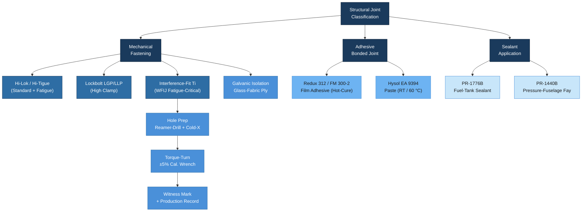

# ATLAS 050-059 · 05.050.020 — Fasteners, Hardware and Joining Practices

## 1. Purpose

This subsubject defines approved fastener families, hardware standards, and joining practices for all structural joints within the AMPEL360/eWTW programme. It covers mechanical fastening (Hi-Lok, Hi-Tigue, Lockbolt), interference-fit titanium systems for fatigue-critical joints, bonded assemblies using qualified adhesive systems (Redux/Hysol), and sealant application requirements per AMS 2650. Dissimilar-metal corrosion prevention and joint verification (torque marking, witness lines) are also addressed. All fastener selections and installation procedures derive their authority from this document unless superseded by a Component Design Standard (CDS) with Q-STRUCTURES concurrence.

## 2. Scope

### 2.1 Approved Fastener Families

The following fastener families are approved for structural use on the programme. Fastener selection is governed by the joint type, base material combination, fatigue classification, and accessibility for installation.

| Fastener Family | Standard | Material | Application | Torque Method |
|---|---|---|---|---|
| Hi-Lok (HL) | NAS1791 / LN9374 | A-286 CRES / Ti-6Al-4V | CFRP-CFRP, CFRP-Al, general structural | Torque-turn (collar shear-off) |
| Hi-Tigue (HLT) | BACB30NX | Ti-6Al-4V (coated) | Fatigue-critical CFRP-CFRP skin splices | Torque-turn — enhanced fatigue rating |
| Lockbolt (LGP/LLP) | BACB30LE | Al 7075 / Ti shank | Wing panels, pressure floor, high-clamp | Pull-type installation tool |
| Cherry Textron (CR) | BACR15CE | Monel / CRES | CFRP access panels, secondary structure | Flush pull-mandrel |
| Huck BOM | MS 20470 / NAS 1398 | CRES A-286 | Pressurised fuselage lap joints | Squeeze set |
| Interference-fit Ti pin | BACP15HG | Ti-6Al-4V | Wing root fitting, WFIJ fatigue-critical holes | Cold-expansion + interference |

Cadmium-plated fasteners are **prohibited** in new design. All fastener coatings shall comply with the programme's Cr(VI)-free / RoHS roadmap.

### 2.2 CFRP-to-Metal Joint Practices

Joints combining CFRP and metallic members require specific engineering controls to prevent galvanic corrosion and protect the laminate during fastener installation:

- **Isolation**: A glass-fabric isolation ply (min. 0.25 mm, per AIMS 05-03-007) is required between CFRP and bare aluminium or steel fittings.
- **Hole preparation**: Reamer-drill to final diameter in a single shot to prevent delamination. Countersink angle tolerance: ±0.5°. Perpendicularity: ≤0.5° to laminate surface.
- **Fastener protrusion**: Maximum 0.5 mm below flush on aerodynamic surfaces; minimum 0 mm.
- **Sealant injection**: Apply PR-1776B (two-part polysulphide, class B) wet-install in all CFRP-to-metal interference holes.
- **Galvanic check**: Any Al fastener in direct contact with CFRP is prohibited. Use Ti or CRES equivalents.

### 2.3 Interference-Fit and Fatigue-Critical Joints

Wing root fittings and Wing Fuselage Interface Joints (WFIJ) are classified as fatigue-critical and require interference-fit installation:

1. **Cold expansion** (Fatigue Technology Inc. Cx process): mandrel oversize 3–4%, verified by strain-gauge rosette in first-article.
2. **Fastener interference**: 0.0254–0.0635 mm (0.001–0.0025 in) for titanium pins in CFRP; 0.0381–0.0762 mm in Al-Li.
3. **Torque-turn verification**: Applied torque measured to ±5% using calibrated digital torque wrench. Results logged in Production Record.
4. **Witness mark**: Torque stripe applied across fastener head and substrate immediately after final torque. Colour code per zone per Q-INDUSTRY colour matrix.

### 2.4 Adhesive Bonded Joints

Bonded structural joints are approved for the following configurations. Bonded-only primary joints require separate SRB approval.

| Adhesive System | Type | Cure Temp | Application | Specification |
|---|---|---|---|---|
| Redux 312 (Hexion) | Film adhesive | 120 °C | CFRP-CFRP co-cure secondary bonds | AIMS 10-06-001 |
| Hysol EA 9394 | Paste | RT / 60 °C | Repair patches, shim bonding | AIMS 10-06-003 |
| FM 300-2 (Cytec / Solvay) | Film adhesive | 175 °C | Primary bonded CFRP panels | AIMS 10-06-005 |
| Araldite 2011 | Paste | RT | Temporary assembly, non-primary | AIMS 10-06-009 |

Surface preparation for all bonded joints: CAA or TSA anodise (metallic) or peel-ply + grit-blast (CFRP); primer (BR-127 or equivalent) applied within 8 hours of surface prep; bond within 72 hours of primer application at RH ≤ 60%.

### 2.5 Sealant Application and Corrosion Avoidance

Sealant application is required in all fuel-tight zones, pressure-tight zones, and faying-surface joints between dissimilar materials:

- **Fuel-tank sealant**: PR-1776B Class A (fillet) and Class B (faying, injection); applied per AMS 2650 and PS-SEAL-001.
- **Pressure-fuselage sealant**: PR-1440B Class B faying surface; applied to all STA frames and stringer clips.
- **Fay-surface corrosion inhibitor**: Mastinox 6856K or SermeTel K applied at all Al-to-Al faying surfaces not already primed.
- **Replenishment interval**: Fuel-zone sealant inspection at C-check (every 6 years); fay-surface CIC at D-check (every 12 years).

## 3. Diagram

## 4. Footprint

| Metric | Value |
|---|---|
| Architecture | ATLAS — Aircraft Top Level Architecture Schema/System |
| Master range | 000–099 |
| Code range | 050-059 |
| Section | 05 — Estructuras |
| Subsection | 050 — Standard Practices — Structures |
| Subsubject | 020 — Fasteners, Hardware and Joining Practices |
| Primary Q-Division | Q-STRUCTURES |
| Support Q-Divisions | Q-AIR · Q-INDUSTRY · Q-HPC |
| ORB support | ORB-PMO · ORB-FIN · ORB-LEG |
| Governance class | baseline |
| Folder path | `Q+ATLANTIDE/000-099_ATLAS/050-059_Estructuras/050_Standard-Practices-Structures/` |
| Document | `050-020-Fasteners-Hardware-and-Joining-Practices.md` |
| Parent subsection | [`README.md`](./README.md) |
| Cross-ref — AMS2650 | AMS 2650 — Sealing Compound Application |
| Cross-ref — AIMS | AIMS 10-06 series — Adhesive film and paste specifications |
| Cross-ref — NAS1791 | NAS 1791 — Hi-Lok fastener standard |
| Cross-ref — CS-25 | CS-25.609 Structural Fasteners; 25.613 Material Properties |

## 5. References & Citations

[^baseline]: Q+ATLANTIDE Baseline Document — `../../../../organization/Q+ATLANTIDE.md`
[^archtable]: ATLAS Architecture Table — `../../README.md`
[^qdiv]: Q-Division Registry — Q-STRUCTURES primary, Q-AIR/Q-INDUSTRY/Q-HPC supporting.
[^gov]: ATLAS Governance Class Definition — baseline implies full SRB/ORB change control.
[^n001]: ATLAS 050 Subsection Index — `../README.md`
[^ata51]: ATA iSpec 2200 Chapter 51 — Standard Practices and Structures. ATA, 2019.
[^ams2650]: AMS 2650 — Application of Sealing Compounds. SAE International, 2021.
[^nas1791]: NAS 1791 / BACP15HG — Fastener installation standards. NAS / Boeing BPS, 2018.
[^cs25609]: EASA CS-25 Amendment 27, 25.609 — Protection of Structure; 25.613 — Material Strength Properties. EASA, 2023.
