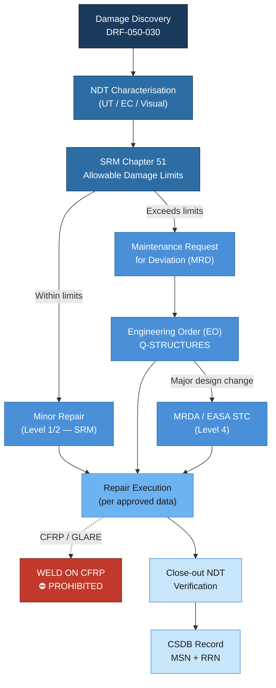

# ATLAS 050-059 · 05.050.030 — Structural Repair General Practices

## 1. Purpose

This subsubject establishes the general framework for structural repair classification, assessment, station qualification, and engineering data flow applicable to all AMPEL360/eWTW structural zones. It defines the authority and responsibilities for repair disposition, the data module structure in S1000D for repair documentation, and the boundaries between SRM-covered repairs and Engineering Order (EO)-based deviations. The document applies to both airline maintenance organisations (Part-145) and the Original Equipment Manufacturer (OEM) repair engineering function.

## 2. Scope

### 2.1 Repair Classification

All structural damage and repairs are classified into one of the following categories before any work begins. Classification determines the required approval authority and documentation path.

| Class | Definition | SRM Coverage | Approval Authority | Documentation |
|---|---|---|---|---|
| Minor | Within SRM limits; no structural analysis required | Yes — SRM Chapter 51 | Maintenance Level 1/2 | Work Order + SRM reference |
| Major (SRM Deviation) | Exceeds SRM limits; structural analysis required; no design change | Partial — SRM limits exceeded | OEM Repair Engineering (Q-STRUCTURES) + EASA Form 1 | MRD → EO → AMM revision |
| Structural Design Change | Permanent modification affecting certification basis | No | OEM Engineering + Competent Authority (EASA STC/MO) | STC supplement or Major Repair Design Approval (MRDA) |
| Temporary Repair | Restores structural function for a limited flight cycle or calendar period | SRM Chapter 51 Appendix T | Maintenance Level 2 + OEM concurrence | Work Order + Temporary Repair Record (TRR) — time-limited |

> **CFRP Zero-Weld Policy**: Welding on any CFRP or GLARE structural element is **unconditionally prohibited**. This policy is not subject to deviation.

### 2.2 Damage Assessment Procedure

Damage assessment follows a structured sequence to ensure consistent classification and prevent initiation of inappropriate repairs:

1. **Initial discovery**: Maintenance technician records damage location, orientation, and preliminary dimensions on a Damage Report Form (DRF-050-030).
2. **NDT characterisation**: Appropriate NDT method selected per ATLAS 050-050 (NDT Practices). Depth, area, and delamination extent are quantified.
3. **Damage sketch / photogrammetry**: Digital sketch or structured-light scan uploaded to CSDB against the tail-number record.
4. **SRM comparison**: Maintenance engineer compares damage against SRM Chapter 51 allowable damage limits for the specific zone and material.
5. **Classification decision**: If within SRM → Minor. If exceeds SRM → contact Q-STRUCTURES OEM Repair Engineering for MRD.
6. **Repair station qualification check**: Verify station capability matches repair class (see §2.3).
7. **Repair execution and close-out**: Repair performed per approved data; NDT verification; close-out inspection; paperwork archived in CSDB.

### 2.3 Repair Station Qualification Levels

Repair stations are qualified by Q-INDUSTRY at four capability levels. Level assignment is based on facility audit, equipment inventory, personnel certification, and demonstrated repair record.

| Level | Scope | Typical Facility | Q-STRUCTURES Oversight |
|---|---|---|---|
| Level 1 | Minor cosmetic and non-structural | Line maintenance (EASA Part-145 basic) | Self-certified per AMM |
| Level 2 | SRM-defined structural repairs (metallic and CFRP patch) | Base maintenance hangar | Periodic audit (annual) |
| Level 3 | EO-based and MRD repairs; composite bonded patch; scarf repairs | Approved Repair Station (ARS) | Review of first-article repair; quarterly audit |
| Level 4 | Major Repair Design Approval (MRDA); EASA Form 1 issuance; new SRM chapter revision | OEM or EASA-approved Design Organisation (Part-21J/G) | Full DOA involvement; continual oversight |

### 2.4 Repair Engineering Data Flow

The data flow from damage discovery to repair close-out follows a defined chain of custody to ensure regulatory traceability:

```
SRM Chapter 51
  └── Damage within limits? → YES → Minor Repair (Level 1/2)
                            → NO  → Maintenance Request for Deviation (MRD)
                                        └── Q-STRUCTURES Repair Engineering Review
                                              └── Engineering Order (EO) issued
                                                    └── AMM / SRM Temporary Revision (TR)
                                                          └── Repair Executed
                                                                └── Close-out NDT → CSDB record
```

All EO-based repairs are assigned a unique Repair Reference Number (RRN) and stored in the CSDB Repair History Module linked to the aircraft serial number (MSN) and tail-number record.

### 2.5 S1000D Data Module Structure for Repairs

Repair documentation within S1000D uses the following information code allocation for ATA 51 / ATLAS 050:

| Information Code | Content | DMC Example |
|---|---|---|
| 040 | Descriptive — damage types and assessment | DMC-AMPEL360-A-051-00-00A-040A-A |
| 200 | Fault isolation / damage reporting | DMC-AMPEL360-A-051-00-00A-200A-A |
| 300 | Examine / Inspect (visual, NDT) | DMC-AMPEL360-A-051-00-00A-300A-A |
| 520 | Repair procedures (metallic + composite) | DMC-AMPEL360-A-051-00-00A-520A-A |
| 940 | Airworthiness Limitations (structural) | DMC-AMPEL360-A-051-00-00A-940A-A |

Temporary repair records are handled via a dedicated Data Module type (DM type code: "TR") with an expiry date encoded in the applicability annotation.

## 3. Diagram



## 4. Footprint

| Metric | Value |
|---|---|
| Architecture | ATLAS — Aircraft Top Level Architecture Schema/System |
| Master range | 000–099 |
| Code range | 050-059 |
| Section | 05 — Estructuras |
| Subsection | 050 — Standard Practices — Structures |
| Subsubject | 030 — Structural Repair General Practices |
| Primary Q-Division | Q-STRUCTURES |
| Support Q-Divisions | Q-AIR · Q-INDUSTRY · Q-HPC |
| ORB support | ORB-PMO · ORB-FIN · ORB-LEG |
| Governance class | baseline |
| Folder path | `Q+ATLANTIDE/000-099_ATLAS/050-059_Estructuras/050_Standard-Practices-Structures/` |
| Document | `050-030-Structural-Repair-General-Practices.md` |
| Parent subsection | [`README.md`](./README.md) |
| Cross-ref — SRM | SRM Chapter 51 — Structural Repair Manual |
| Cross-ref — S1000D | S1000D Issue 5.0 — DM information codes 040/200/300/520/940 |
| Cross-ref — CS-25 | CS-25.571 — Damage Tolerance and Fatigue Evaluation |
| Cross-ref — Part-145 | EASA Part-145 — Maintenance Organisation Approvals |

## 5. References & Citations

[^baseline]: Q+ATLANTIDE Baseline Document — `../../../../organization/Q+ATLANTIDE.md`
[^archtable]: ATLAS Architecture Table — `../../README.md`
[^qdiv]: Q-Division Registry — Q-STRUCTURES primary, Q-AIR/Q-INDUSTRY/Q-HPC supporting.
[^gov]: ATLAS Governance Class Definition — baseline implies full SRB/ORB change control.
[^n001]: ATLAS 050 Subsection Index — `../README.md`
[^s1000d]: S1000D Issue 5.0 — International specification for technical publications using a Common Source DataBase. ASD/AIA/ATA, 2021.
[^cs25571]: EASA CS-25 Amendment 27, 25.571 — Damage-Tolerance and Fatigue Evaluation of Structure. EASA, 2023.
[^ata51]: ATA iSpec 2200 Chapter 51 — Standard Practices and Structures. ATA, 2019.
[^part145]: EASA Part-145 — Continuing Airworthiness Management Organisations. Commission Regulation (EU) No 1321/2014.
