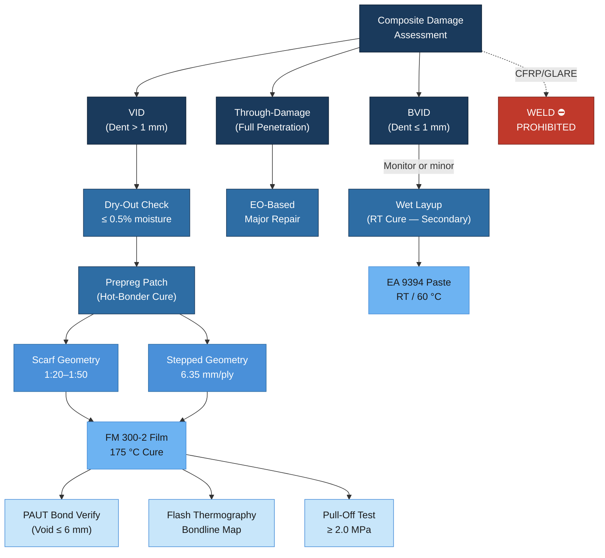

# ATLAS 050-059 · 05.050.040 — Composite Repair and Bonding Practices

## 1. Purpose

This subsubject defines the approved methods, materials, and qualification requirements for composite structural repair and adhesive bonding on CFRP and GLARE structural zones of the AMPEL360/eWTW programme. It addresses damage classification from a composite-damage-tolerance standpoint (BVID, VID, through-damage), specifies wet-layup and prepreg patch repair procedures, prescribes hot-bonder cure cycles, defines scarf and stepped repair geometry, and establishes non-destructive verification requirements for bond quality. Room-temperature cure limitations and moisture ingress management before repair are also covered.

## 2. Scope

### 2.1 Composite Damage Tolerance Classification

Composite structural damage is classified in accordance with CS-25 Appendix X and EASA CM-S-006 into the following categories, each triggering a specific repair response:

| Damage Category | Definition | Detection Method | Required Action |
|---|---|---|---|
| BVID (Barely Visible Impact Damage) | Dent depth ≤ 1.0 mm; impact energy below threshold of reliable visual detection | NDT (UT phased array) at scheduled inspection | No immediate repair required; monitor per DT analysis |
| VID (Visible Impact Damage) | Dent depth > 1.0 mm; visible to unaided eye at standard inspection distance (1.5 m) | Visual inspection + UT | Repair before next flight or within AOG time limit per SRM |
| Through-Damage | Full penetration of laminate; all plies severed | Visual (obvious) + UT boundary | Aircraft grounded; EO-based major repair |
| Delamination (sub-surface) | Interlaminar separation not visible externally | UT phased array / thermography | Assess extent; if within SRM limits → monitor; if exceeds → repair |
| Impact with moisture ingress | Damage creating voids allowing water infiltration | Flash thermography (pre-repair) | Mandatory dry-out before any bonded repair |

### 2.2 Wet Layup and Prepreg Patch Repairs

Two patch repair routes are approved, selected based on repair classification, available equipment, and structural criticality.

**Wet Layup (Room-Temperature Cure)**:
- Applicable to secondary structure (non-primary) and BVID repairs where elevated-temperature cure is impractical.
- Resin system: Araldite LY 1564 / HY 1564 (Huntsman) or equivalent AIMS 10-02-approved system.
- Maximum structural use: 8 plies (equivalent thickness ≤ 3.0 mm); higher ply counts require EO approval.
- **Limitation**: Wet-layup repairs must not be applied to fuel-tank walls, pressure-fuselage primary skin, or wing spar caps without specific EO approval.
- Cure cycle: 24 h at 20–25 °C then post-cure 1 h at 60 °C minimum (where accessible).

**Prepreg Patch (Hot-Bonder Cure)**:
- Applicable to primary structure and all VID / delamination repairs.
- Material: IM7/8552 prepreg (AIMS 05-01-002) or approved RT-storage prepreg for on-wing use.
- Cure via certified hot-bonder (Heatcon HMS-4 or equivalent, calibrated per PS-HOTBOND-001):
  - Ramp: 1–3 °C/min
  - Dwell: 120 °C / 90 min (co-cure) or 180 °C / 120 min (full-cure)
  - Vacuum: ≥ 0.085 MPa absolute throughout cure
  - Cool-down: ≤ 3 °C/min to 60 °C before vacuum release

### 2.3 Scarf and Stepped Repair Geometry

Scarf and stepped repairs are the two approved load-transfer geometries for bonded patch repair of primary CFRP structure:

**Scarf Repair**:
- Preferred for aerodynamic surfaces (smooth outer surface restoration).
- Scarf angle: 1:20 to 1:50 (taper ratio) depending on load level and laminate thickness. Steeper angles (1:20) for lightly loaded zones only.
- Ply-by-ply material matching: each repair ply must match the fibre orientation of the removed parent ply.
- Maximum depth: full laminate depth; core zones require additional face-sheet doubler.

**Stepped Repair**:
- Preferred for thick laminates (> 6 mm) and repair patches where scarf machining would risk adjacent structure.
- Step size: minimum 6.35 mm per ply step; step height = 1 ply nominal thickness.
- Surface preparation of each step: grit-blast (80-grit aluminium oxide) to Sa 2.5 immediately before adhesive application.

| Parameter | Scarf | Stepped |
|---|---|---|
| Aerodynamic surface penalty | None (flush) | Minor step offset |
| Preferred laminate thickness | < 6 mm | > 6 mm |
| Damage area max | 150 mm diameter | 250 mm × 200 mm |
| Load transfer efficiency | High | Moderate–high |

### 2.4 Adhesive Film and Paste Systems for Bonded Repair

| Adhesive | Form | Cure | Peel Strength | Shear Strength | Primary Use |
|---|---|---|---|---|---|
| Cytec FM 300-2 | Film (0.06 psf) | 175 °C / 60 min | ≥ 80 N/25 mm | ≥ 40 MPa | Primary bonded repair patches |
| Hysol EA 9394 | Paste | RT or 60 °C | ≥ 40 N/25 mm | ≥ 30 MPa | Secondary repair, BVID fills |
| 3M AF 163-2 | Film | 120 °C | ≥ 70 N/25 mm | ≥ 35 MPa | On-wing medium-temp repairs |

**Moisture management**: All CFRP repair zones must be dried to ≤ 0.5% moisture content by weight (measured by microwave moisture meter per PS-MOISTURE-001) before adhesive application. Drying procedure: heat blanket at 70 °C for minimum 8 h; verify by moisture probe.

### 2.5 Non-Destructive Verification of Bond Quality

Post-repair NDT is mandatory for all bonded repairs on primary structure. Accepted methods:

- **Phased-array UT (PAUT)**: Bond-line porosity, voids > 6 mm diameter are reject criteria. Acceptance per SRM Chapter 51 NDT appendix.
- **Resonance (coin tap / mechanical impedance)**: Acceptable for secondary structure only; max detectable flaw size 25 mm².
- **Thermographic inspection**: Active flash thermography for bondline uniformity check; thermal map archived in CSDB.
- **Pull-off test**: Destructive witness coupon required for every hot-bonder cure batch; minimum 2.0 MPa tensile pull-off.

## 3. Diagram

## 4. Footprint

| Metric | Value |
|---|---|
| Architecture | ATLAS — Aircraft Top Level Architecture Schema/System |
| Master range | 000–099 |
| Code range | 050-059 |
| Section | 05 — Estructuras |
| Subsection | 050 — Standard Practices — Structures |
| Subsubject | 040 — Composite Repair and Bonding Practices |
| Primary Q-Division | Q-STRUCTURES |
| Support Q-Divisions | Q-AIR · Q-INDUSTRY · Q-HPC |
| ORB support | ORB-PMO · ORB-FIN · ORB-LEG |
| Governance class | baseline |
| Folder path | `Q+ATLANTIDE/000-099_ATLAS/050-059_Estructuras/050_Standard-Practices-Structures/` |
| Document | `050-040-Composite-Repair-and-Bonding-Practices.md` |
| Parent subsection | [`README.md`](./README.md) |
| Cross-ref — CS-25 | CS-25 App X; EASA CM-S-006 Composite DT methodology |
| Cross-ref — AIMS | AIMS 05-01-002 (IM7/8552 prepreg); AIMS 10-02 (wet resin) |
| Cross-ref — SRM | SRM Chapter 51 — CFRP repair NDT acceptance criteria |
| Cross-ref — MSG-3 | MSG-3 Rev 2015.1 — Composite structural inspection intervals |

## 5. References & Citations

[^baseline]: Q+ATLANTIDE Baseline Document — `../../../../organization/Q+ATLANTIDE.md`
[^archtable]: ATLAS Architecture Table — `../../README.md`
[^qdiv]: Q-Division Registry — Q-STRUCTURES primary, Q-AIR/Q-INDUSTRY/Q-HPC supporting.
[^gov]: ATLAS Governance Class Definition — baseline implies full SRB/ORB change control.
[^n001]: ATLAS 050 Subsection Index — `../README.md`
[^cms006]: EASA CM-S-006 Issue 1 — Certification Memorandum: Composite Aircraft Structure. EASA, 2010.
[^cs25571]: EASA CS-25 Amendment 27, App X — Composite Structure Damage Tolerance. EASA, 2023.
[^aims0501]: AIMS 05-01-002 — IM7/8552 Carbon Fibre Prepreg Material Specification. Airbus SAS.
[^msg3]: MSG-3 Rev 2015.1 — Operator/Manufacturer Scheduled Maintenance Development. ATA, 2015.
