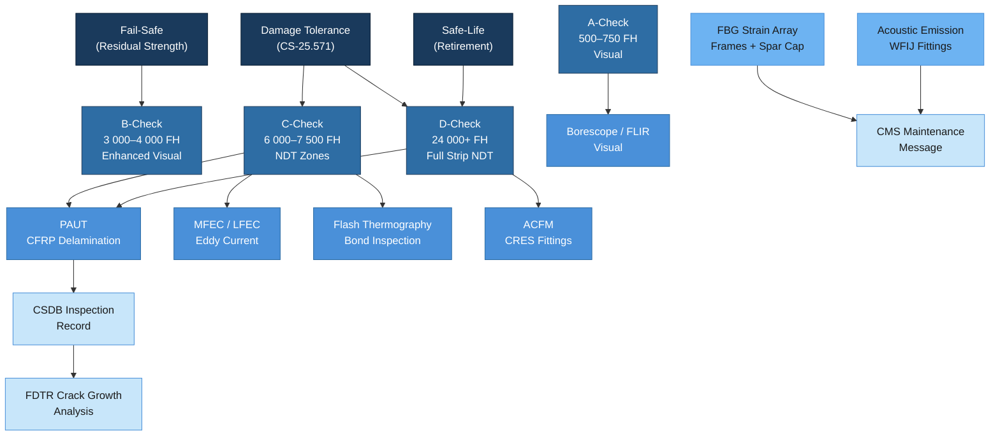

# ATLAS 050-059 · 05.050.050 — Inspection, NDT and Damage-Tolerance Practices

## 1. Purpose

This subsubject defines the structural inspection programme basis, approved NDT methods, and damage-tolerance analysis framework for the AMPEL360/eWTW programme in accordance with CS-25.571, MSG-3 (Rev 2015.1), and EASA AMC 25.1309. It establishes inspection intervals for A/B/C/D check escalation, specifies approved NDT techniques and their minimum detectable flaw sizes, addresses EWIS (Electrical Wiring Interconnection System) structural inspection zones, and defines the integration of Structural Health Monitoring (SHM) sensor data into the inspection programme. The document applies to all primary and secondary structural zones registered in the CSDB.

## 2. Scope

### 2.1 Inspection Programme Basis

The structural inspection programme for the AMPEL360/eWTW is based on three complementary design philosophies as defined by MSG-3 Rev 2015.1 and CS-25.571:

| Philosophy | Applicability | Key Requirement | AMPEL360 Zones |
|---|---|---|---|
| Damage Tolerance (DT) | All primary CFRP and metallic structure | Detectable crack/delamination before two-flight growth to critical size | Wing box, fuselage frames, WFIJ |
| Safe-Life | Landing gear, engine mounts (fatigue-only failure) | Mandatory retirement life (no inspection credit) | Nose gear fork, main gear axle |
| Fail-Safe | Secondary structure with alternative load paths | Partial failure must be detectable before residual strength falls below limit load | Fuselage floor beams, cargo panels |

Inspection intervals are derived from the DT analysis and validated by the MSG-3 Structures Working Group (SWG). All intervals are expressed in flight cycles (FC) and flight hours (FH), with the more restrictive controlling.

### 2.2 Inspection Check Escalation

| Check Level | Nominal Interval | Structural Focus Areas | Access Level |
|---|---|---|---|
| A-Check | 500–750 FH (every ~6 weeks) | Visual — fuselage skin exterior, leading edge, drain mast condition | Line maintenance |
| B-Check | 3 000–4 000 FH (every ~6 months) | Enhanced visual — frame bays, window surrounds, cargo door surrounds, EWIS clamps | Base maintenance (partial access) |
| C-Check | 6 000–7 500 FH (every ~18 months) | NDT — wing-root zone, WFIJ, fuselage lap joints, pressure bulkhead, fuel-tank walls | Full base maintenance |
| D-Check | 24 000–30 000 FH (every ~12 years) | Full strip-down NDT — all primary zones, fatigue life reset tasks, corrosion survey | Heavy maintenance facility |

C- and D-check intervals are subject to MSG-3 escalation approval based on fleet-wide data and Q-STRUCTURES concurrence.

### 2.3 Approved NDT Methods

The following NDT methods are approved for structural inspection on the AMPEL360/eWTW programme. Method selection for each zone is defined in the Task Card (TC) within the CSDB.

| Method | Standard | Minimum Detectable Flaw | Applicable Zones | Qualification |
|---|---|---|---|---|
| Phased-Array Ultrasonic Testing (PAUT) | EN 4179 / NAS 410 Level 2 | 6 mm ∅ delamination in CFRP at 20 mm depth | CFRP wing skins, fuselage panels, bonded joints | Level 2 UT + PAUT endorsement |
| Multi-Frequency Eddy Current — MFEC | EN 4179 Level 2 | 1.5 mm surface crack in CFRP-to-metal interface | CFRP-to-metal joints, frame bays | Level 2 ET |
| Low-Frequency Eddy Current — LFEC | EN 4179 Level 2 | Corrosion thinning > 10% in Al-Li skin | Al-Li lower wing skin-stringer bonds | Level 2 ET (LFEC endorsement) |
| Active Flash Thermography (AFT) | ASTM E2582 | 12 mm ∅ delamination at ≤ 5 mm depth | CFRP outer panels, GLARE, repair patch verification | Certified thermographer (Level 2) |
| Alternating Current Field Measurement (ACFM) | BSEN 16018 | 3 mm surface crack in steel/CRES fittings | Ti and CRES fittings, pylon attachments | ACFM qualified (Level 2) |
| Borescope / FLIR visual | MIL-STD-1689A | Visible damage, fluid ingress, general condition | Fuel tank interiors, sealed zones, ECS ducts | Level 1 (Part-66 Cat B1/B2) |
| Fibre Bragg Grating (SHM) | IEC 61757-1-1 | Strain anomaly > 3σ from baseline | Fuselage frames, wing spar caps (SHM-fitted) | SHM system operator certification |

### 2.4 Damage-Tolerance Analysis per CS-25.571

The DT analysis programme for ATLAS-registered structures is documented in the Fatigue and Damage Tolerance Report (FDTR-AMPEL360-050) and covers:

- **Crack growth analysis**: AFGROW / FASTRAN software; baseline spectrum from the Design and Certification Analysis (DCA) dispersed load spectrum.
- **Initial flaw size**: Per EASA AMC 25.571 — 0.05 inch (1.27 mm) edge crack for metallic zones; BVID for CFRP zones.
- **Inspection threshold**: 50% of crack growth life from initial flaw to detectable size.
- **Inspection interval**: 50% of remaining life from detectable to critical (two-inspection rule).
- **Residual strength**: Limit load sustained for 5 s with assumed damage at the end of the inspection interval.

Damage tolerance findings affecting type design require notification to EASA within 14 days per Part-21.A.3(b).

### 2.5 SHM Sensor Integration

Structural Health Monitoring sensors supplement but do not replace certified NDT methods unless a specific SHM-as-inspection credit is approved by EASA via Special Condition.

| SHM Sensor | Location | Output | PHM Integration |
|---|---|---|---|
| FBG strain array | Fuselage frames Sec. 43–46; wing spar cap at Rib 5/10/20 | Strain (με), temperature | Real-time anomaly alert → CMS maintenance message |
| Acoustic emission (AE) | WFIJ Ti fittings, primary longerons | AE event rate, energy | Fleet-wide AE trend → RUL estimation |
| Piezo-electric PWAS | CFRP bonded joints (secondary) | Guided-wave attenuation | Delamination growth tracking |

SHM data is stored in the PHM cloud node and synchronised with the structural digital twin at each flight cycle. Anomalies exceeding the alert threshold trigger a maintenance message to the Centralised Maintenance System (CMS) via AFDX.

## 3. Diagram

## 4. Footprint

| Metric | Value |
|---|---|
| Architecture | ATLAS — Aircraft Top Level Architecture Schema/System |
| Master range | 000–099 |
| Code range | 050-059 |
| Section | 05 — Estructuras |
| Subsection | 050 — Standard Practices — Structures |
| Subsubject | 050 — Inspection, NDT and Damage-Tolerance Practices |
| Primary Q-Division | Q-STRUCTURES |
| Support Q-Divisions | Q-AIR · Q-INDUSTRY · Q-HPC |
| ORB support | ORB-PMO · ORB-FIN · ORB-LEG |
| Governance class | baseline |
| Folder path | `Q+ATLANTIDE/000-099_ATLAS/050-059_Estructuras/050_Standard-Practices-Structures/` |
| Document | `050-050-Inspection-NDT-and-Damage-Tolerance-Practices.md` |
| Parent subsection | [`README.md`](./README.md) |
| Cross-ref — CS-25 | CS-25.571 — Damage Tolerance and Fatigue Evaluation |
| Cross-ref — MSG-3 | MSG-3 Rev 2015.1 — Structures Task development |
| Cross-ref — EN4179 | EN 4179 / NAS 410 — NDT Personnel Qualification |
| Cross-ref — SHM | ATLAS 050-080 — Structures Monitoring and Diagnostics |

## 5. References & Citations

[^baseline]: Q+ATLANTIDE Baseline Document — `../../../../organization/Q+ATLANTIDE.md`
[^archtable]: ATLAS Architecture Table — `../../README.md`
[^qdiv]: Q-Division Registry — Q-STRUCTURES primary, Q-AIR/Q-INDUSTRY/Q-HPC supporting.
[^gov]: ATLAS Governance Class Definition — baseline implies full SRB/ORB change control.
[^n001]: ATLAS 050 Subsection Index — `../README.md`
[^cs25571]: EASA CS-25 Amendment 27, 25.571 — Damage Tolerance and Fatigue Evaluation of Structure. EASA, 2023.
[^msg3]: MSG-3 Rev 2015.1 — Operator/Manufacturer Scheduled Maintenance Development. ATA, 2015.
[^nas410]: NAS 410 / EN 4179 — Qualification and Approval of Non-destructive Testing Personnel. AIA / AECMA, 2022.
[^amc25571]: EASA AMC 25.571 — Damage-Tolerance and Fatigue Evaluation of Structure — Acceptable Means of Compliance. EASA, 2023.
