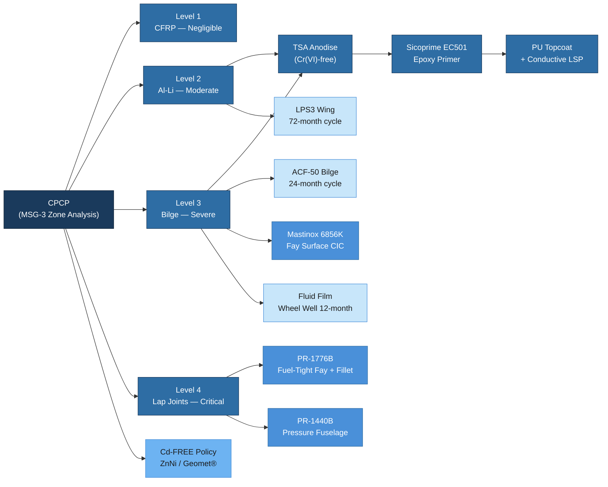

# ATLAS 050-059 · 05.050.060 — Corrosion Protection, Sealing and Surface Treatment

## 1. Purpose

This subsubject defines the Corrosion Prevention and Control Programme (CPCP) for the AMPEL360/eWTW programme in accordance with MSG-3 Rev 2015.1 and EASA AMC 20-20. It establishes the approved surface treatment matrix (anodising, conversion coating, primer, topcoat), sealant application zones and materials, cadmium-free fastener policy, and Corrosion Inhibiting Compound (CIC) application and replenishment intervals. The CPCP is a baseline programme that all maintenance organisations and repair stations must comply with to preserve structural airworthiness over the designed economic service life of 60 000 FC / 90 000 FH.

## 2. Scope

### 2.1 Corrosion Prevention and Control Programme (CPCP)

The CPCP is structured per MSG-3 Zone Analysis and classifies the airframe into corrosion levels based on environmental exposure, material susceptibility, and drainage characteristics:

| Corrosion Level | Zone Examples | Inspection Driver | Treatment Standard |
|---|---|---|---|
| Level 1 (Negligible) | CFRP crown panels (no drain trap) | D-check visual survey | Topcoat maintained; no periodic CIC |
| Level 2 (Moderate) | Al-Li lower wing structure, fuselage floor | C-check enhanced visual + LFEC | Annual CIC replenishment; TSA primer intact |
| Level 3 (Severe) | Bilge zone (Sec. 44–46 lower), wheel well | A-check visual drain check; C-check LFEC + UT | Semiannual CIC; enhanced drain inspection |
| Level 4 (Critical) | Lap joints, WFIJ interface, drain channel | C/D-check NDT + chemical strip | Full surface treatment re-application at D-check |

All CPCP tasks are encoded as S1000D Data Modules (info code 300 — Examine / Inspect) and included in the CSDB-published Maintenance Planning Document (MPD).

### 2.2 Surface Treatment Matrix

The approved surface treatment sequence for aluminium alloys and metallic components follows a layered protection system:

| Layer | Treatment | Specification | Applicable Material | Notes |
|---|---|---|---|---|
| 1 — Pre-treatment | Degreasing (MEK or Brulin 815GD) | PS-CLEAN-001 | All metallic | REACH-compliant solvent |
| 2 — Conversion coat | Chromic Acid Anodise (CAA) | PS-ANOD-CAA-001 / AMS 2470 | Al alloys — non-structural bond surfaces | Being phased to TSA by 2027 |
| 2 — Conversion coat | Tartaric Sulphuric Anodise (TSA) | PS-ANOD-TSA-001 / EN 4704 | Al alloys — preferred (Cr(VI)-free) | Programme standard from PDR |
| 2 — Conversion coat | Bonderite C-IC 1132 (Alodine equiv.) | PS-CHEM-001 / MIL-DTL-5541 Class 2 | Al alloys — areas not anodised | Touch-up and field repair |
| 3 — Primer | Sicoprime EC501 (epoxy-polyamide) | PS-PRIMER-001 / AIMS 04-04-001 | All metallic | Chromate-free; 50–75 µm DFT |
| 3 — Primer | BR-127 (Cytec) | PS-PRIMER-002 | Pre-bond surfaces (before film adhesive) | 1–2 µm DFT; 8 h pot life |
| 4 — Topcoat | Sikkens Aerodur 2K/3K PU | PS-TOPCOAT-001 / AIMS 04-05-001 | External aerodynamic surfaces | Colour per livery spec |
| 4 — Conductive topcoat | SEM Aeroshield CU topcoat | PS-TOPCOAT-002 | Lightning-strike protection zones (CFRP) | Surface resistivity ≤ 1 kΩ/sq |

### 2.3 Sealant Application Zones

Sealant is applied in three functional categories, each requiring a specific compound and application method:

**Fuel-Tight Zones (Wing Box, Centre Tank)**:
- Compound: PR-1776B Class A (fillet bead) and Class B (faying surface wet-install).
- Application: faying surfaces coated with Class B within 2 h of assembly; all fastener holes injected with Class B; fillet beads applied within 4 h of assembly closure.
- Specification: AMS 2650E; PS-SEAL-FUEL-001.
- Re-sealing trigger: any C-check fuel leak finding or fuel-zone structural repair.

**Pressure-Tight Zones (Pressurised Fuselage)**:
- Compound: PR-1440B Class B faying surface; PR-1776B Class A fillet at frame-to-skin attachments.
- Application: all frame clip faying surfaces; stringer-to-frame intersections; pressure bulkhead edge seal.
- Specification: AMS 2650E; PS-SEAL-PRES-001.

**Fay-Surface Corrosion Inhibiting Joints**:
- Compound: Mastinox 6856K (chromate-free) or SermeTel K at Al-to-Al faying surfaces.
- Application: brush-applied to dry faying surface before assembly; no cure required; sealed under fastener clamp.

### 2.4 Cadmium-Free Fastener Policy

The programme operates a **cadmium-prohibition policy** aligned with EU REACH Regulation (EC) 1907/2006. No cadmium-plated fasteners are approved for new design or as replacement parts:

| Prohibited Coating | Approved Replacement | Standard |
|---|---|---|
| Cadmium (Cd) plating | Zinc-Nickel (ZnNi 8–15%) | AMS 2417 |
| Cadmium (Cd) plating | Geomet® 500 / Dacromet | ASTM F1470 |
| Chromate sealcoat | Alocrom 1200 alternative | MIL-DTL-5541 Cl.2 |

Existing legacy fasteners in Cd plating discovered during D-check are replaced under the Cadmium Replacement Programme (CRP-050-060) managed by Q-INDUSTRY.

### 2.5 CIC Application and Replenishment Intervals

Corrosion Inhibiting Compounds (CIC) are applied to enclosed structural cavities and bilge zones at manufacture and replenished at the following scheduled intervals:

| Zone | CIC Product | Initial Application | Replenishment Interval |
|---|---|---|---|
| Fuselage bilge (Sec. 44–46) | ACF-50 or Corrosion X HD | Manufacture | 24 months (C-check) |
| Wing lower cover (Al-Li) | LPS 3 Heavy Duty | Manufacture | 72 months (extended C-check) |
| Wheel well structure | Fluid Film AS | Manufacture | 12 months (B-check) |
| Flap track / slat mechanism | Shell Ensis SX | Manufacture | 24 months |
| Sealed frame cavities | Dinitrol 3125 | Manufacture | D-check (12 years) |

CIC application is documented on a dedicated Task Card (TC info code 312 — Lubricate/Service). Volume applied and product batch number are recorded in the CSDB.

## 3. Diagram

## 4. Footprint

| Metric | Value |
|---|---|
| Architecture | ATLAS — Aircraft Top Level Architecture Schema/System |
| Master range | 000–099 |
| Code range | 050-059 |
| Section | 05 — Estructuras |
| Subsection | 050 — Standard Practices — Structures |
| Subsubject | 060 — Corrosion Protection, Sealing and Surface Treatment |
| Primary Q-Division | Q-STRUCTURES |
| Support Q-Divisions | Q-AIR · Q-INDUSTRY · Q-HPC |
| ORB support | ORB-PMO · ORB-FIN · ORB-LEG |
| Governance class | baseline |
| Folder path | `Q+ATLANTIDE/000-099_ATLAS/050-059_Estructuras/050_Standard-Practices-Structures/` |
| Document | `050-060-Corrosion-Protection-Sealing-and-Surface-Treatment.md` |
| Parent subsection | [`README.md`](./README.md) |
| Cross-ref — MSG-3 | MSG-3 Rev 2015.1 — CPCP Zone Analysis |
| Cross-ref — AMS2650 | AMS 2650E — Sealant Application for Aerospace |
| Cross-ref — REACH | EU REACH Reg. (EC) 1907/2006 — Cd prohibition |
| Cross-ref — AMC20-20 | EASA AMC 20-20 — Continuing Structural Integrity Programme |

## 5. References & Citations

[^baseline]: Q+ATLANTIDE Baseline Document — `../../../../organization/Q+ATLANTIDE.md`
[^archtable]: ATLAS Architecture Table — `../../README.md`
[^qdiv]: Q-Division Registry — Q-STRUCTURES primary, Q-AIR/Q-INDUSTRY/Q-HPC supporting.
[^gov]: ATLAS Governance Class Definition — baseline implies full SRB/ORB change control.
[^n001]: ATLAS 050 Subsection Index — `../README.md`
[^msg3]: MSG-3 Rev 2015.1 — Operator/Manufacturer Scheduled Maintenance Development. ATA, 2015.
[^amc2020]: EASA AMC 20-20 — Continuing Structural Integrity Programme. EASA, 2019.
[^ams2650]: AMS 2650E — Application of Sealing Compounds. SAE International, 2021.
[^reach]: Regulation (EC) No 1907/2006 — Registration, Evaluation, Authorisation and Restriction of Chemicals (REACH). EU, 2006.
