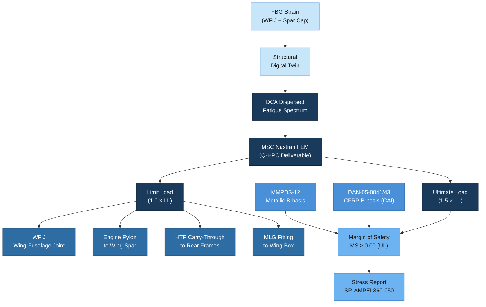

# ATLAS 050-059 · 05.050.070 — Structural Loads, Interfaces and Allowables

## 1. Purpose

This subsubject defines the structural loads basis, primary load transfer paths, material allowables sources, and margin of safety calculation methodology applicable to all primary structural zones of the AMPEL360/eWTW programme. It establishes the interface between the flight loads model (MSC Nastran FEM deliverables), the DCA dispersed fatigue spectrum, and the structural design and certification process under CS-25. The document also addresses ground loads per CS-25.473 and specifies the correlation method between SHM in-service strain data and the design loads envelope.

## 2. Scope

### 2.1 Structural Loads Basis

All primary structural design is based on the following load condition categories:

| Load Category | Definition | Factor | CS-25 Reference |
|---|---|---|---|
| Limit Load (LL) | Maximum load expected in service (1-per-10⁻⁵ probability) | 1.0 | CS-25.301 |
| Ultimate Load (UL) | Limit load multiplied by factor of safety | 1.5 × LL | CS-25.303 |
| Fatigue Spectrum | DCA dispersed load spectrum — 60 000 FC design goal | N/A | CS-25.571 |
| Proof Load | Pressure vessel / hydraulic system test load | 1.1 × LL | CS-25.843 |
| Ground Manoeuvre Load | Taxiing, hard landing, towing, jacking | Per CS-25.473–CS-25.509 | CS-25.473 |

The DCA (Design and Certification Analysis) dispersed load spectrum is generated by the Flight Loads group (Q-AIR) using stochastic Monte Carlo dispersion of the standard mission profile and delivered to Q-STRUCTURES as an .op2 file from MSC Nastran for fatigue crack growth analysis.

### 2.2 Primary Load Transfer Paths

Load transfer paths define the route by which external aerodynamic and inertial loads are redistributed through the primary structure to ground reaction points. The following primary paths are established for the AMPEL360:

| Interface | Load Path Description | Primary Structural Elements | FEM Node Set |
|---|---|---|---|
| Wing-Fuselage Interface Joint (WFIJ) | Wing bending moment + shear → fuselage frames | WFIJ Ti fittings, frames FR42–FR48, spar ends | SET-WFIJ-001 |
| Engine Pylon to Wing | Thrust, vertical, side loads → wing front spar | Pylon attach fittings, front spar chord, rib 5/6 | SET-ENG-PYLON-001 |
| Tail to Fuselage (HTP) | Elevator pitching loads → rear pressure bulkhead / frames | HTP carry-through, FR70–FR74, keel beam | SET-HTP-001 |
| Tail to Fuselage (VTP) | Rudder lateral loads → fuselage torsion box | VTP spar → FR70–FR76 circumferential shear panels | SET-VTP-001 |
| Nose Gear to Fuselage | Ground reaction → nose gear beam + frames FR15–FR20 | Nose gear dragbrace, keel beam, FR15–FR20 | SET-NLG-001 |
| Main Landing Gear (MLG) | Ground reaction → wing box / centre wingbox | MLG fitting, wing main spar, centre wingbox rib | SET-MLG-001 |

### 2.3 Material Allowables Sources

Structural allowables are derived from the following qualification sources. Usage of an allowable at a design load case requires that the material lot meets the corresponding qualification requirements.

| Material | Allowables Source | Basis | Environment | Notes |
|---|---|---|---|---|
| Al-Li 2198-T8 | MMPDS-12 Chapter 3 | B-basis | RTD, ETW (82 °C), CTD (−54 °C) | MMPDS statistically derived; batch acceptance per §2.4 of 050-010 |
| Al 7150-T7751 | MMPDS-12 Chapter 3 | B-basis | RTD, ETW | Keel beam; standard aerospace alloy |
| Ti-6Al-4V (ELI) forging | MMPDS-12 Chapter 5 | B-basis | RTD, ETW | Fatigue allowables from MMPDS-12 §5.4 |
| CFRP IM7/8552 | Programme DAN-05-0041 | B-basis (open hole, filled hole, bearing, shear, interlaminar) | RTW, ETW, CTD | Derived from 6 000+ test coupons; EASA-accepted |
| CFRP T800/M21 | Programme DAN-05-0043 | B-basis | RTW, ETW | Empennage; Airbus TANGO heritage |
| GLARE 3-3/2-0.3 | NLR Report NLR-CR-2007-085 | B-basis | RTD, ETW | Nose fuselage; fatigue allowables from certified dossier |

Allowables are temperature- and environment-adjusted using knockdown factors defined in the respective DAN documents. Compression-after-impact (CAI) allowables for CFRP zones are derived at BVID equivalent impact energy (15 J typical) and constitute the design-driving compression allowable for damage-tolerant sizing.

### 2.4 Margin of Safety Calculation

The programme-standard margin of safety (MS) is calculated per:

```
MS = (Allowable Load or Stress) / (Applied Load or Stress × Fitting Factor × Scatter Factor) − 1
```

Where:
- **Fitting Factor**: 1.15 for single-bolt joints; 1.0 for multi-path joints (CS-25.625).
- **Scatter Factor**: 1.0 for B-basis allowables; 1.15 for mean (typical) allowables.
- **MS ≥ 0.00** required for ultimate load cases; **MS ≥ 0.10** recommended for metallic fatigue-sensitive elements.
- Negative MS triggers an Engineering Change Request (ECR) to Q-STRUCTURES within 5 working days.

All MS calculations are documented in the Stress Report (SR-AMPEL360-050-xxx) maintained in the programme Engineering Records database and linked to the relevant ATLAS document via the CSDB.

### 2.5 SHM Correlation with Loads Envelope

SHM strain data from FBG arrays is used to validate and update the loads envelope in service:

| SHM Output | Design Model Input | Correlation Metric | Alert Threshold |
|---|---|---|---|
| FBG strain at WFIJ (με) | Nastran node SET-WFIJ-001 reaction forces | Strain-to-load transfer function (TF) per calibration flight | > 110% of DCA LL strain for 3 consecutive flights |
| FBG at wing spar cap Rib 5 | Wing root bending moment | Linear regression R² ≥ 0.98 required | > 105% DCA LL |
| AE event rate at Ti fittings | Fatigue spectrum usage factor | AE cumulative energy vs predicted cycle count | AE energy > 2σ above fleet median |

Correlation results are reviewed by Q-STRUCTURES at each MPD revision cycle (every 2 years) and fed into the structural digital twin for loads envelope updates.

## 3. Diagram



## 4. Footprint

| Metric | Value |
|---|---|
| Architecture | ATLAS — Aircraft Top Level Architecture Schema/System |
| Master range | 000–099 |
| Code range | 050-059 |
| Section | 05 — Estructuras |
| Subsection | 050 — Standard Practices — Structures |
| Subsubject | 070 — Structural Loads, Interfaces and Allowables |
| Primary Q-Division | Q-STRUCTURES |
| Support Q-Divisions | Q-AIR · Q-INDUSTRY · Q-HPC |
| ORB support | ORB-PMO · ORB-FIN · ORB-LEG |
| Governance class | baseline |
| Folder path | `Q+ATLANTIDE/000-099_ATLAS/050-059_Estructuras/050_Standard-Practices-Structures/` |
| Document | `050-070-Structural-Loads-Interfaces-and-Allowables.md` |
| Parent subsection | [`README.md`](./README.md) |
| Cross-ref — MMPDS | MMPDS-12 Metallic Materials Properties and Standardization |
| Cross-ref — CS-25 | CS-25.301/303/571/473/625 — Loads and Strength |
| Cross-ref — FEM | MSC Nastran FEM deliverables — Q-HPC ATLAS bridge |
| Cross-ref — SHM | ATLAS 050-080 — Structures Monitoring and Diagnostics |

## 5. References & Citations

[^baseline]: Q+ATLANTIDE Baseline Document — `../../../../organization/Q+ATLANTIDE.md`
[^archtable]: ATLAS Architecture Table — `../../README.md`
[^qdiv]: Q-Division Registry — Q-STRUCTURES primary, Q-AIR/Q-INDUSTRY/Q-HPC supporting.
[^gov]: ATLAS Governance Class Definition — baseline implies full SRB/ORB change control.
[^n001]: ATLAS 050 Subsection Index — `../README.md`
[^mmpds]: MMPDS-12 — Metallic Materials Properties Development and Standardization. AFRL/FAA, 2022.
[^cs25]: EASA CS-25 Amendment 27, Subpart C — Structure; 25.301, 25.303, 25.473, 25.571, 25.625. EASA, 2023.
[^dan0041]: Programme DAN-05-0041 — CFRP IM7/8552 Design Allowable Note, B-basis. Q-STRUCTURES, 2022.
[^nastran]: MSC Nastran 2021.4 Reference Manual. MSC Software Corporation, 2021.
