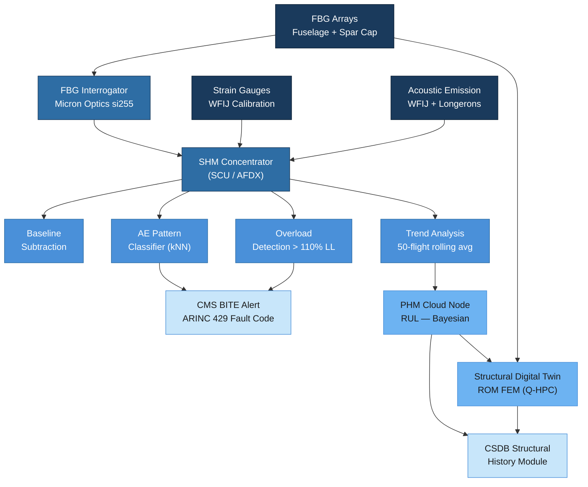

# ATLAS 050-059 · 05.050.080 — Structures Monitoring, Diagnostics and Control Interfaces

## 1. Purpose

This subsubject defines the Structural Health Monitoring (SHM) architecture, data acquisition strategy, diagnostics processing, and Prognostics and Health Management (PHM) framework for the AMPEL360/eWTW programme. It specifies the sensor types, their placement on fuselage frames and wing spar caps, the data acquisition path via the AFDX SHM concentrator, edge-processing algorithms for anomaly detection, and the interface to the Centralised Maintenance System (CMS) for maintenance alert generation. Fleet-wide data aggregation, remaining useful life (RUL) estimation for fatigue-critical locations, and synchronisation with the structural digital twin are also addressed.

## 2. Scope

### 2.1 SHM Architecture Overview

The SHM system on the AMPEL360/eWTW is a distributed sensing network organised into three layers:

| Layer | Function | Components | Communication |
|---|---|---|---|
| Sensor Layer | Physical signal acquisition from structural locations | FBG arrays, AE sensors, PWAS, strain gauges | Optical fibre (FBG) / shielded coax (AE/PWAS) |
| Edge Processing Layer | Signal conditioning, feature extraction, anomaly detection | SHM Concentrator Unit (SCU) per zone | AFDX (ARINC 664 Part 7) |
| Fleet PHM Layer | RUL estimation, fleet trending, digital twin sync | PHM cloud node + structural digital twin | ACMS → ground server (ACARS / secure VPN) |

The SHM system is designed as a **supplemental** monitoring tool. It does not replace certified NDT inspection intervals unless an EASA-approved Special Condition for SHM-as-inspection credit is in force.

### 2.2 Sensor Types and Placement

#### Fibre Bragg Grating (FBG) Arrays

FBG sensors provide distributed strain and temperature monitoring with ±2 με resolution. Placement is based on the critical locations identified in the FDTR fatigue analysis (ATLAS 050-070):

| Location | Number of FBG Points | Monitored Parameter | FDTR Critical Location ID |
|---|---|---|---|
| Fuselage frames FR42–FR48 (WFIJ zone) | 24 (4 per frame) | Hoop strain, bending strain | CL-WFIJ-01 to CL-WFIJ-06 |
| Wing lower spar cap — Rib 5, 10, 20 | 12 (4 per rib) | Axial strain (bending load) | CL-WSC-01 to CL-WSC-03 |
| Pressure bulkhead rim — FR74 | 8 | Circumferential strain | CL-PBH-01 |
| Fuselage lap joint zone — Sec. 44 | 16 | Skin shear strain | CL-LAP-01 to CL-LAP-04 |

FBG interrogator units (Micron Optics si255 or equivalent, certified per DO-160G) are installed in the avionics bay and polled at 1 Hz nominal / 100 Hz during manoeuvre-load events detected by the flight data bus trigger.

#### Acoustic Emission (AE) Sensors

Piezo-ceramic AE sensors monitor fatigue-crack initiation and growth in metallic fittings:

| Location | Sensor Count | Threshold | Alert Condition |
|---|---|---|---|
| WFIJ Ti-6Al-4V fittings (4 locations) | 8 (2 per fitting) | 45 dB AE threshold | Cumulative AE energy > 2σ fleet median |
| Primary longerons FR42–FR44 | 4 | 45 dB | Event rate > 10 events/FC for 3 consecutive FC |
| Engine pylon drag-strut attach | 2 | 50 dB | Any single event > 80 dB |

#### Strain Gauges (WFIJ Calibration)

Bonded foil strain gauges at WFIJ provide the calibration reference for the FBG transfer function established during the structural ground test (SGT):

- Type: Vishay CEA-06-500UW-350 (350 Ω, uniaxial).
- Bridge configuration: quarter-bridge with temperature compensation.
- Active during SGT and first 500 FC in-service for FBG correlation; decommissioned thereafter unless anomaly triggers reactivation.

### 2.3 Data Acquisition via AFDX SHM Concentrator

Each SHM zone (WFIJ, Wing, Pressure Bulkhead, Lap-Joint) has a dedicated SHM Concentrator Unit (SCU):

- **SCU hardware**: Thales SHM-SCU-400 or equivalent; AFDX ARINC 664 Part 7 dual-star network.
- **Sampling rates**: FBG — 1 Hz background, 100 Hz triggered; AE — continuous 500 kHz.
- **Data latency**: FBG alert generation ≤ 200 ms from event; AE ≤ 50 ms.
- **Data storage**: Onboard 32 GB non-volatile flash per SCU; rolling 30-day buffer; full download at gate via ACMS.
- **Cybersecurity**: AES-256 encryption on AFDX SHM sub-network; DO-326A threat assessment completed (DO-326A SA-5 level).

### 2.4 Edge Processing and Anomaly Detection

The SCU performs the following real-time processing before transmitting alerts to CMS:

1. **Baseline subtraction**: Subtract ground/cold-soak baseline strain state recorded at each power-up.
2. **Overload detection**: Flag any FBG reading exceeding 110% of DCA LL strain threshold (from 050-070 loads database).
3. **Trend analysis**: 50-flight rolling average strain amplitude; alert if trend slope exceeds ±5 με/100 FC.
4. **AE pattern classification**: Fast Fourier Transform (FFT) + wavelet decomposition; k-nearest-neighbour (kNN) classifier distinguishes crack signatures from noise (rain, galley impact, turbulence).
5. **Alert message generation**: ARINC 429 maintenance word → CMS BITE fault code per ATLAS BITE allocation table (BAT-050-080).

### 2.5 PHM: Remaining Useful Life and Digital Twin Synchronisation

The PHM cloud node ingests SHM data from the entire AMPEL360 fleet to compute:

| PHM Output | Method | Update Frequency | Stakeholder |
|---|---|---|---|
| RUL — WFIJ fatigue | Paris Law crack growth, Bayesian updating with FBG strain history | Every 500 FC | Q-STRUCTURES, Operator MPD |
| RUL — Wing spar cap | Miner's rule, spectrum counting via rain-flow from FBG | Every 500 FC | Q-STRUCTURES |
| Fleet load severity index | Median vs design spectrum comparison per tail number | Monthly | Q-AIR, Q-STRUCTURES |
| Digital twin strain field | FEM model updating (reduced-order model) with FBG inputs | Each flight cycle | Q-HPC structural twin node |

Digital twin synchronisation uses a reduced-order FEM model (ROM, 150 000 DOF vs 8 M DOF full model) resident on the Q-HPC cloud node. FBG strain inputs update the ROM boundary conditions; ROM outputs updated stress fields and remaining life are stored in the CSDB structural history module.

## 3. Diagram

## 4. Footprint

| Metric | Value |
|---|---|
| Architecture | ATLAS — Aircraft Top Level Architecture Schema/System |
| Master range | 000–099 |
| Code range | 050-059 |
| Section | 05 — Estructuras |
| Subsection | 050 — Standard Practices — Structures |
| Subsubject | 080 — Structures Monitoring, Diagnostics and Control Interfaces |
| Primary Q-Division | Q-STRUCTURES |
| Support Q-Divisions | Q-AIR · Q-INDUSTRY · Q-HPC |
| ORB support | ORB-PMO · ORB-FIN · ORB-LEG |
| Governance class | baseline |
| Folder path | `Q+ATLANTIDE/000-099_ATLAS/050-059_Estructuras/050_Standard-Practices-Structures/` |
| Document | `050-080-Structures-Monitoring-Diagnostics-and-Control-Interfaces.md` |
| Parent subsection | [`README.md`](./README.md) |
| Cross-ref — AFDX | ARINC 664 Part 7 — AFDX network specification |
| Cross-ref — DO-326A | DO-326A — Airworthiness Security (SHM cybersecurity) |
| Cross-ref — Loads | ATLAS 050-070 — Structural Loads, Interfaces and Allowables |
| Cross-ref — NDT | ATLAS 050-050 — Inspection, NDT and Damage-Tolerance Practices |

## 5. References & Citations

[^baseline]: Q+ATLANTIDE Baseline Document — `../../../../organization/Q+ATLANTIDE.md`
[^archtable]: ATLAS Architecture Table — `../../README.md`
[^qdiv]: Q-Division Registry — Q-STRUCTURES primary, Q-AIR/Q-INDUSTRY/Q-HPC supporting.
[^gov]: ATLAS Governance Class Definition — baseline implies full SRB/ORB change control.
[^n001]: ATLAS 050 Subsection Index — `../README.md`
[^arinc664]: ARINC 664 Part 7 — Aircraft Data Network — AFDX Network. Airlines Electronic Engineering Committee (AEEC), 2009.
[^do326a]: DO-326A / ED-202A — Airworthiness Security Process Specification. RTCA/EUROCAE, 2014.
[^iec61757]: IEC 61757-1-1 — Fibre Optic Sensors — Strain Measurement Using FBG. IEC, 2016.
[^do160g]: DO-160G — Environmental Conditions and Test Procedures for Airborne Equipment. RTCA, 2010.
