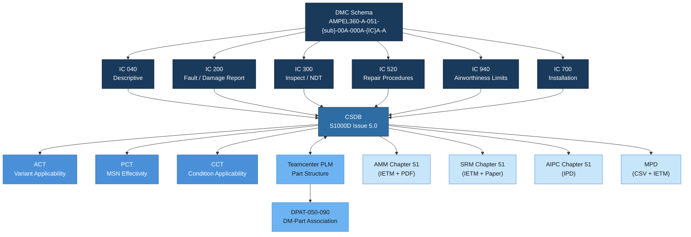

# ATLAS 050-059 · 05.050.090 — S1000D CSDB Mapping and Traceability

## 1. Purpose

This subsubject defines the S1000D Data Module Code (DMC) schema, information code allocation, and CSDB applicability configuration for all documentation within the ATA Chapter 51 / ATLAS 050 domain (Standard Practices — Structures) of the AMPEL360/eWTW programme. It establishes the cross-reference mapping between S1000D Data Modules and PLM part structure, specifies CSDB applicability annotation (ACT/PCT/CCT) for AMPEL360 variants, and identifies the publication output streams (AMM, SRM, AIPC). The document provides the single authoritative reference for traceability between engineering data, maintenance documentation, and the programme digital thread.

## 2. Scope

### 2.1 DMC Schema for ATA 51 / ATLAS 050

All Data Modules (DMs) covering structural standard practices for the AMPEL360/eWTW programme use the following S1000D Issue 5.0 DMC construction:

```
DMC-{ModelIdentCode}-{SystemDiffCode}-{SystemCode}{SubSystemCode}{SubSubSystemCode}-{AssyCode}-{DisassyCode}{DisassyCodeVariant}-{InfoCode}{InfoCodeVariant}-{ItemLocationCode}
```

For ATLAS 050 (ATA Chapter 51 structures standard practices), the fields are fixed as follows:

| DMC Field | Value | Notes |
|---|---|---|
| ModelIdentCode | AMPEL360 | Programme model identifier |
| SystemDiffCode | A (baseline) / B (eWTW variant) | Variant suffix per ACT |
| SystemCode | 051 | ATA Chapter 51 — Structures |
| SubSystemCode | 00–09 | Subsubject within chapter 51 |
| SubSubSystemCode | 00 | Fixed; sub-subdivision not used at this level |
| AssyCode | 00A | Assembly code (default: 00A for chapter-level DMs) |
| DisassyCode | 000A | Disassembly code (default for standard practices) |
| InfoCode | See §2.2 | Information code per DM type |
| InfoCodeVariant | A | Single variant per info code (except where multi-variant exists) |
| ItemLocationCode | A | Airborne (default) |

**Example full DMC for CFRP repair procedures (info code 520):**
```
DMC-AMPEL360-A-051-00-00A-000A-520A-A
```

### 2.2 Information Code Allocation for ATLAS 050

The following information code allocation is reserved for all DMs within the ATA 51 / ATLAS 050 domain:

| Info Code | Category | Content Type | ATLAS 050 Application |
|---|---|---|---|
| 040 | Descriptive | Technical description | Material specifications, process overviews, design philosophy |
| 200 | Fault reporting | Fault isolation / damage reporting | Damage report procedure, DRF-050-xxx forms |
| 300 | Examine | Inspect / check | NDT task cards, visual inspection tasks, CPCP inspection tasks |
| 312 | Examine | Service / lubricate | CIC replenishment task cards |
| 520 | Repair | Repair procedure | Metallic repair, CFRP wet-layup, prepreg patch, scarf/stepped repair |
| 940 | Airworthiness | Airworthiness Limitations (ALI) | Structural life limits (safe-life), DT mandatory inspection thresholds |
| 700 | Assemble | Installation / assembly | Fastener installation torque procedures, sealant application |
| 200A | Fault reporting | NDT result recording | Post-repair NDT acceptance worksheet |

Each DM is assigned a unique Issue Number within the CSDB; superseded issues are archived but retained per programme document retention policy (minimum 20 years beyond EIS + service life).

### 2.3 CSDB Applicability: ACT, PCT, CCT

CSDB applicability management for AMPEL360/eWTW uses three S1000D applicability tables:

**ACT — Applicability Cross-Reference Table**:
Defines the variants to which each DM applies. AMPEL360 programme ACT entries:

| Product Attribute | Values |
|---|---|
| ModelIdentCode | AMPEL360-A, AMPEL360-B, eWTW-A |
| ConfigCode | CONFIG-STD, CONFIG-LONG, CONFIG-FREIGHTER |
| StructuralZone | CFRP-ONLY, HYBRID-CFRP-ALI, GLARE-NOSE |

**PCT — Product Cross-Reference Table**:
Links Data Modules to specific aircraft serial numbers (MSN) and effectivity ranges. Structural repair DMs are PCT-annotated with the applicable MSN range where the repair has been embodied.

**CCT — Condition Cross-Reference Table**:
Used for conditional applicability of repair DMs — e.g., a composite repair DM is only applicable when the damage condition (BVID, VID) and zone (fuel-tight, pressurised) match the CCT conditions evaluated at maintenance time.

### 2.4 Cross-Reference to PLM Part Structure

The following mapping table cross-references ATLAS 050 DMs to Teamcenter PLM part structure nodes. This mapping is maintained in the DM–Part Association Table (DPAT-050-090) stored in the CSDB and synchronised with Teamcenter via the PLCS interface.

| DM Information Code | PLM Part Node | Teamcenter Object Type | PLM Node ID |
|---|---|---|---|
| 040 (Descriptive) | Material specification master | Airbus MSDB material record | TC-MAT-AIMS-05-01-002 |
| 520 (Repair) | Repair scheme drawing | DS-drawing (Part-21G-approved) | TC-RPR-051-520-xxx |
| 300 (Inspect) | Task card template | Maintenance task (MT) | TC-MT-051-300-xxx |
| 940 (ALI) | Airworthiness Limitations record | Certification record (CR) | TC-CR-ALI-051-940-xxx |
| 700 (Install) | Installation engineering data | Engineering Order (EO) | TC-EO-051-700-xxx |

All PLM nodes linked to CSDB DMs are subject to concurrent configuration control: any change to a PLM node that affects the technical content of a linked DM triggers a DM revision request in the CSDB change management workflow.

### 2.5 Publication Output Streams

ATLAS 050 DMs are published into the following output publications:

| Publication | ATA Reference | Output Format | ATLAS 050 Chapters Included |
|---|---|---|---|
| Aircraft Maintenance Manual (AMM) | ATA iSpec 2200 Chapter 51 | S1000D IETM (interactive electronic) + PDF | 040, 300, 312, 520, 700 info codes |
| Structural Repair Manual (SRM) | ATA iSpec 2200 Chapter 51 | S1000D IETM + paper backup | 040 (damage assessment), 520 (repair), 200/200A (damage reporting), 940 (ALI) |
| Illustrated Parts Catalogue (AIPC) | ATA iSpec 2200 Chapter 51 | S1000D IPD (illustrated parts data) | Spare part numbers for structural consumables, fasteners, sealants |
| Maintenance Planning Document (MPD) | ATA MSG-3 / CS-25.1529 | CSV + IETM | 300 and 940 info codes (task intervals) |

Publications are released under the programme Document Release Schedule (DRS) aligned to aircraft certification milestones (PDR, CDR, First Flight, TC application, TC grant). Post-TC, SRM revisions are issued as Temporary Revisions (TR) within 30 days of repair approval.

## 3. Diagram



## 4. Footprint

| Metric | Value |
|---|---|
| Architecture | ATLAS — Aircraft Top Level Architecture Schema/System |
| Master range | 000–099 |
| Code range | 050-059 |
| Section | 05 — Estructuras |
| Subsection | 050 — Standard Practices — Structures |
| Subsubject | 090 — S1000D CSDB Mapping and Traceability |
| Primary Q-Division | Q-STRUCTURES |
| Support Q-Divisions | Q-AIR · Q-INDUSTRY · Q-HPC |
| ORB support | ORB-PMO · ORB-FIN · ORB-LEG |
| Governance class | baseline |
| Folder path | `Q+ATLANTIDE/000-099_ATLAS/050-059_Estructuras/050_Standard-Practices-Structures/` |
| Document | `050-090-S1000D-CSDB-Mapping-and-Traceability.md` |
| Parent subsection | [`README.md`](./README.md) |
| Cross-ref — S1000D | S1000D Issue 5.0 — DMC schema, ACT/PCT/CCT specification |
| Cross-ref — PLM | Teamcenter DPAT-050-090 — DM-Part Association Table |
| Cross-ref — ATA | ATA iSpec 2200 Chapter 51 — AMM/SRM/AIPC publication |
| Cross-ref — MPD | MSG-3 Rev 2015.1 — MPD task compilation |

## 5. References & Citations

[^baseline]: Q+ATLANTIDE Baseline Document — `../../../../organization/Q+ATLANTIDE.md`
[^archtable]: ATLAS Architecture Table — `../../README.md`
[^qdiv]: Q-Division Registry — Q-STRUCTURES primary, Q-AIR/Q-INDUSTRY/Q-HPC supporting.
[^gov]: ATLAS Governance Class Definition — baseline implies full SRB/ORB change control.
[^n001]: ATLAS 050 Subsection Index — `../README.md`
[^s1000d]: S1000D Issue 5.0 — International specification for technical publications using a Common Source DataBase. ASD/AIA/ATA, 2021.
[^ata51]: ATA iSpec 2200 Chapter 51 — Standard Practices and Structures. ATA, 2019.
[^plcs]: ISO 10303-239 (PLCS) — Product Life Cycle Support. ISO, 2012.
[^msg3]: MSG-3 Rev 2015.1 — Operator/Manufacturer Scheduled Maintenance Development. ATA, 2015.
