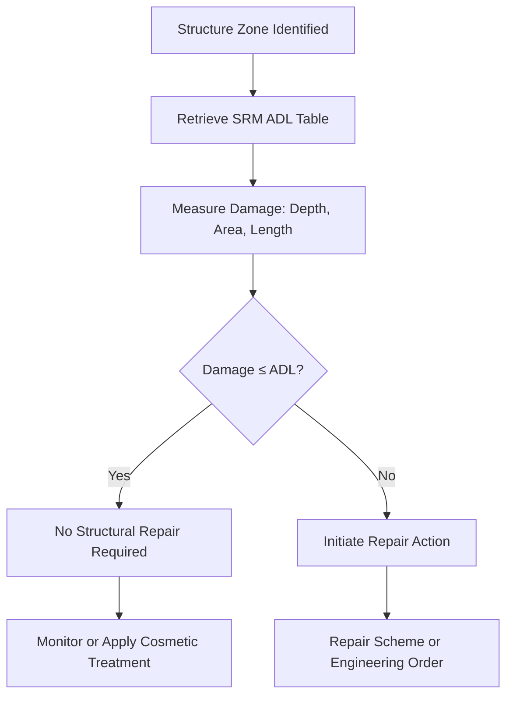

# ATLAS 050-059 · 05.051.030 — Allowable Damage Limits and Repair Criteria

> **ATLAS-1000** · Q+ATLANTIDE Baseline · Section 05.051 Standard Practices — Structures

---

## 1. Purpose

Defines the allowable damage limits (ADL) for primary and secondary structure and establishes the criteria for when repair is mandatory. ADL tables provide zone-specific thresholds that balance operational flexibility with structural safety margins required under CS-25.571.

---

## 2. Scope

### 2.1 Context

Allowable damage limits are zone-specific thresholds defined in the SRM for each structural component. Damage within ADL does not require structural repair but may require cosmetic treatment or monitoring. The ADL accounts for residual strength requirements per CS-25.571, ensuring that structure with damage at or below the limit retains sufficient residual strength throughout the inspection interval.

ADL tables are specific to each structural zone classification. Primary structure (Zone 1) has more restrictive ADL values than secondary structure (Zone 2), reflecting the higher consequence of failure. Damage in close proximity to fastener holes, cutouts, or existing repairs may be subject to additional restrictions beyond the standard ADL tables.

### 2.2 Scope Diagram

### 2.3 Key Parameters

| Parameter | Value |
|-----------|-------|
| ADL Basis | Residual Strength, Fatigue Life, Stiffness |
| Zone Categories | Z1 Primary, Z2 Secondary, Z3 Tertiary |
| Measurement Precision | ±0.1 mm depth, ±1 mm length |
| SRM Revision Currency | At time of damage assessment |

---

## 3. Footprint

| Field | Value |
|-------|-------|
| **Document ID** | `QATL-ATLAS-1000-ATLAS-050-059-05-051-030-ALLOWABLE-DAMAGE-LIMITS-AND-REPAIR-CRITERIA` |
| **Status** |  |
| **Folder Path** | `Q+ATLANTIDE/000-099_ATLAS/050-059_Estructuras/051_Standard-Practices-Structures/051-030-Structural-Repair-General-Practices/` |

---

## 4. References

> [^1]: All references below are applicable at the revision level current at the time of document release. Superseded revisions must be assessed for impact before continued use.

| Reference | Description |
|-----------|-------------|
| SRM 51-00 | Allowable Damage Tables by Zone and Structural Component |
| EASA CS-25.571(b) | Residual Strength Requirements for Damage-Tolerant Structure |
| EASA CS-25.573 | Damage Tolerance and Fatigue Evaluation of Structure |
| FAA AC 120-104 | Establishing and Implementing Limit of Validity (LOV) of the Engineering Data |
