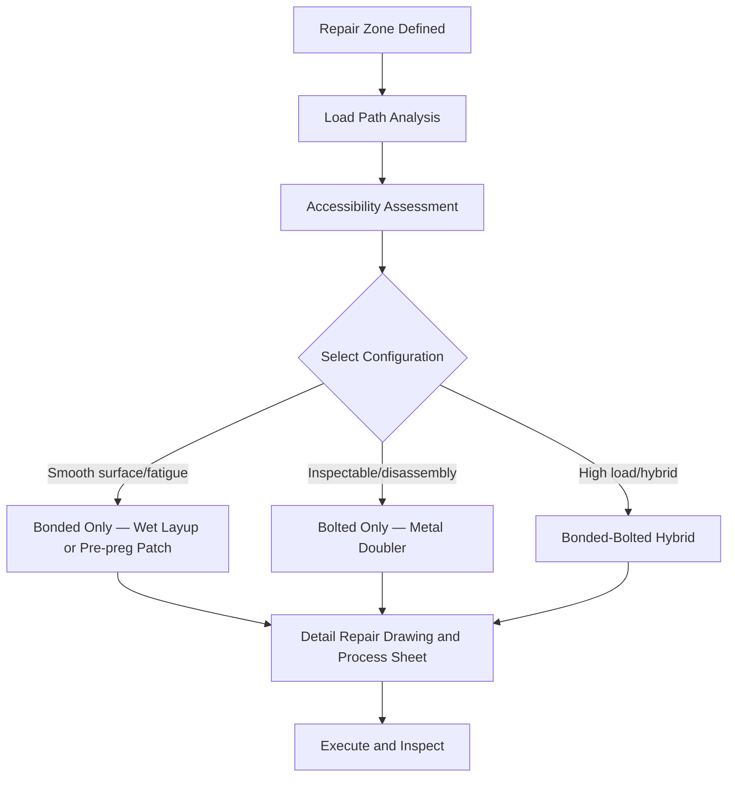

# ATLAS 050-059 · 05.051.030 — Bonded and Bolted Repair Configurations

> **ATLAS-1000** · Q+ATLANTIDE Baseline · Section 05.051 Standard Practices — Structures

---

## 1. Purpose

Defines the approved configurations for bonded, bolted, and hybrid (bonded-bolted) structural repairs and specifies selection criteria based on load path, accessibility, and structural zone. Configuration selection directly influences joint efficiency, inspection accessibility, and long-term durability.

---

## 2. Scope

### 2.1 Context

Bonded repairs are preferred where surface finish, aerodynamic smoothness, or fatigue performance requirements preclude drilling. Bolted repairs are preferred where disassembly for inspection is required, or where the substrate cannot support the cure environment for bonded repair. Hybrid repairs combine both load transfer mechanisms to optimise performance.

The choice between bonded and bolted configurations must consider the peel stress environment, the mode of load transfer, the accessibility for future NDT, and whether the repair will be subjected to thermal cycling that could degrade bond integrity. Engineering analysis must confirm joint efficiency meets or exceeds the original structure for the applicable load cases.

### 2.2 Scope Diagram

### 2.3 Key Parameters

| Parameter | Value |
|-----------|-------|
| Bonded Patch Types | Wet layup CFRP, pre-preg CFRP, metal bonded doubler |
| Bolted Doubler Configurations | Single shear, double shear per SRM |
| Hybrid Repair Ratio | Primary bolted load transfer with supplemental bonding |
| Joint Efficiency Requirement | ≥ original structure for all design load cases |

---

## 3. Footprint

| Field | Value |
|-------|-------|
| **Document ID** | `QATL-ATLAS-1000-ATLAS-050-059-05-051-030-BONDED-AND-BOLTED-REPAIR-CONFIGURATIONS` |
| **Status** |  |
| **Folder Path** | `Q+ATLANTIDE/000-099_ATLAS/050-059_Estructuras/051_Standard-Practices-Structures/051-030-Structural-Repair-General-Practices/` |

---

## 4. References

> [^1]: All references below are applicable at the revision level current at the time of document release. Superseded revisions must be assessed for impact before continued use.

| Reference | Description |
|-----------|-------------|
| SRM 51 | Bonded and Bolted Repair Scheme Library |
| AMM 51-40-00 | Bolted Structural Repair Procedures |
| ASTM D5573 | Standard Practice for Classifying Failure Modes in Bonded Joints |
| MIL-HDBK-17 | Composite Materials Handbook — Joining and Repair |
