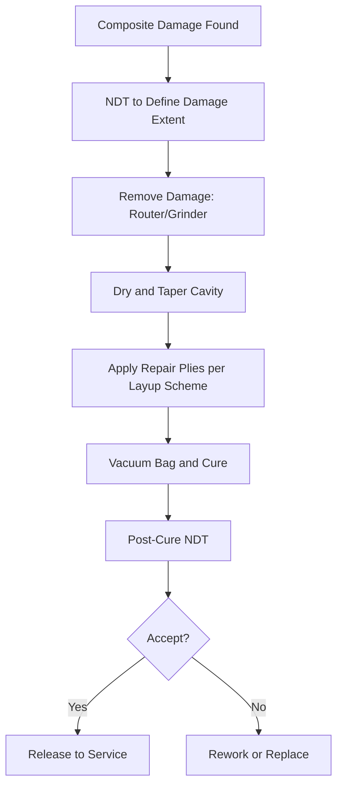

# ATLAS 050-059 · 05.051.030 — Composite Structural Repair Practices (General)

> **ATLAS-1000** · Q+ATLANTIDE Baseline · Section 05.051 Standard Practices — Structures

---

## 1. Purpose

Provides general practices for assessing and repairing composite structural components on Q+ATLANTIDE aircraft, covering damage removal, ply restoration, and cure verification. These practices ensure structural equivalence to the original laminate specification and compliance with SRM repair schemes.

---

## 2. Scope

### 2.1 Context

Composite structural repair requires knowledge of the original laminate specification, fibre orientation, resin system, and sandwich core type. Damage must be fully removed and the repair laminate must restore the original structural properties. All repairs must be documented and verified by NDT after cure to confirm absence of disbonds or voids exceeding acceptance criteria.

Repair execution requires controlled environmental conditions. Temperature and humidity must be monitored and recorded during layup, bagging, and cure operations. Repair personnel must hold current training certification for the applicable repair process, and all materials must be within shelf-life as confirmed by the cold store log prior to issue.

### 2.2 Scope Diagram

### 2.3 Key Parameters

| Parameter | Value |
|-----------|-------|
| Material Systems | CFRP, GFRP, Nomex honeycomb sandwich |
| Repair Ply Count | Match original laminate count per zone |
| Cure Temperature | Hot bond unit (120°C) or autoclave (175°C) |
| NDT Verification | Tap test, UT pulse-echo, active thermography |

---

## 3. Footprint

| Field | Value |
|-------|-------|
| **Document ID** | `QATL-ATLAS-1000-ATLAS-050-059-05-051-030-COMPOSITE-STRUCTURAL-REPAIR-PRACTICES` |
| **Status** |  |
| **Folder Path** | `Q+ATLANTIDE/000-099_ATLAS/050-059_Estructuras/051_Standard-Practices-Structures/051-030-Structural-Repair-General-Practices/` |

---

## 4. References

> [^1]: All references below are applicable at the revision level current at the time of document release. Superseded revisions must be assessed for impact before continued use.

| Reference | Description |
|-----------|-------------|
| SRM Chapter 51 | Composite Repair Schemes and Ply Layup Instructions |
| AMM 51-70-00 | Composite Structural Repair General Procedures |
| Boeing BMS 8-276 | Epoxy Pre-preg Resin System Specification |
| FAA AC 145-6 | Repair Station for Composite and Bonded Aircraft Structure |
