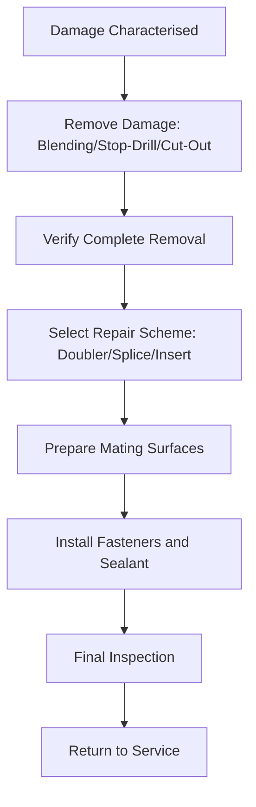

# ATLAS 050-059 · 05.051.030 — Metallic Structural Repair Practices

> **ATLAS-1000** · Q+ATLANTIDE Baseline · Section 05.051 Standard Practices — Structures

---

## 1. Purpose

Provides the standard practices for repairing metallic aircraft structure including aluminium alloys, titanium, and steel components using approved methods. These practices ensure that repaired structure meets the original design intent for strength, fatigue life, and corrosion resistance.

---

## 2. Scope

### 2.1 Context

Metallic structural repairs typically involve material removal, reshaping, splicing, or doubler installation. Selection of repair material must match or exceed the original material specification for strength, temper, and corrosion resistance. Cold-working and interference-fit fastening practices are used in fatigue-critical zones to introduce beneficial compressive residual stresses and extend fatigue life.

Damage removal by blending must not create sharp re-entrant corners or exceed the depth limits specified in the SRM. All drilled fastener holes in fatigue-critical locations must be reamed to final size and, where specified, cold-worked using an approved mandrel tool to achieve the required interference fit and surface finish.

### 2.2 Scope Diagram

### 2.3 Key Parameters

| Parameter | Value |
|-----------|-------|
| Repair Materials | 2024-T3, 7075-T6, 6061-T6, Ti-6Al-4V per AMS spec |
| Fastener Types | Solid Rivets, Hi-Loks, Hi-Tigue Bolts |
| Surface Preparation | Alodine (MIL-DTL-5541) / Anodise (AMS 2470) |
| Faying Surface Sealant | PR-1422 / BMS 5-95 polysulfide |

---

## 3. Footprint

| Field | Value |
|-------|-------|
| **Document ID** | `QATL-ATLAS-1000-ATLAS-050-059-05-051-030-METALLIC-STRUCTURAL-REPAIR-PRACTICES` |
| **Status** |  |
| **Folder Path** | `Q+ATLANTIDE/000-099_ATLAS/050-059_Estructuras/051_Standard-Practices-Structures/051-030-Structural-Repair-General-Practices/` |

---

## 4. References

> [^1]: All references below are applicable at the revision level current at the time of document release. Superseded revisions must be assessed for impact before continued use.

| Reference | Description |
|-----------|-------------|
| AMM 51-40-00 | Metallic Structural Repair Procedures |
| AMS 2770 | Heat Treatment of Aluminium Alloy Parts |
| AMS 4037 | Aluminium Alloy 2024-T3 Sheet and Plate |
| SRM Chapter 51 | Metallic Repair Schemes and Doubler Configurations |
