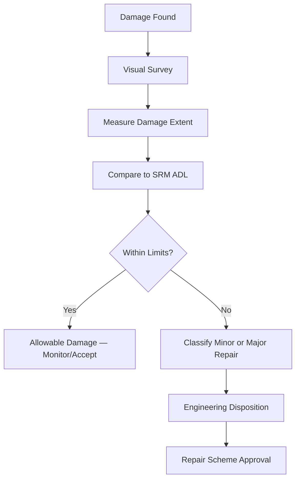

# ATLAS 050-059 · 05.051.030 — Repair Classification and Damage Assessment

> **ATLAS-1000** · Q+ATLANTIDE Baseline · Section 05.051 Standard Practices — Structures

---

## 1. Purpose

Establishes the methodology for classifying structural damage and assigning the appropriate repair category (minor/major) in accordance with regulatory and OEM requirements. The classification process ensures that the correct level of engineering authority, documentation, and inspection is applied to each repair.

---

## 2. Scope

### 2.1 Context

Damage assessment begins with a visual inspection to characterise the extent, type, and location of damage. Measurements are recorded and compared against SRM allowable damage limits. Damage exceeding allowable limits requires an engineering disposition. Classification as minor or major determines the approval authority required for the repair scheme.

Major repairs require an EASA-approved engineering order or are performed under an approved SRM chapter. Minor repairs are performed directly in accordance with the SRM without additional engineering involvement. In all cases, the repair record must reference the approval basis, and the certifying staff must verify compliance before release.

### 2.2 Scope Diagram

### 2.3 Key Parameters

| Parameter | Value |
|-----------|-------|
| Damage Categories | Dent, Scratch, Gouge, Crack, Delamination |
| Classification Authority | SRM ADL / Major Repair SB |
| Measurement Tools | Depth Gauge, Borescope, Ultrasonic |
| Disposition Paths | Fly-as-is, Monitor, Repair, Replace |

---

## 3. Footprint

| Field | Value |
|-------|-------|
| **Document ID** | `QATL-ATLAS-1000-ATLAS-050-059-05-051-030-REPAIR-CLASSIFICATION-AND-DAMAGE-ASSESSMENT` |
| **Status** |  |
| **Folder Path** | `Q+ATLANTIDE/000-099_ATLAS/050-059_Estructuras/051_Standard-Practices-Structures/051-030-Structural-Repair-General-Practices/` |

---

## 4. References

> [^1]: All references below are applicable at the revision level current at the time of document release. Superseded revisions must be assessed for impact before continued use.

| Reference | Description |
|-----------|-------------|
| SRM Chapter 51-00 | Allowable Damage Limit Tables |
| FAA AC 43.13-1B | Acceptable Methods, Techniques and Practices — Aircraft Inspection and Repair |
| EASA CS-25.571 | Damage Tolerance and Fatigue Evaluation |
| ASTM E2533 | Standard Guide for NDE of Polymer Matrix Composites |
