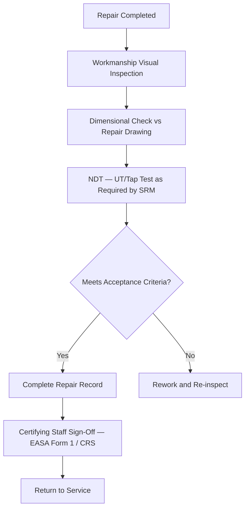

# ATLAS 050-059 · 05.051.030 — Repair Inspection, Verification and Release

> **ATLAS-1000** · Q+ATLANTIDE Baseline · Section 05.051 Standard Practices — Structures

---

## 1. Purpose

Defines the inspection steps, acceptance criteria, and airworthiness release requirements for structural repairs prior to return to service. The release process ensures that each repair is fully verified and that the certifying staff confirms compliance with all applicable requirements.

---

## 2. Scope

### 2.1 Context

All structural repairs must undergo a documented inspection sequence covering workmanship, dimensional conformance, NDT acceptance, and final sign-off by an authorised certifying staff. The release must reference the applicable SRM scheme number or engineering order, the certifying staff's Part-66 licence number, and the date and aircraft registration.

Independent inspection (duplicate inspection) is required for structural repairs involving primary flight controls, primary load-bearing frames, or any repair designated as requiring two-person verification in the AMM. The independent inspector must confirm that the repair is complete and conforms to the approved data before the certifying staff issues the CRS.

### 2.2 Scope Diagram

### 2.3 Key Parameters

| Parameter | Value |
|-----------|-------|
| Inspection Authority | EASA Part-145 Certifying Staff (Category B) |
| CRS Requirements | EASA Part-145.A.50 — statement of compliance |
| NDT Certification | EN 4179 / NAS 410 Level 2 minimum |
| Record Retention | Per Part-M / Part-CAMO — minimum aircraft life |

---

## 3. Footprint

| Field | Value |
|-------|-------|
| **Document ID** | `QATL-ATLAS-1000-ATLAS-050-059-05-051-030-REPAIR-INSPECTION-VERIFICATION-AND-RELEASE` |
| **Status** |  |
| **Folder Path** | `Q+ATLANTIDE/000-099_ATLAS/050-059_Estructuras/051_Standard-Practices-Structures/051-030-Structural-Repair-General-Practices/` |

---

## 4. References

> [^1]: All references below are applicable at the revision level current at the time of document release. Superseded revisions must be assessed for impact before continued use.

| Reference | Description |
|-----------|-------------|
| EASA Part-145.A.50 | Certification of Maintenance — Release to Service |
| EN 4179 | Qualification and Approval of Personnel for NDT |
| AMM 51-70-00 | Repair Release and Inspection Procedures |
| SRM Chapter 51 | Repair Acceptance Criteria by Repair Type |
