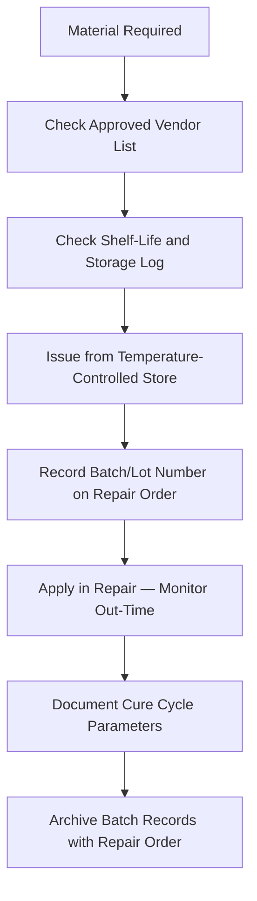

# ATLAS 050-059 · 05.051.030 — Repair Materials, Consumables and Process Control

> **ATLAS-1000** · Q+ATLANTIDE Baseline · Section 05.051 Standard Practices — Structures

---

## 1. Purpose

Specifies material qualification, shelf-life management, and process control requirements for all repair materials and consumables used in structural repair operations. Correct material handling and traceability are prerequisites for structural repair release to service.

---

## 2. Scope

### 2.1 Context

Structural repair materials include pre-pregs, adhesive films, paste adhesives, sealants, primers, and metallic sheet stock. All materials must be sourced from approved vendor lists (AVL) and stored in accordance with OEM specification. Traceability from material batch to repair record is mandatory to support certification, in-service monitoring, and failure investigation.

Pre-preg and film adhesive materials require frozen storage at −18°C. Out-time tracking begins when the material is removed from cold storage and must not exceed the specification limit at the time of application. Expired or out-of-specification material must be segregated, labelled, and disposed of in accordance with the Quality Management System procedure.

### 2.2 Scope Diagram

### 2.3 Key Parameters

| Parameter | Value |
|-----------|-------|
| Pre-preg Cold Store Temperature | −18°C (±2°C) per BMS 8-276 |
| Adhesive Film Store Temperature | +4°C maximum per BMS 5-137 |
| Out-Time Limit | Per individual BMS specification — logged from removal |
| Batch Traceability | Certificate of Conformance with each material issue |

---

## 3. Footprint

| Field | Value |
|-------|-------|
| **Document ID** | `QATL-ATLAS-1000-ATLAS-050-059-05-051-030-REPAIR-MATERIALS-CONSUMABLES-AND-PROCESS-CONTROL` |
| **Status** |  |
| **Folder Path** | `Q+ATLANTIDE/000-099_ATLAS/050-059_Estructuras/051_Standard-Practices-Structures/051-030-Structural-Repair-General-Practices/` |

---

## 4. References

> [^1]: All references below are applicable at the revision level current at the time of document release. Superseded revisions must be assessed for impact before continued use.

| Reference | Description |
|-----------|-------------|
| BMS 8-276 | Pre-preg Storage and Out-Time Requirements |
| AMS 3276 | Aerospace Sealant — Storage and Application |
| AMM 51-70-00 | Material Consumption and Process Control |
| EASA Part-145.A.50 | Release to Service Requirements |
