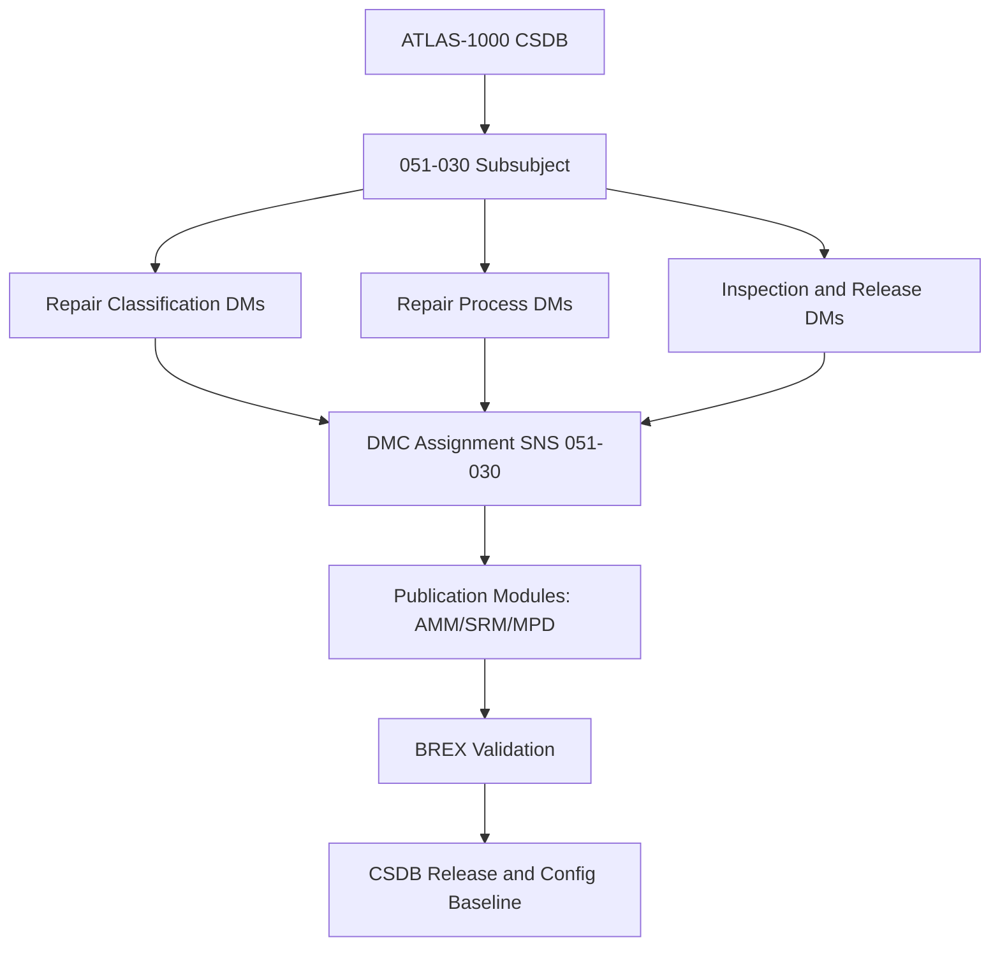

# ATLAS 050-059 · 05.051.030 — S1000D CSDB Mapping and Traceability

> **ATLAS-1000** · Q+ATLANTIDE Baseline · Section 05.051 Standard Practices — Structures

---

## 1. Purpose

Provides the S1000D DMC mapping and CSDB traceability matrix for all documents within the 051-030 Structural Repair General Practices subsubject. This mapping enables structured publication and configuration management of repair documentation within the ATLAS-1000 CSDB.

---

## 2. Scope

### 2.1 Context

Each document in this subsubject is assigned a unique S1000D Data Module Code (DMC) under the ATLAS-1000 CSDB using SNS 051-030, enabling structured publication into AMM, SRM, and related data modules for structural repair. The traceability matrix links ATLAS repair documents to SRM task data modules and process specifications, supporting change propagation control.

The BREX (Business Rules Exchange) file for ATLAS-1000 defines the publication constraints applicable to all 051-030 data modules, including applicability coding, warning/caution category usage, and graphic resolution standards. All data modules must pass BREX validation before inclusion in the CSDB baseline release.

### 2.2 Scope Diagram

### 2.3 Key Parameters

| Parameter | Value |
|-----------|-------|
| DMC Model Identifier | QATL |
| SNS Code | 051-030 Structural Repair General Practices |
| Issue Authority | Q-STRUCTURES / Technical Publications |
| BREX File | ATLAS-1000-BREX-051.xml |

---

## 3. Footprint

| Field | Value |
|-------|-------|
| **Document ID** | `QATL-ATLAS-1000-ATLAS-050-059-05-051-030-S1000D-CSDB-MAPPING-AND-TRACEABILITY` |
| **Status** |  |
| **Folder Path** | `Q+ATLANTIDE/000-099_ATLAS/050-059_Estructuras/051_Standard-Practices-Structures/051-030-Structural-Repair-General-Practices/` |

---

## 4. References

> [^1]: All references below are applicable at the revision level current at the time of document release. Superseded revisions must be assessed for impact before continued use.

| Reference | Description |
|-----------|-------------|
| S1000D Issue 5.0 | DMC Coding Rules and Publication Framework |
| ASD SX000i | Integrated Technical Publication Framework |
| ATLAS BREX Q+ATLANTIDE | Business Rules Exchange for ATLAS-1000 CSDB |
| SRM Chapter 51 | Repair Documentation and Traceability Requirements |
