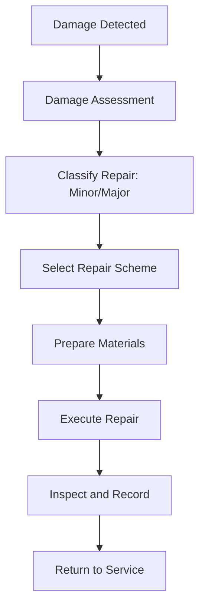

# ATLAS 050-059 · 05.051.030 — Structural Repair General Practices — Overview

> **ATLAS-1000** · Q+ATLANTIDE Baseline · Section 05.051 Standard Practices — Structures

---

## 1. Purpose

Provides an overview of general structural repair practices applied to metallic and composite aircraft structure, covering classification, documentation, and process control. All repairs must restore the original strength, stiffness, and fatigue life of the structure to ensure continued airworthiness in accordance with EASA Part-145 requirements.

---

## 2. Scope

### 2.1 Context

Structural repairs are required when aircraft structure is damaged beyond allowable limits defined in the SRM or applicable damage tolerance assessment. All repairs must restore the original strength, stiffness, and fatigue life of the structure. The repair process is governed by EASA Part-145, the applicable Structural Repair Manual (SRM), and any engineering orders raised in support.

Repair authority is determined by the damage category and location. Minor repairs within SRM limits may be executed without additional engineering approval; major repairs exceeding SRM data require an EASA-approved engineering disposition and may necessitate a Form 1 release to service. All repair activities are subject to quality assurance oversight.

### 2.2 Scope Diagram

### 2.3 Key Parameters

| Parameter | Value |
|-----------|-------|
| Repair Authority | SRM / Major Repair per EASA Form 1 |
| Damage Types | Dents, Cracks, Corrosion, Impact |
| Documentation | Repair Order, QA Sign-off |
| Regulatory Basis | EASA Part-145 |

---

## 3. Footprint

| Field | Value |
|-------|-------|
| **Document ID** | `QATL-ATLAS-1000-ATLAS-050-059-05-051-030-STRUCTURAL-REPAIR-GENERAL-PRACTICES-OVERVIEW` |
| **Status** |  |
| **Folder Path** | `Q+ATLANTIDE/000-099_ATLAS/050-059_Estructuras/051_Standard-Practices-Structures/051-030-Structural-Repair-General-Practices/` |

---

## 4. References

> [^1]: All references below are applicable at the revision level current at the time of document release. Superseded revisions must be assessed for impact before continued use.

| Reference | Description |
|-----------|-------------|
| AMM 51-70-00 | Structural Repair General Procedures |
| SRM 51-00 | Allowable Damage and Repair Limits |
| EASA CS-25.571 | Damage Tolerance and Fatigue Evaluation of Structure |
| EASA Part-145 | Maintenance Organisation Approval Requirements |
