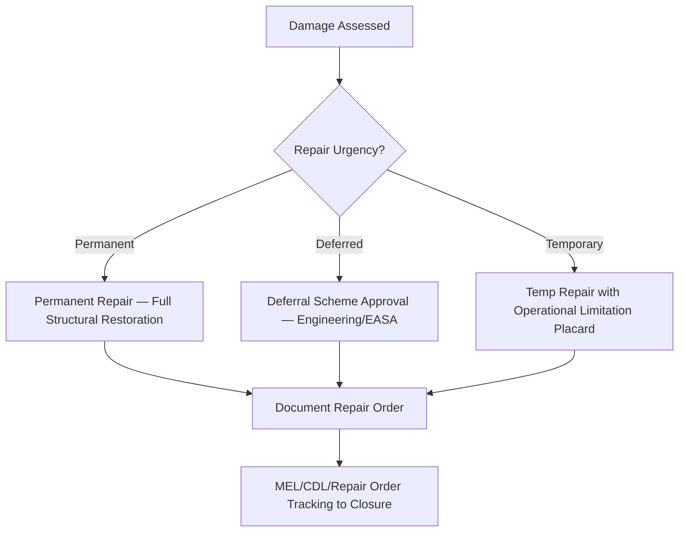

# ATLAS 050-059 · 05.051.030 — Temporary, Permanent and Deferred Repairs

> **ATLAS-1000** · Q+ATLANTIDE Baseline · Section 05.051 Standard Practices — Structures

---

## 1. Purpose

Defines the categories of structural repair disposition — temporary, permanent, and deferred — and specifies the conditions, limitations, and documentation requirements for each. Correct categorisation ensures that operational safety is maintained while minimising unscheduled aircraft ground time.

---

## 2. Scope

### 2.1 Context

A temporary repair restores airworthiness for a defined period or number of flight cycles pending a permanent repair. It must be accompanied by specific operational limitations and an approved time limit. Deferred repairs are permitted only within approved deferral schemes, such as those referenced in the MEL/CDL or engineering deferral orders approved under EASA Part-M.

Permanent repairs restore the structure to its original or equivalent structural capability with no time limitation. All repair categories require a completed maintenance record and a Certifying Staff release to service. The repair category must be explicitly stated in the repair record and cross-referenced to the approval basis.

### 2.2 Scope Diagram

### 2.3 Key Parameters

| Parameter | Value |
|-----------|-------|
| Temp Repair Validity | Defined flight cycles or calendar days per approval |
| Deferral Authority | Engineering order / EASA-approved deferral |
| Permanent Repair Restoration | Full structural and damage tolerance life |
| Documentation | Repair Sticker, Technical Log Entry, Repair Order |

---

## 3. Footprint

| Field | Value |
|-------|-------|
| **Document ID** | `QATL-ATLAS-1000-ATLAS-050-059-05-051-030-TEMPORARY-PERMANENT-AND-DEFERRED-REPAIRS` |
| **Status** |  |
| **Folder Path** | `Q+ATLANTIDE/000-099_ATLAS/050-059_Estructuras/051_Standard-Practices-Structures/051-030-Structural-Repair-General-Practices/` |

---

## 4. References

> [^1]: All references below are applicable at the revision level current at the time of document release. Superseded revisions must be assessed for impact before continued use.

| Reference | Description |
|-----------|-------------|
| AMM 51-70-00 | Structural Repair Procedures and Disposition |
| MEL/CDL Framework | Minimum Equipment / Configuration Deviation List |
| EASA Part-M / Part-CAMO | Continuing Airworthiness Management Requirements |
| SRM Chapter 51 | Disposition Tables for Temporary and Deferred Repairs |
