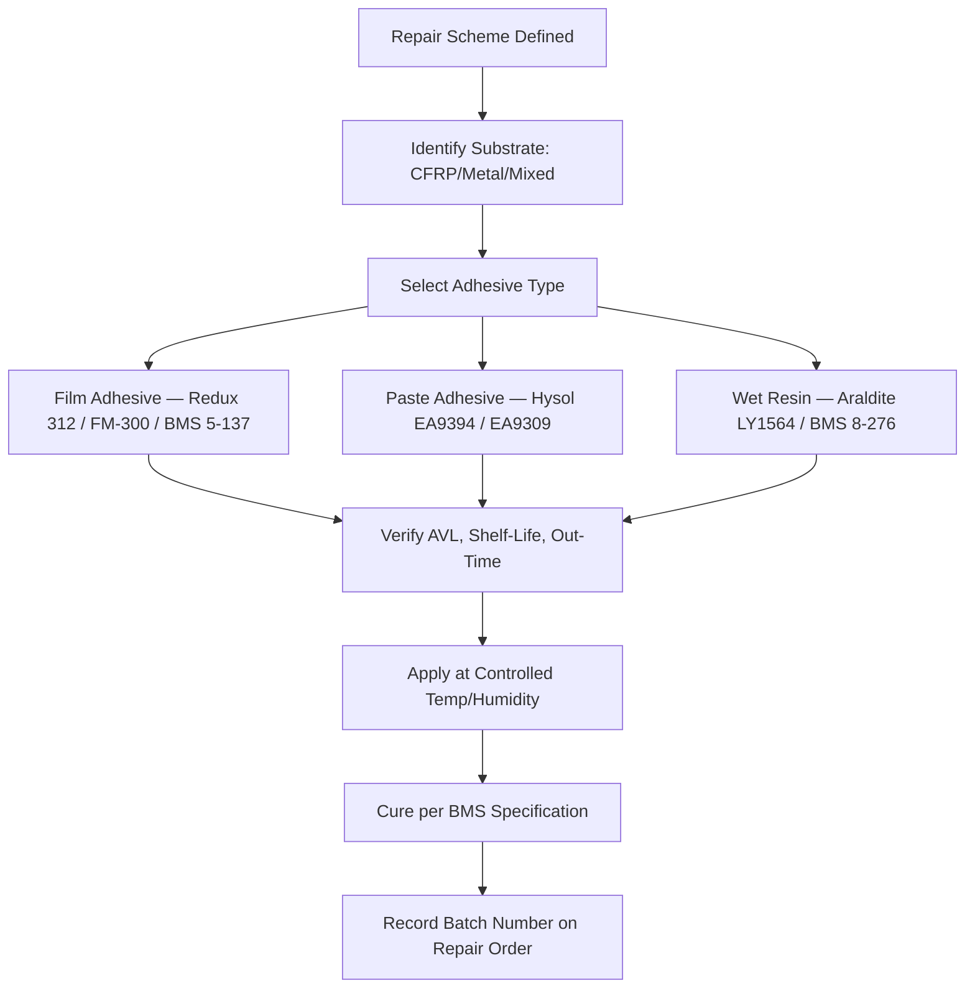

# ATLAS 050-059 · 05.051.040 — Adhesive Film, Paste and Resin Systems

> **ATLAS-1000** · Q+ATLANTIDE Baseline · Section 05.051 Standard Practices — Structures

---

## 1. Purpose

Specifies the approved adhesive film, paste adhesive, and resin systems for composite repair and bonding applications, including selection criteria, storage requirements, and cure parameters. Correct material selection is essential to achieve joint performance equivalent to the original structure.

---

## 2. Scope

### 2.1 Context

The selection of adhesive system depends on the repair category, substrate material, cure temperature capability, and environmental exposure requirements. Film adhesives provide controlled bondline thickness and uniform coverage, making them preferred for primary structure repairs where bondline control is critical. Paste adhesives accommodate irregular surfaces and can be applied in field conditions where film handling is impractical.

All adhesive materials are temperature-sensitive and have defined cold storage and out-time requirements. Materials must be issued from a certified temperature-controlled store, with the issue time and ambient temperature logged on the repair order. Material that exceeds the specified out-time or has been subject to contamination must not be used and must be disposed of per the QMS procedure.

### 2.2 Scope Diagram

### 2.3 Key Parameters

| Parameter | Value |
|-----------|-------|
| Approved Film Adhesives | Redux 312, FM-300, BMS 5-137 (per AVL) |
| Approved Paste Adhesives | Hysol EA9394, EA9309.3NA (per AVL) |
| Wet Resin Systems | Araldite LY1564, BMS 8-276 epoxy |
| Cure Temperature Range | 60–80°C hot bond; 120–180°C autoclave pre-preg |

---

## 3. Footprint

| Field | Value |
|-------|-------|
| **Document ID** | `QATL-ATLAS-1000-ATLAS-050-059-05-051-040-ADHESIVE-FILM-PASTE-AND-RESIN-SYSTEMS` |
| **Status** |  |
| **Folder Path** | `Q+ATLANTIDE/000-099_ATLAS/050-059_Estructuras/051_Standard-Practices-Structures/051-040-Composite-Repair-and-Bonding-Practices/` |

---

## 4. References

> [^1]: All references below are applicable at the revision level current at the time of document release. Superseded revisions must be assessed for impact before continued use.

| Reference | Description |
|-----------|-------------|
| BMS 5-137 | Film Adhesive Material Specification |
| BMS 8-276 | Epoxy Resin System for Composite Repair |
| ASTM C297 | Flatwise Tensile Strength of Sandwich Constructions |
| SRM Chapter 51 | Material Specifications and Approved Substitutes |
