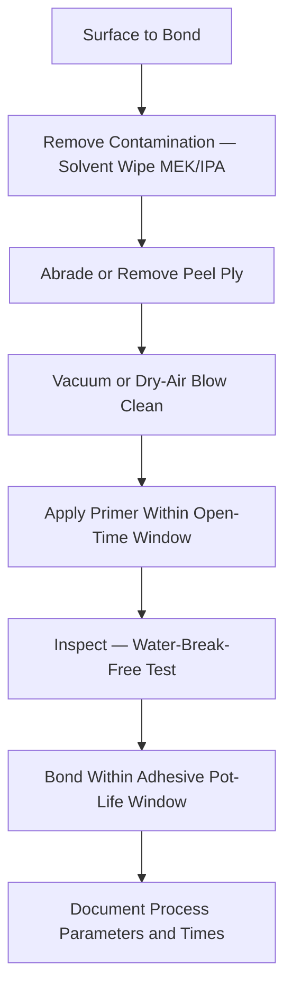

# ATLAS 050-059 · 05.051.040 — Bonding Surface Preparation and Cleaning

> **ATLAS-1000** · Q+ATLANTIDE Baseline · Section 05.051 Standard Practices — Structures

---

## 1. Purpose

Defines the approved methods for preparing and cleaning composite and metallic bonding surfaces to achieve the peel strength and bondline quality required for structural bonded repairs. Surface preparation is the single most critical factor influencing bonded joint durability and must be performed by trained, authorised personnel.

---

## 2. Scope

### 2.1 Context

Bond surface preparation is the most critical determinant of bonded joint quality. Contamination by hydraulic fluid, water ingress, or release agents will cause premature cohesive or adhesive failure that may not be detected during post-cure NDT. Approved preparation sequences include solvent wipe, abrasion, peel-ply removal, and grit blasting, followed by primer application within the specified open time.

The water-break-free test is used to verify surface cleanliness before bonding or primer application. A properly prepared surface holds a continuous water sheet for a minimum of 10 seconds without beading. Any beading indicates contamination and requires the cleaning sequence to be repeated from the degreasing step.

### 2.2 Scope Diagram

### 2.3 Key Parameters

| Parameter | Value |
|-----------|-------|
| Primary Solvent | MEK (ASTM D740) or IPA (MIL-I-6702) |
| Abrasive Grade | 180-grit minimum (dry, one direction) |
| Primer Open Time | Apply within ≤ 4 hr after abrasion |
| Water-Break-Free Criterion | Continuous water sheet for ≥ 10 seconds |

---

## 3. Footprint

| Field | Value |
|-------|-------|
| **Document ID** | `QATL-ATLAS-1000-ATLAS-050-059-05-051-040-BONDING-SURFACE-PREPARATION-AND-CLEANING` |
| **Status** |  |
| **Folder Path** | `Q+ATLANTIDE/000-099_ATLAS/050-059_Estructuras/051_Standard-Practices-Structures/051-040-Composite-Repair-and-Bonding-Practices/` |

---

## 4. References

> [^1]: All references below are applicable at the revision level current at the time of document release. Superseded revisions must be assessed for impact before continued use.

| Reference | Description |
|-----------|-------------|
| BMS 5-89 | Surface Preparation for Structural Bonding |
| ASTM D2651 | Standard Guide for Preparation of Metal Surfaces for Adhesive Bonding |
| AMM 51-70-00 | Surface Preparation Procedures for Bonded Repairs |
| SRM Chapter 51 | Bonding Process and Cleaning Requirements |
