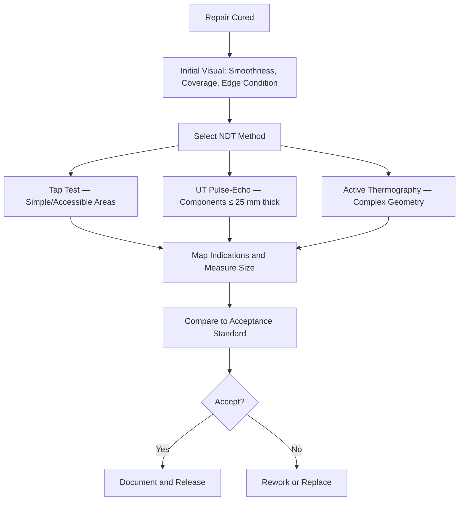

# ATLAS 050-059 · 05.051.040 — Bondline Inspection and NDT Verification

> **ATLAS-1000** · Q+ATLANTIDE Baseline · Section 05.051 Standard Practices — Structures

---

## 1. Purpose

Defines the non-destructive inspection methods, acceptance criteria, and reporting requirements for verifying bondline quality and composite repair integrity following cure. NDT verification is a mandatory step before any bonded repair is released to service.

---

## 2. Scope

### 2.1 Context

Bondline quality is assessed using tap testing, ultrasonic pulse-echo or through-transmission inspection, thermography, or shearography. Each method has applicable thickness ranges and detection limits. The choice of NDT method depends on the accessibility, component thickness, and repair geometry. A combination of methods may be required to fully characterise large or complex repair areas.

Calibration to a reference standard representing the repaired area thickness and material is required before inspection. NDT personnel must hold a valid Level 2 or Level 3 certification to EN 4179 or NAS 410 for the applicable NDT method. All calibration records and scan data must be archived with the repair record.

### 2.2 Scope Diagram

### 2.3 Key Parameters

| Parameter | Value |
|-----------|-------|
| Tap Test Grid Spacing | Maximum 25 mm between test points |
| UT Reference Sensitivity | 6 dB down from full back-wall echo |
| Maximum Acceptable Disbond | ≤ 6.5 mm diameter per ATA 26 criteria |
| Thermographic Contrast Resolution | ≥ 2°C differential for 3 mm depth disbond |

---

## 3. Footprint

| Field | Value |
|-------|-------|
| **Document ID** | `QATL-ATLAS-1000-ATLAS-050-059-05-051-040-BONDLINE-INSPECTION-AND-NDT-VERIFICATION` |
| **Status** |  |
| **Folder Path** | `Q+ATLANTIDE/000-099_ATLAS/050-059_Estructuras/051_Standard-Practices-Structures/051-040-Composite-Repair-and-Bonding-Practices/` |

---

## 4. References

> [^1]: All references below are applicable at the revision level current at the time of document release. Superseded revisions must be assessed for impact before continued use.

| Reference | Description |
|-----------|-------------|
| AMM 51-70-00 | NDT Procedures After Composite and Bonded Repair |
| ASTM E1556 | Standard Guide for Thermographic Inspection |
| NAS 410 / EN 4179 | NDT Personnel Qualification and Certification |
| SRM Chapter 51 | Bondline Acceptance Criteria by Repair Category |
