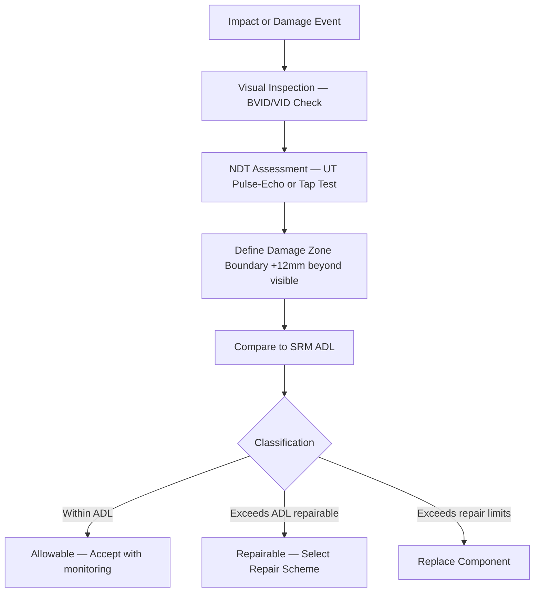

# ATLAS 050-059 · 05.051.040 — Composite Damage Assessment and Classification

> **ATLAS-1000** · Q+ATLANTIDE Baseline · Section 05.051 Standard Practices — Structures

---

## 1. Purpose

Establishes the methodology for assessing and classifying damage in composite structure including delamination, impact damage, fibre fracture, and core damage. Accurate classification determines the repair scheme and approval level required to restore structural airworthiness.

---

## 2. Scope

### 2.1 Context

Composite damage cannot always be detected visually. Low-energy impacts can cause barely visible impact damage (BVID) with significant internal delamination extending well beyond the visible indentation. NDT is required to define the true damage boundary before any repair scheme is selected. Damage is classified as allowable, repairable, or requiring replacement based on SRM criteria.

BVID thresholds are defined in the SRM for each structural zone and are based on the residual strength and damage tolerance analysis conducted during aircraft certification. Damage exceeding the BVID threshold in area or depth is classified as visible impact damage (VID) and requires a formal repair disposition with engineering approval.

### 2.2 Scope Diagram

### 2.3 Key Parameters

| Parameter | Value |
|-----------|-------|
| BVID Dent Depth Threshold | Per SRM (typically ≤ 6 mm) |
| NDT Boundary Extension | +12 mm beyond visible damage boundary |
| Damage Types | Delamination, matrix crack, fibre fracture, core crush |
| Classification Categories | Category 1 (Allowable) / 2 (Repairable) / 3 (Replace) |

---

## 3. Footprint

| Field | Value |
|-------|-------|
| **Document ID** | `QATL-ATLAS-1000-ATLAS-050-059-05-051-040-COMPOSITE-DAMAGE-ASSESSMENT-AND-CLASSIFICATION` |
| **Status** |  |
| **Folder Path** | `Q+ATLANTIDE/000-099_ATLAS/050-059_Estructuras/051_Standard-Practices-Structures/051-040-Composite-Repair-and-Bonding-Practices/` |

---

## 4. References

> [^1]: All references below are applicable at the revision level current at the time of document release. Superseded revisions must be assessed for impact before continued use.

| Reference | Description |
|-----------|-------------|
| SRM 51-00 | Composite Allowable Damage Limit Tables |
| EASA CS-25.571 | Composite Structure Damage Tolerance Requirements |
| ASTM D7136 | Measuring Damage Resistance of Polymer Matrix Composites |
| FAA AC 20-107B | Composite Aircraft Structure Certification |
