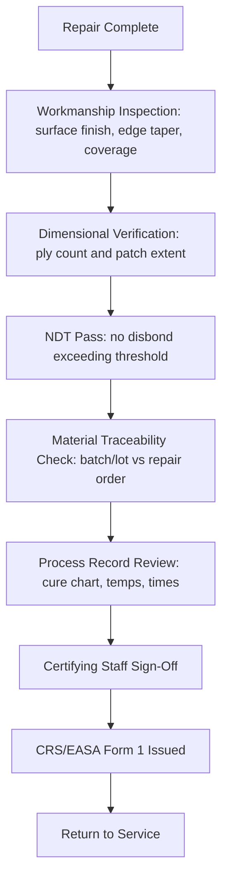

# ATLAS 050-059 · 05.051.040 — Composite Repair Acceptance and Release Criteria

> **ATLAS-1000** · Q+ATLANTIDE Baseline · Section 05.051 Standard Practices — Structures

---

## 1. Purpose

Specifies the acceptance criteria and airworthiness release requirements for composite bonded repairs before return to service. The release process ensures full compliance with the approved repair scheme, material traceability, and NDT acceptance before the certifying staff issues the Certificate of Release to Service.

---

## 2. Scope

### 2.1 Context

Composite repair release requires satisfactory completion of workmanship inspection, dimensional verification, NDT acceptance, and documentation review. The certifying staff must confirm that the repair was executed in accordance with an approved scheme and that all acceptance criteria have been met before signing the CRS.

The maintenance record must include the scheme reference, material batch numbers, cure cycle chart reference, NDT method and result, and the certifying staff signature and authorisation number. Any deviation from the approved scheme during execution must be dispositioned by engineering before release and must be recorded in the maintenance documentation.

### 2.2 Scope Diagram

### 2.3 Key Parameters

| Parameter | Value |
|-----------|-------|
| Surface Step Height Limit | ≤ 0.8 mm over repair boundary |
| Bondline Void Area Limit | ≤ 2% of repair area by ultrasonic scan |
| Ply Alignment Tolerance | ±5° of nominal fibre angle |
| Release Authority | EASA Part-145 Category B2 Certifying Staff |

---

## 3. Footprint

| Field | Value |
|-------|-------|
| **Document ID** | `QATL-ATLAS-1000-ATLAS-050-059-05-051-040-COMPOSITE-REPAIR-ACCEPTANCE-AND-RELEASE-CRITERIA` |
| **Status** |  |
| **Folder Path** | `Q+ATLANTIDE/000-099_ATLAS/050-059_Estructuras/051_Standard-Practices-Structures/051-040-Composite-Repair-and-Bonding-Practices/` |

---

## 4. References

> [^1]: All references below are applicable at the revision level current at the time of document release. Superseded revisions must be assessed for impact before continued use.

| Reference | Description |
|-----------|-------------|
| EASA Part-145.A.50 | Release to Service Requirements |
| SRM Chapter 51 | Composite Repair Acceptance Criteria by Zone |
| AMM 51-70-00 | Final Inspection and Repair Documentation |
| EN 4179 | NDT Personnel Requirements for Release Signatory |
