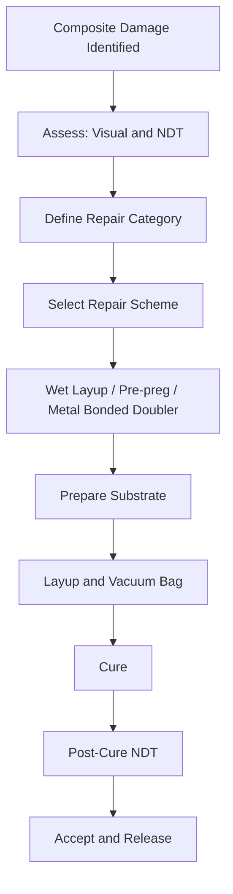

# ATLAS 050-059 · 05.051.040 — Composite Repair and Bonding Practices — Overview

> **ATLAS-1000** · Q+ATLANTIDE Baseline · Section 05.051 Standard Practices — Structures

---

## 1. Purpose

Provides a comprehensive overview of composite structural repair and bonding practices applicable to CFRP and GFRP components on Q+ATLANTIDE aircraft. All repair activities must restore the laminate to a structural equivalence satisfying the original damage tolerance and fatigue requirements, with approved repair schemes defined in the SRM.

---

## 2. Scope

### 2.1 Context

Composite repair encompasses damage removal, surface preparation, ply restoration, adhesive application, cure cycle execution, and NDT verification. All repair activities must restore the laminate to a structural equivalence that satisfies the original damage tolerance and fatigue requirements. Approved repair schemes are defined in the SRM.

Repair selection is driven by the structural zone, damage extent, and available cure capability. Field repairs using hot bond units are permitted within defined limits; repairs exceeding those limits require autoclave cure or component replacement. All repair personnel must hold appropriate composite repair training certification.

### 2.2 Scope Diagram

### 2.3 Key Parameters

| Parameter | Value |
|-----------|-------|
| Material Systems | CFRP, GFRP, Nomex honeycomb sandwich |
| Cure Methods | Hot bond unit (120°C), autoclave (175°C), oven |
| NDT Verification | UT C-scan, tap test, active thermography |
| Approval Basis | SRM scheme number or Engineering Order |

---

## 3. Footprint

| Field | Value |
|-------|-------|
| **Document ID** | `QATL-ATLAS-1000-ATLAS-050-059-05-051-040-COMPOSITE-REPAIR-AND-BONDING-PRACTICES-OVERVIEW` |
| **Status** |  |
| **Folder Path** | `Q+ATLANTIDE/000-099_ATLAS/050-059_Estructuras/051_Standard-Practices-Structures/051-040-Composite-Repair-and-Bonding-Practices/` |

---

## 4. References

> [^1]: All references below are applicable at the revision level current at the time of document release. Superseded revisions must be assessed for impact before continued use.

| Reference | Description |
|-----------|-------------|
| SRM Chapter 51 | Composite Repair Schemes and Ply Layup Data |
| AMM 51-70-00 | Composite Structural Repair General Practices |
| FAA AC 145-6 | Repair Stations for Composite and Bonded Aircraft Structure |
| Boeing BMS 8-276 | Epoxy Pre-preg Material and Process Specification |
