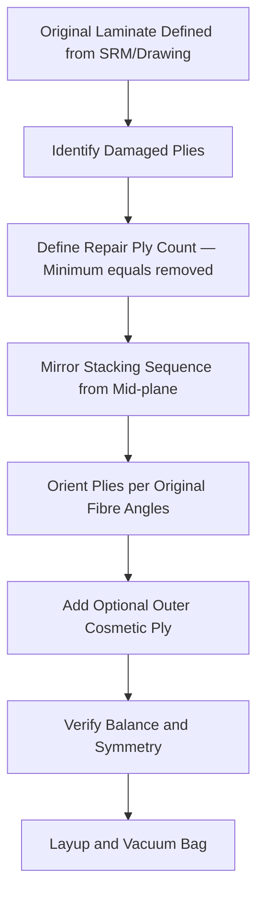

# ATLAS 050-059 · 05.051.040 — Layup, Ply Orientation and Repair Stacking Rules

> **ATLAS-1000** · Q+ATLANTIDE Baseline · Section 05.051 Standard Practices — Structures

---

## 1. Purpose

Defines the rules for determining repair ply count, fibre orientation, stacking sequence, and symmetry to restore the original laminate mechanical properties. Adherence to these rules is critical to ensure the repair laminate provides equivalent in-plane stiffness, bending stiffness, and strength to the original design.

---

## 2. Scope

### 2.1 Context

The repair laminate must replicate the original laminate ply-for-ply where possible. Ply orientations must match the original design angles (0°/±45°/90°) to ensure load path continuity. Symmetric and balanced stacking sequences are required to prevent cure-induced warpage and to maintain the in-plane/bending stiffness coupling characteristics of the original laminate.

Where the original laminate stacking is not available from the SRM or design drawing, the engineering assessment must reconstruct the most probable ply sequence based on the zone function and load orientation. The repair laminate must be verified by analysis or test to demonstrate structural equivalence before production of the repair scheme.

### 2.2 Scope Diagram

### 2.3 Key Parameters

| Parameter | Value |
|-----------|-------|
| Ply Fibre Orientations | 0°/+45°/−45°/90° per SRM laminate schedule |
| Minimum Ply Count | ≥ number of plies removed from original laminate |
| Scarf or Taper Overlap | Minimum 25:1 per ply thickness |
| Laminate Symmetry | Balanced and symmetric about mid-plane — mandatory |

---

## 3. Footprint

| Field | Value |
|-------|-------|
| **Document ID** | `QATL-ATLAS-1000-ATLAS-050-059-05-051-040-LAYUP-PLY-ORIENTATION-AND-REPAIR-STACKING-RULES` |
| **Status** |  |
| **Folder Path** | `Q+ATLANTIDE/000-099_ATLAS/050-059_Estructuras/051_Standard-Practices-Structures/051-040-Composite-Repair-and-Bonding-Practices/` |

---

## 4. References

> [^1]: All references below are applicable at the revision level current at the time of document release. Superseded revisions must be assessed for impact before continued use.

| Reference | Description |
|-----------|-------------|
| SRM Chapter 51 | Composite Layup Schemes and Ply Orientation Tables |
| MIL-HDBK-17 | Composite Materials Handbook — Design and Analysis |
| ASTM D3039 | Tensile Properties of Polymer Matrix Composite Materials |
| AMM 51-70-00 | Ply Orientation and Stacking Requirements |
