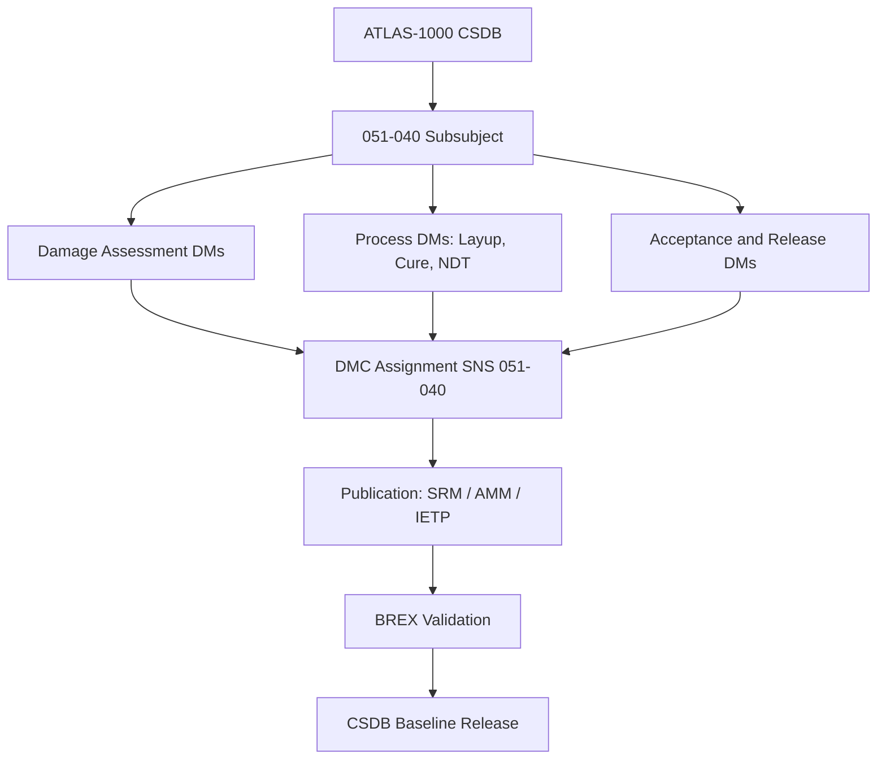

# ATLAS 050-059 · 05.051.040 — S1000D CSDB Mapping and Traceability

> **ATLAS-1000** · Q+ATLANTIDE Baseline · Section 05.051 Standard Practices — Structures

---

## 1. Purpose

Provides the S1000D DMC mapping and CSDB traceability matrix for all documents within the 051-040 Composite Repair and Bonding Practices subsubject. This mapping enables structured publication and configuration-controlled release of composite repair documentation within the ATLAS-1000 CSDB.

---

## 2. Scope

### 2.1 Context

Each document in this subsubject is assigned a unique S1000D DMC under the ATLAS-1000 CSDB using SNS 051-040, enabling structured publication into SRM, AMM, and process data modules covering composite repair. Links connect to layup drawings, cure cycle sheets, and NDT procedure modules, supporting integrated electronic technical publication delivery.

Change management within this subsubject follows the ATLAS-1000 CSDB change authority process. Any change to a composite repair scheme, material specification, or cure parameter must result in a delta data module and a corresponding CSDB change note before publication of the revised content.

### 2.2 Scope Diagram

### 2.3 Key Parameters

| Parameter | Value |
|-----------|-------|
| DMC Model Identifier | QATL |
| SNS Code | 051-040 Composite Repair and Bonding |
| Issue Authority | Q-STRUCTURES / Technical Publications |
| BREX File | ATLAS-1000-BREX-051.xml |

---

## 3. Footprint

| Field | Value |
|-------|-------|
| **Document ID** | `QATL-ATLAS-1000-ATLAS-050-059-05-051-040-S1000D-CSDB-MAPPING-AND-TRACEABILITY` |
| **Status** |  |
| **Folder Path** | `Q+ATLANTIDE/000-099_ATLAS/050-059_Estructuras/051_Standard-Practices-Structures/051-040-Composite-Repair-and-Bonding-Practices/` |

---

## 4. References

> [^1]: All references below are applicable at the revision level current at the time of document release. Superseded revisions must be assessed for impact before continued use.

| Reference | Description |
|-----------|-------------|
| S1000D Issue 5.0 | DMC Coding Rules and Publication Standards |
| ASD SX000i | Integrated Technical Publication Framework |
| ATLAS BREX Q+ATLANTIDE | Business Rules Exchange for ATLAS-1000 CSDB |
| SRM Chapter 51 | Composite Repair Documentation and Traceability |
