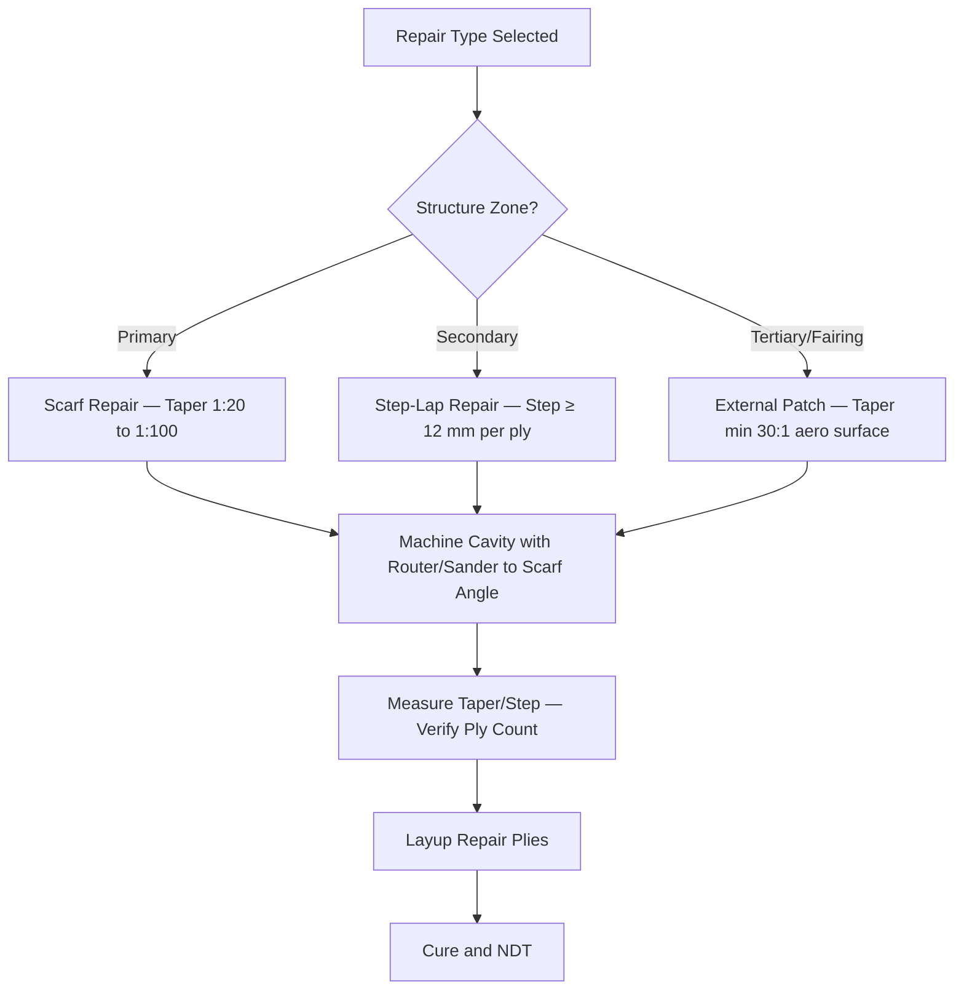

# ATLAS 050-059 · 05.051.040 — Scarf, Step and Patch Repair Practices

> **ATLAS-1000** · Q+ATLANTIDE Baseline · Section 05.051 Standard Practices — Structures

---

## 1. Purpose

Defines the approved geometric configurations for composite structural repairs including scarf, step-lap, and external patch geometries, with dimensional requirements for each. Geometry selection is driven by structural zone criticality, aerodynamic surface requirements, and repair tooling capability.

---

## 2. Scope

### 2.1 Context

Scarf repairs provide the highest joint efficiency and are used for primary structure where aerodynamic smoothness is critical. A scarf joint gradually transfers load through the taper angle, minimising stress concentration. Step-lap repairs are easier to execute in the field and provide good load transfer through discrete overlap steps but are restricted to secondary structure. External patch repairs are the fastest to apply but introduce a step on the outer mold line.

Scarf ratio selection depends on the laminate thickness and structural zone. Primary structure typically requires a 1:50 scarf ratio or better (shallower taper). Step width must be sufficient to transfer the load carried by each ply. All repair geometries must be verified by the certifying staff before ply application begins.

### 2.2 Scope Diagram

### 2.3 Key Parameters

| Parameter | Value |
|-----------|-------|
| Minimum Scarf Ratio | 1:20 (secondary), 1:50 typical primary structure |
| Step Width (Step-Lap) | ≥ 12 mm per ply — measured radially |
| External Patch Taper | Minimum 30:1 on aerodynamic surfaces |
| Overlap Margin | ≥ 25 mm beyond NDT-confirmed damage boundary |

---

## 3. Footprint

| Field | Value |
|-------|-------|
| **Document ID** | `QATL-ATLAS-1000-ATLAS-050-059-05-051-040-SCARF-STEP-AND-PATCH-REPAIR-PRACTICES` |
| **Status** |  |
| **Folder Path** | `Q+ATLANTIDE/000-099_ATLAS/050-059_Estructuras/051_Standard-Practices-Structures/051-040-Composite-Repair-and-Bonding-Practices/` |

---

## 4. References

> [^1]: All references below are applicable at the revision level current at the time of document release. Superseded revisions must be assessed for impact before continued use.

| Reference | Description |
|-----------|-------------|
| SRM Chapter 51 | Scarf and Step-Lap Repair Geometry Requirements |
| AMM 51-70-00 | Repair Cavity Preparation and Geometry Inspection |
| ASTM D5656 | Standard Test Method for Thick-Adherend Metal Lap-Shear Joints |
| FAA AC 145-6 | Composite Repair Classification and Geometry |
