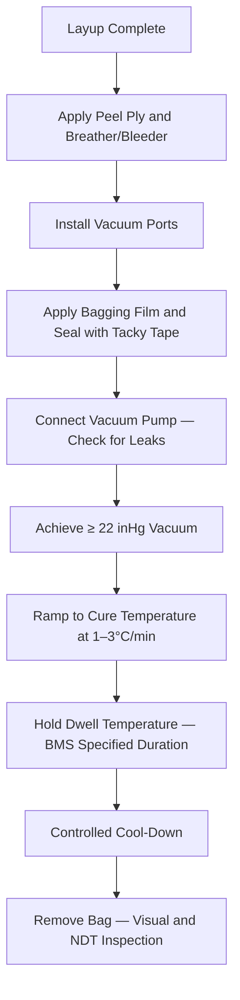

# ATLAS 050-059 · 05.051.040 — Vacuum Bagging, Cure and Process Control

> **ATLAS-1000** · Q+ATLANTIDE Baseline · Section 05.051 Standard Practices — Structures

---

## 1. Purpose

Defines the vacuum bagging procedures, cure cycle parameters, and process control requirements to achieve void-free, fully consolidated composite repair laminates. The cure cycle is the most critical phase of composite repair, directly determining the final structural properties of the repaired zone.

---

## 2. Scope

### 2.1 Context

Vacuum bagging applies compaction pressure to the repair laminate during cure, consolidating plies and removing entrapped air and volatiles. The vacuum level, ramp rate, hold temperature, and dwell time are critical parameters controlled by the hot bond unit or autoclave control system. All cure cycle data must be recorded and archived as part of the repair documentation package.

The bagging assembly must be checked for leaks before heat-up begins. A leak rate exceeding 25 mbar/min after isolation from the vacuum source indicates a defective bag and must be corrected before proceeding with the cure cycle. Thermocouple placement on the repair surface is required to confirm temperature conformance throughout the dwell period.

### 2.2 Scope Diagram

### 2.3 Key Parameters

| Parameter | Value |
|-----------|-------|
| Minimum Vacuum Level | ≥ 22 inHg (≥ 74 kPa) during cure |
| Hot Bond Cure Temperature | 120°C ± 5°C per BMS 8-276 |
| Autoclave Cure Temperature | 175°C ± 5°C per BMS 8-276 |
| Heat Ramp Rate | 1–3°C/min (controlled, not exceeding 3°C/min) |

---

## 3. Footprint

| Field | Value |
|-------|-------|
| **Document ID** | `QATL-ATLAS-1000-ATLAS-050-059-05-051-040-VACUUM-BAGGING-CURE-AND-PROCESS-CONTROL` |
| **Status** |  |
| **Folder Path** | `Q+ATLANTIDE/000-099_ATLAS/050-059_Estructuras/051_Standard-Practices-Structures/051-040-Composite-Repair-and-Bonding-Practices/` |

---

## 4. References

> [^1]: All references below are applicable at the revision level current at the time of document release. Superseded revisions must be assessed for impact before continued use.

| Reference | Description |
|-----------|-------------|
| BMS 8-276 | Cure Cycle Requirements for Epoxy Pre-preg Systems |
| AMM 51-70-00 | Vacuum Bagging and Cure Procedures |
| Boeing D6-84011 | Composites Design and Fabrication Standard |
| ASTM D5687 | Standard Guide for Preparation of Flat Composite Panels |
