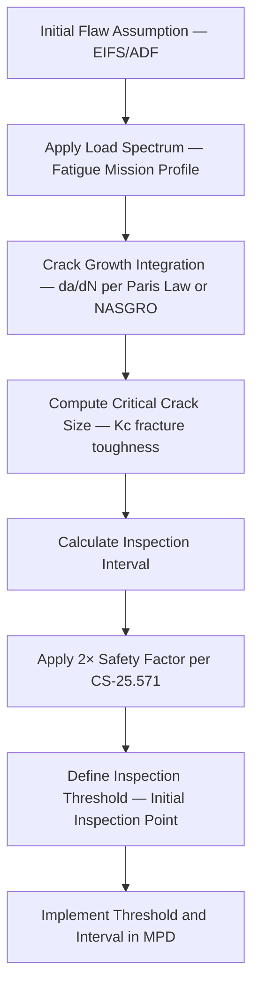

# ATLAS 050-059 · 05.051.050 — Damage Tolerance and Crack Growth Principles

> **ATLAS-1000** · Q+ATLANTIDE Baseline · Section 05.051 Standard Practices — Structures

---

## 1. Purpose

Provides the engineering principles of damage tolerance design and crack growth methodology as applied to the structural inspection programme for Q+ATLANTIDE aircraft. These principles underpin the derivation of inspection thresholds and intervals published in the MPD.

---

## 2. Scope

### 2.1 Context

Damage tolerance methodology requires that structure containing the maximum undetected initial flaw will sustain design limit loads for the inspection interval without growing to critical crack size. Crack growth analysis uses linear elastic fracture mechanics (LEFM) with applied stress spectra from the fatigue load sequence. The inspection interval is set at half the crack growth period from detectable to critical size to account for inspection reliability.

The equivalent initial flaw size (EIFS) represents the maximum flaw size that may exist undetected after manufacture and inspection. It accounts for the POD of manufacturing inspection and is used as the starting point for crack growth analysis. For transport category aircraft, EIFS values are typically set conservatively to bound manufacturing variability.

### 2.2 Scope Diagram

### 2.3 Key Parameters

| Parameter | Value |
|-----------|-------|
| Equivalent Initial Flaw Size (EIFS) | Typically 1.27 mm half-crack for metallic structure |
| Residual Strength Requirement | ≥ Design Limit Load at critical crack size |
| Crack Growth Model | NASGRO (NASA/ESACRACK) or FASTRAN |
| Safety Factor on Interval | 2× per CS-25.571 damage tolerance requirements |

---

## 3. Footprint

| Field | Value |
|-------|-------|
| **Document ID** | `QATL-ATLAS-1000-ATLAS-050-059-05-051-050-DAMAGE-TOLERANCE-AND-CRACK-GROWTH-PRINCIPLES` |
| **Status** |  |
| **Folder Path** | `Q+ATLANTIDE/000-099_ATLAS/050-059_Estructuras/051_Standard-Practices-Structures/051-050-Inspection-NDT-and-Damage-Tolerance-Practices/` |

---

## 4. References

> [^1]: All references below are applicable at the revision level current at the time of document release. Superseded revisions must be assessed for impact before continued use.

| Reference | Description |
|-----------|-------------|
| EASA CS-25.571 | Damage Tolerance and Fatigue Evaluation |
| NASGRO Fracture Mechanics Database | Crack Growth and Fracture Data for Aerospace Alloys |
| MIL-HDBK-1823A | Nondestructive Evaluation System Reliability |
| FAA AC 25.571-1D | Damage Tolerance and Fatigue Evaluation of Structure |
