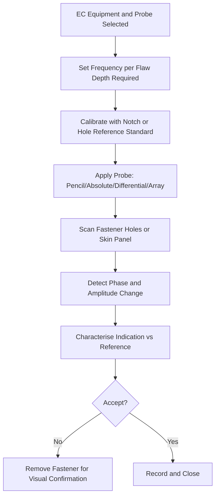

# ATLAS 050-059 · 05.051.050 — Eddy Current and Conductivity Inspection Practices

> **ATLAS-1000** · Q+ATLANTIDE Baseline · Section 05.051 Standard Practices — Structures

---

## 1. Purpose

Defines the methods, calibration standards, and scanning parameters for eddy current inspection of metallic aircraft structure and conductivity measurement for alloy and heat treatment verification. EC inspection is particularly effective for fatigue crack detection at fastener holes in aluminium structure.

---

## 2. Scope

### 2.1 Context

Eddy current inspection detects surface and near-surface cracks, corrosion thinning, and material property variations in conductive materials. It is particularly effective for fatigue crack detection around fastener holes and in thin-skin areas where other methods have limited sensitivity. Conductivity measurement using an EC instrument verifies alloy type and heat treatment condition following repair or suspected overheating.

Probe selection is critical to eddy current sensitivity. Pencil probes are used for fastener hole inspection in single-layer skin; absolute probes detect conductivity variations and general surface cracking; differential probes are sensitive to local discontinuities. Array probes provide rapid large-area coverage. Each probe type requires a specific reference standard and calibration procedure.

### 2.2 Scope Diagram

### 2.3 Key Parameters

| Parameter | Value |
|-----------|-------|
| Frequency for Surface Cracks | 100 kHz – 2 MHz |
| Frequency for Deeper Flaws | 10 kHz – 100 kHz |
| Reference Standard | 0.38 mm notch / 1 mm FBH as specified |
| Conductivity Range (2024-T3) | 17–23 MS/m (verify alloy and heat treatment) |

---

## 3. Footprint

| Field | Value |
|-------|-------|
| **Document ID** | `QATL-ATLAS-1000-ATLAS-050-059-05-051-050-EDDY-CURRENT-AND-CONDUCTIVITY-INSPECTION-PRACTICES` |
| **Status** |  |
| **Folder Path** | `Q+ATLANTIDE/000-099_ATLAS/050-059_Estructuras/051_Standard-Practices-Structures/051-050-Inspection-NDT-and-Damage-Tolerance-Practices/` |

---

## 4. References

> [^1]: All references below are applicable at the revision level current at the time of document release. Superseded revisions must be assessed for impact before continued use.

| Reference | Description |
|-----------|-------------|
| ASTM E1004 | Standard Practice for EC Determination of Electrical Conductivity |
| ASTM E426 | Standard Practice for EC Examination of Tubing |
| NAS 410 | NDT Personnel Qualification — EC Level 2 |
| AMM 51-10-00 | Eddy Current Inspection Procedures |
