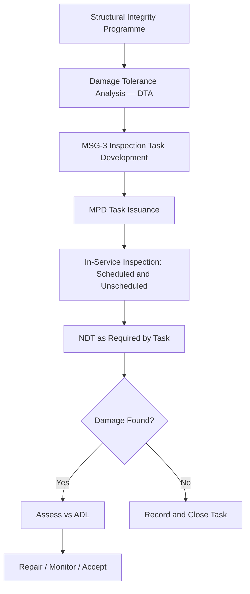

# ATLAS 050-059 · 05.051.050 — Inspection, NDT and Damage-Tolerance Practices — Overview

> **ATLAS-1000** · Q+ATLANTIDE Baseline · Section 05.051 Standard Practices — Structures

---

## 1. Purpose

Provides an overview of the inspection programme, non-destructive testing methods, and damage tolerance principles applied to Q+ATLANTIDE aircraft structures. The programme integrates MSG-3 maintenance task development with in-service NDT execution to maintain structural integrity throughout the aircraft operational life.

---

## 2. Scope

### 2.1 Context

Structural integrity is maintained through a combination of in-service inspection, NDT, and damage tolerance assessments. The inspection programme is derived from the damage tolerance and fatigue analysis conducted during certification and is reflected in the MPD and MSG-3 maintenance tasks. All inspections must be performed by appropriately qualified and authorised personnel.

The structural inspection programme addresses both fatigue cracking and accidental damage. Fatigue inspections are derived from damage tolerance analysis; accidental damage inspections are performed following any hard landing, birdstrike, or other significant event. Both categories require documented findings and dispositioning through the CAMO.

### 2.2 Scope Diagram

### 2.3 Key Parameters

| Parameter | Value |
|-----------|-------|
| Regulatory Basis | EASA CS-25.571 and CS-25.573 |
| Programme Methodology | MSG-3 Damage Tolerance Analysis |
| Inspection Intervals | Derived from DTA crack growth analysis |
| NDT Methods | UT, EC, RT, Visual, Active Thermography |

---

## 3. Footprint

| Field | Value |
|-------|-------|
| **Document ID** | `QATL-ATLAS-1000-ATLAS-050-059-05-051-050-INSPECTION-NDT-AND-DAMAGE-TOLERANCE-PRACTICES-OVERVIEW` |
| **Status** |  |
| **Folder Path** | `Q+ATLANTIDE/000-099_ATLAS/050-059_Estructuras/051_Standard-Practices-Structures/051-050-Inspection-NDT-and-Damage-Tolerance-Practices/` |

---

## 4. References

> [^1]: All references below are applicable at the revision level current at the time of document release. Superseded revisions must be assessed for impact before continued use.

| Reference | Description |
|-----------|-------------|
| EASA CS-25.571 | Damage-Tolerant Design Requirements |
| MSG-3 Revision 2 | Maintenance Programme Development for Transport Category Aircraft |
| ATA MSG-3 | Maintenance Steering Group Task Logic Analysis |
| EASA AMC 20-20 | Continuing Structural Integrity Programme |
