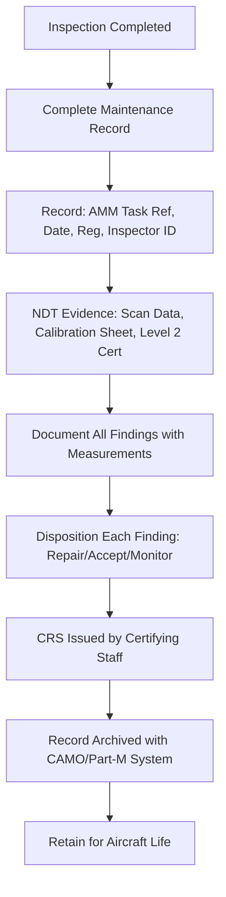

# ATLAS 050-059 · 05.051.050 — Inspection Records, Evidence and Acceptance Criteria

> **ATLAS-1000** · Q+ATLANTIDE Baseline · Section 05.051 Standard Practices — Structures

---

## 1. Purpose

Defines the documentation requirements, evidence standards, and acceptance criteria for structural inspections and NDT findings. Comprehensive and traceable inspection records are a regulatory requirement and a key element of the aircraft continuing airworthiness data package.

---

## 2. Scope

### 2.1 Context

Inspection records must capture the task reference, date, aircraft registration, inspector identity, access achieved, findings, and disposition. For NDT tasks, additional evidence includes calibration records, scan data files, and certified personnel qualification. Records form part of the aircraft continuing airworthiness data package and must be retained for the life of the aircraft plus the period specified by the national authority.

Electronic records stored in CSDB-linked maintenance management systems must be protected against unauthorised modification and must provide an audit trail showing the creation, amendment, and approval history of each record. Paper records must be legible, indelible, and stored in a controlled environment to prevent deterioration.

### 2.2 Scope Diagram

### 2.3 Key Parameters

| Parameter | Value |
|-----------|-------|
| Record Retention Period | Aircraft life or per national authority minimum |
| Inspector Identity Requirement | Part-66 AME licence category and authorisation |
| NDT Evidence Format | Scan data archived in CSDB-compatible format |
| Calibration Traceability | UKAS-accredited or national metrology standard |

---

## 3. Footprint

| Field | Value |
|-------|-------|
| **Document ID** | `QATL-ATLAS-1000-ATLAS-050-059-05-051-050-INSPECTION-RECORDS-EVIDENCE-AND-ACCEPTANCE-CRITERIA` |
| **Status** |  |
| **Folder Path** | `Q+ATLANTIDE/000-099_ATLAS/050-059_Estructuras/051_Standard-Practices-Structures/051-050-Inspection-NDT-and-Damage-Tolerance-Practices/` |

---

## 4. References

> [^1]: All references below are applicable at the revision level current at the time of document release. Superseded revisions must be assessed for impact before continued use.

| Reference | Description |
|-----------|-------------|
| EASA Part-145.A.55 | Maintenance Records Requirements |
| EASA Part-M.A.306 | Technical Log and Continuing Airworthiness Records |
| EN 4179 | NDT Record Requirements and Personnel Certification |
| ATA Spec 2200 | Documentation Standard for Aviation Maintenance |
