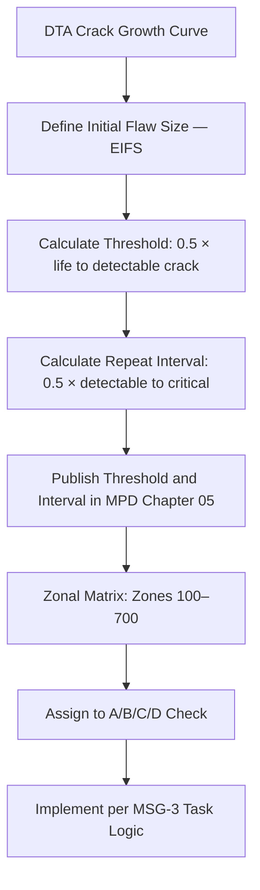

# ATLAS 050-059 · 05.051.050 — Inspection Thresholds, Intervals and Zonal Logic

> **ATLAS-1000** · Q+ATLANTIDE Baseline · Section 05.051 Standard Practices — Structures

---

## 1. Purpose

Defines the derivation and application of inspection thresholds, initial inspection intervals, and repeat intervals for structural inspection tasks in the MPD, including the zonal inspection programme. Correct interval derivation ensures that structural damage is detected before it can grow to a safety-critical size.

---

## 2. Scope

### 2.1 Context

Inspection thresholds represent the earliest point in aircraft service life at which a damage tolerance task must first be performed. They are derived as half the crack growth period from EIFS to the minimum detectable crack size. Inspection intervals define the maximum flight hours or cycles between repeat inspections, derived as half the growth period from detectable to critical crack size. The zonal inspection programme provides systematic coverage of all aircraft zones at each maintenance visit regardless of specific task applicability.

Zonal inspection tasks are assigned to aircraft maintenance check types (A/C/D checks) based on structural accessibility and inspection frequency requirements. The zone matrix maps each structural zone to its applicable check type and inspection method, ensuring complete coverage of the aircraft structure at defined intervals. Missed zones or overdue tasks must be reported to the CAMO for dispositioned action.

### 2.2 Scope Diagram

### 2.3 Key Parameters

| Parameter | Value |
|-----------|-------|
| Threshold Derivation Basis | 0.5 × total life to minimum detectable crack size |
| Repeat Interval Basis | 0.5 × growth period from detectable to critical |
| Zonal Group Range | Zone 100 (Fuselage) to Zone 700 (Powerplant) |
| Check Type Assignment | A/C/D checks per structural accessibility and interval |

---

## 3. Footprint

| Field | Value |
|-------|-------|
| **Document ID** | `QATL-ATLAS-1000-ATLAS-050-059-05-051-050-INSPECTION-THRESHOLDS-INTERVALS-AND-ZONAL-LOGIC` |
| **Status** |  |
| **Folder Path** | `Q+ATLANTIDE/000-099_ATLAS/050-059_Estructuras/051_Standard-Practices-Structures/051-050-Inspection-NDT-and-Damage-Tolerance-Practices/` |

---

## 4. References

> [^1]: All references below are applicable at the revision level current at the time of document release. Superseded revisions must be assessed for impact before continued use.

| Reference | Description |
|-----------|-------------|
| EASA CS-25.571(b) | Inspection Programme Derivation Requirements |
| MSG-3 Rev 2 | Structural Task Development and Zonal Logic |
| ATA MRBR Development Guide | Maintenance Review Board Report Development |
| MPD Chapter 05 | Scheduled Structural Inspection Programme |
