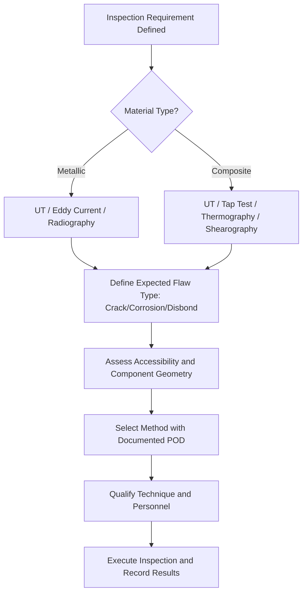

# ATLAS 050-059 · 05.051.050 — NDT Method Selection and Applicability

> **ATLAS-1000** · Q+ATLANTIDE Baseline · Section 05.051 Standard Practices — Structures

---

## 1. Purpose

Provides selection criteria and applicability guidance for NDT methods used in structural inspection including ultrasonic, eddy current, radiography, thermography, and shearography. Method selection must be justified by the inspection requirement and supported by qualification data demonstrating the required probability of detection.

---

## 2. Scope

### 2.1 Context

NDT method selection depends on the material type, geometry, expected flaw type, accessibility, and required probability of detection (POD). No single NDT method is universally applicable to all structural inspection scenarios; the selection must be justified by the inspection task, material properties, and available qualification data. Method combinations may be required for complex geometries or multi-mode damage scenarios.

POD demonstration is required to validate that the selected method and technique can reliably detect the target flaw size at the defined inspection interval threshold. POD data must be developed in accordance with MIL-HDBK-1823A or equivalent methodology. Where POD data does not exist for a specific configuration, conservative assumptions or additional inspection passes must be applied.

### 2.2 Scope Diagram

### 2.3 Key Parameters

| Parameter | Value |
|-----------|-------|
| UT Applicability | Thickness 1–100 mm metallic and composite |
| EC Applicability | Surface and near-surface cracks in conductive metals |
| Thermography Applicability | Bondline and composite disbond ≤ 25 mm depth |
| POD Target | 90% POD at 95% confidence (MIL-HDBK-1823A) |

---

## 3. Footprint

| Field | Value |
|-------|-------|
| **Document ID** | `QATL-ATLAS-1000-ATLAS-050-059-05-051-050-NDT-METHOD-SELECTION-AND-APPLICABILITY` |
| **Status** |  |
| **Folder Path** | `Q+ATLANTIDE/000-099_ATLAS/050-059_Estructuras/051_Standard-Practices-Structures/051-050-Inspection-NDT-and-Damage-Tolerance-Practices/` |

---

## 4. References

> [^1]: All references below are applicable at the revision level current at the time of document release. Superseded revisions must be assessed for impact before continued use.

| Reference | Description |
|-----------|-------------|
| NAS 410 / EN 4179 | NDT Personnel Qualification and Certification |
| MIL-HDBK-1823A | Nondestructive Evaluation System Reliability Assessment |
| ASTM E2533 | Standard Guide for NDE of Polymer Matrix Composites |
| AMM 51-10-00 | NDT Method Selection and Guidance |
