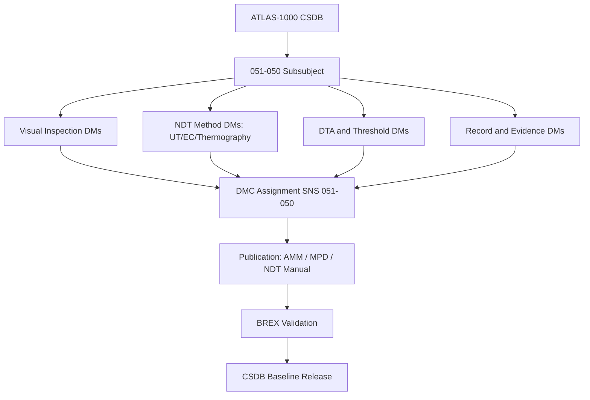

# ATLAS 050-059 · 05.051.050 — S1000D CSDB Mapping and Traceability

> **ATLAS-1000** · Q+ATLANTIDE Baseline · Section 05.051 Standard Practices — Structures

---

## 1. Purpose

Provides the S1000D DMC mapping and CSDB traceability matrix for all documents within the 051-050 Inspection, NDT and Damage-Tolerance Practices subsubject. This mapping ensures that all inspection and NDT documentation is traceable from DTA source data through to MPD task publication.

---

## 2. Scope

### 2.1 Context

Each document is assigned a unique S1000D DMC under ATLAS-1000 CSDB SNS 051-050, linking to NDT procedure modules, MPD task data modules, and DTA summary documents. Traceability supports change propagation from DTA update to inspection programme revision to MPD amendment, ensuring that all three levels remain synchronised through the configuration management process.

The BREX file for ATLAS-1000 enforces publication rules applicable to all inspection and NDT data modules, including applicability coding for aircraft series and variant, safety note categories, and qualified source data identification. Non-compliant data modules are rejected at BREX validation and must be corrected before CSDB inclusion.

### 2.2 Scope Diagram

### 2.3 Key Parameters

| Parameter | Value |
|-----------|-------|
| DMC Model Identifier | QATL |
| SNS Code | 051-050 Inspection and NDT |
| Issue Authority | Q-STRUCTURES / Technical Publications |
| BREX File | ATLAS-1000-BREX-051.xml |

---

## 3. Footprint

| Field | Value |
|-------|-------|
| **Document ID** | `QATL-ATLAS-1000-ATLAS-050-059-05-051-050-S1000D-CSDB-MAPPING-AND-TRACEABILITY` |
| **Status** |  |
| **Folder Path** | `Q+ATLANTIDE/000-099_ATLAS/050-059_Estructuras/051_Standard-Practices-Structures/051-050-Inspection-NDT-and-Damage-Tolerance-Practices/` |

---

## 4. References

> [^1]: All references below are applicable at the revision level current at the time of document release. Superseded revisions must be assessed for impact before continued use.

| Reference | Description |
|-----------|-------------|
| S1000D Issue 5.0 | DMC Coding Rules and Publication Standards |
| ASD SX000i | Integrated Technical Publication Framework |
| ATLAS BREX Q+ATLANTIDE | Business Rules Exchange for ATLAS-1000 CSDB |
| MPD Chapter 05 | Structural Inspection Task References |
