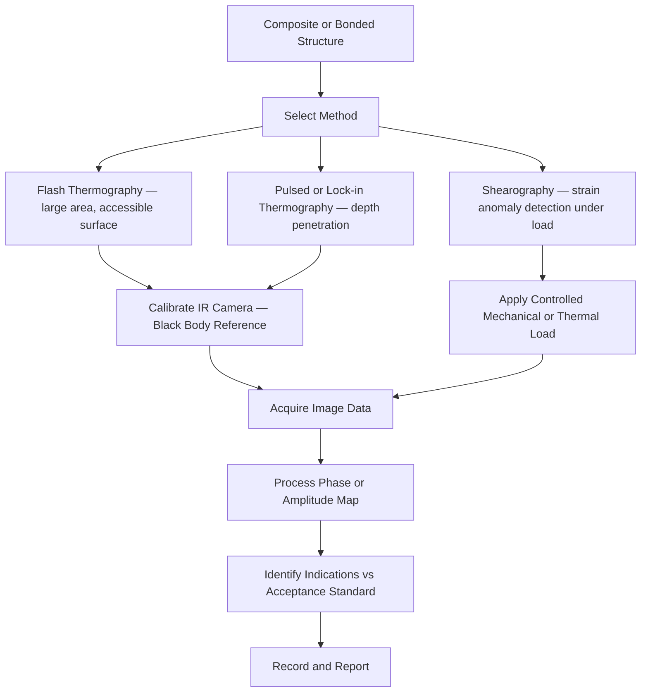

# ATLAS 050-059 · 05.051.050 — Thermography, Shearography and Bondline Inspection

> **ATLAS-1000** · Q+ATLANTIDE Baseline · Section 05.051 Standard Practices — Structures

---

## 1. Purpose

Defines the application of flash thermography, active thermography, and shearography for the detection of disbonds, delaminations, and impact damage in composite and bonded structures. These methods provide full-field imaging capability suited to rapid large-area inspection of composite primary and secondary structure.

---

## 2. Scope

### 2.1 Context

Thermographic methods detect thermal anomalies caused by subsurface voids, disbonds, and delaminations. Flash thermography uses a high-energy xenon flash lamp to deposit surface heat and monitors the thermal decay pattern using a cooled IR camera. Areas with subsurface voids conduct heat more slowly, appearing as warm regions in the phase or amplitude image. Lock-in and pulsed thermography are used where greater depth penetration or sensitivity is required.

Shearography uses coherent laser illumination and electronic speckle pattern interferometry to measure surface strain distribution under applied mechanical or thermal loading. Subsurface defects cause anomalous strain concentrations that appear as fringe pattern discontinuities in the shearogram. Shearography requires controlled loading and a vibration-isolated measurement environment.

### 2.2 Scope Diagram

### 2.3 Key Parameters

| Parameter | Value |
|-----------|-------|
| Flash Energy | ≥ 4 kJ for 3 mm CFRP panel (per equipment spec) |
| IR Camera Frame Rate | ≥ 200 Hz for flash thermography |
| Thermal Contrast Resolution | ≥ 0.05°C for 3 mm depth disbond |
| Shearography Shear Amount | Typically 4–8 mm for composite panel inspection |

---

## 3. Footprint

| Field | Value |
|-------|-------|
| **Document ID** | `QATL-ATLAS-1000-ATLAS-050-059-05-051-050-THERMOGRAPHY-SHEAROGRAPHY-AND-BONDLINE-INSPECTION` |
| **Status** |  |
| **Folder Path** | `Q+ATLANTIDE/000-099_ATLAS/050-059_Estructuras/051_Standard-Practices-Structures/051-050-Inspection-NDT-and-Damage-Tolerance-Practices/` |

---

## 4. References

> [^1]: All references below are applicable at the revision level current at the time of document release. Superseded revisions must be assessed for impact before continued use.

| Reference | Description |
|-----------|-------------|
| ASTM E1875 | Standard Guide for Thermographic Inspection |
| ASTM E2581 | Standard Practice for Shearography of Composites |
| NAS 410 Level 2 | NDT Personnel Qualification — Thermography |
| AMM 51-10-00 | Thermographic Inspection Procedures |
